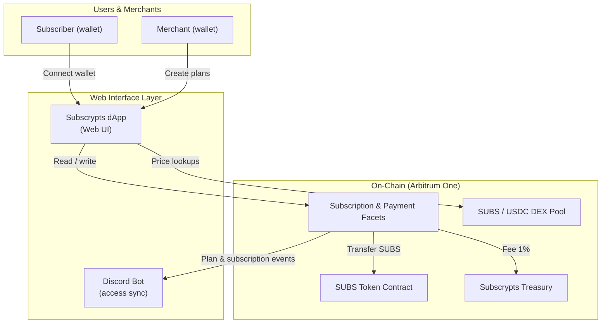

# Introduction

The **Subscrypts Web Interface Layer** is provided by the official web application, the [Subscrypts dApp](https://app.subscrypts.com). It is the primary way for merchants and subscribers to interact with the **Subscrypts subscription protocol** without needing to write code or manually call smart contracts.

Where the on-chain **Smart Contract Suite** defines *what* happens (subscription logic, token flows, pricing, and events), the [Subscrypts dApp](https://app.subscrypts.com) defines *how* real users experience it:

* Merchants configure subscription plans, monitor active subscribers, and receive revenue directly in **SUBS** on Arbitrum.
* Subscribers browse plans, connect a wallet, subscribe or cancel, and manage recurring payments in a familiar web interface.
* Off-chain tools such as the [Discord Bot](https://discord.onsubscrypts.com) use the same on-chain events to grant or revoke access in external platforms.

All of this is done while staying true to the core **Subscrypts** principles introduced in the main docs:

* **Privacy-first:** no usernames, email addresses, or card details required to subscribe.
* **Non-custodial:** users keep full control over their funds; the protocol never holds customer balances.
* **On-chain transparency:** all subscription payments are enforced by smart contracts on **Arbitrum One** and are verifiable on a public blockchain.
* **Compliance by design:** the platform is aligned with the regulatory principles described in the MiCAR-focused [Subscrypts whitepaper](https://subscrypts.com/whitepaper).

For background on the overall vision, token model, and protocol architecture, see:

* [Subscrypts Overview](../subscrypts/01-introduction.md)
* [Subscrypts Architecture](../subscrypts/04-architecture.md)
* [Smart Contract Suite – Introduction](../smart-contract/01-introduction.md)

You can also visit the public website at the main [Subscrypts homepage](https://subscrypts.com) for a high-level product overview.

---

## What the dApp Is (and Is Not)

Today, the [Subscrypts dApp](https://app.subscrypts.com) is an **early-stage but fully functional Web3 interface** focused on the core tasks required to run blockchain-based subscriptions:

* Viewing and understanding subscription plans.
* Creating new on-chain subscription plans as a merchant.
* Subscribing to plans and handling recurring payments.
* Swapping between **SUBS** and **USDC** so users can pay even if they don’t yet hold SUBS.

Over time, the goal is for the [Subscrypts dApp](https://app.subscrypts.com) to evolve into the **primary UI layer** for the entire Subscrypts ecosystem:

* Operational control for merchants (plans, subscribers, revenue, settings).
* Analytics dashboards and reporting.
* Subscriber account management across multiple services and merchants.
* Integrated payment and PSP-style features for Web2 and Web3 services.

It is **not** intended to be a low-level developer console or a technical playground. For smart contract details and ABI-level integration, developers should refer to:

* [Subscrypts ABI Reference](../smart-contract/11-abi-reference.md)

That said, the [Subscrypts dApp](https://app.subscrypts.com) does include an **Interact** section for advanced users who want to call smart contract functions directly from the browser. This is covered in detail on the dedicated [Interact Page](06-interact-page.md).

---

## How the dApp Fits into the Ecosystem

At a high level, the [Subscrypts dApp](https://app.subscrypts.com) acts as a **bridge between users and the on-chain Smart Contract Suite**, while remaining completely non-custodial:

* **Users and merchants** connect their Ethereum wallet (e.g. MetaMask) on Arbitrum.
* The [Subscrypts dApp](https://app.subscrypts.com) prepares the correct smart contract calls (approvals, plan creation, subscription start, recurring toggles, etc.).
* The wallet prompts the user to confirm transactions; nothing happens without an explicit signature.
* Smart contracts execute on **Arbitrum One**, moving funds directly between subscriber and merchant, and emitting events.
* External services like the [Discord Bot](https://discord.onsubscrypts.com) listen to these events and act on them (grant or revoke roles, notify users, etc.).

From the user’s perspective, all the complexity of **SUBS token flows**, **SUBS/USDC pricing**, and **subscription lifecycle transitions** is hidden behind a UI that feels similar to a modern SaaS billing portal.

### High-Level Architecture

> The web layer (the [Subscrypts dApp](https://app.subscrypts.com) and [Discord Bot](https://discord.onsubscrypts.com)) never holds user funds. All value transfer and subscription state live on the **Arbitrum One** blockchain.

---

## Who This Documentation Is For

This dApp section of the documentation is meant to be useful for several audiences:

* **Merchants & Creators** who want to understand how to launch subscription plans, receive revenue, and connect access control (e.g. Discord roles) to on-chain subscriptions.
* **Subscribers** who want a clear explanation of how to connect a wallet, subscribe, manage renewals, and stay in control of their payments.
* **Developers & Integrators** who don’t need internal backend details, but do want a precise mental model of how the [Subscrypts dApp](https://app.subscrypts.com) maps UI actions to on-chain contract calls.
* **Reviewers, partners, and investors** who want to see how the user-facing layer aligns with the broader protocol, token model, and regulatory approach described in the main docs and the [Subscrypts MiCAR whitepaper](https://subscrypts.com/whitepaper).

Technical implementation details such as specific backend frameworks or templating engines are **out of scope** here. Where relevant, we will instead refer to on-chain functions and public interfaces so that readers can cross-reference with the **Smart Contract Suite** documentation and the ABI.

---

## What Comes Next in the dApp Documentation

The rest of the **Subscrypts dApp** documentation is structured to walk you from high-level capabilities to detailed flows and reference material:

1. **[Current Capabilities](02-current-capabilities.md)** – What the dApp can do today and how it supports real-world subscriptions.
2. **[User Experience](03-user-experience.md)** – A step-by-step walkthrough of the typical subscriber journey.
3. **[Merchant Features](04-merchant-features.md)** – How merchants use the UI to create plans, see subscribers, and manage revenue.
4. **[Wallet Connection](05-wallet-connection.md)** – Supported wallets, Arbitrum network setup, and security considerations.
5. **[Interact Page](06-interact-page.md)** – How the advanced Interact interface exposes raw smart contract functions.
6. **[Smart Contract Functions in the dApp](07-smart-contract-functions.md)** – Mapping UI actions to underlying on-chain function calls.
7. **[Access Control & Outputs](08-access-control-and-outputs.md)** – How permissions and events work from a dApp perspective.
8. **[Future Direction](09-future-direction.md)** – How the [Subscrypts dApp](https://app.subscrypts.com) will evolve into a full operational and analytics hub for the Subscrypts ecosystem.

For a deeper dive into the underlying smart contracts, see:

* [Smart Contract Suite – Structure and Documentation Scope](../smart-contract/02-design.md)
* [Subscrypts ABI Reference](../smart-contract/11-abi-reference.md)

And for the broader project context, you can always return to the main [Subscrypts section](../subscrypts/01-introduction.md).
