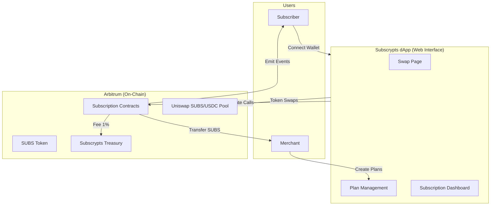

---

title: Subscrypts dApp – Current Capabilities
description: Overview of the live features and functionality available in the current version of the Subscrypts dApp, including subscription creation, payments, swaps, and integrations.
tags:
 - dapp
 - capabilities
 - subscriptions
 - payments
 - arbitrum
 - subscrypts

---

# Current Capabilities

The [**Subscrypts dApp**](https://app.subscrypts.com) represents the **first fully functional Web3 interface** for managing blockchain-powered subscriptions using the **Subscrypts Smart Contract Suite** on Arbitrum. It enables both merchants and subscribers to perform essential tasks securely and transparently, without needing to interact directly with the blockchain or understand smart contract internals.

At this stage, the dApp focuses on accessibility and reliability — giving non-technical users the ability to participate in on-chain subscriptions with confidence. Below is an overview of what the dApp can do today.

---

## Core Functionalities

### View and Explore Subscription Plans

Users can browse all available **on-chain subscription plans** created by merchants. Each plan includes details such as:

* Plan name and description.
* Price (in SUBS or equivalent USD via on-chain exchange rate).
* Billing interval (e.g., monthly, yearly).
* Merchant information and subscription duration.

These plans are fetched directly from the blockchain via the **view functions** of the smart contract suite, ensuring that the displayed data is always accurate and tamper-proof.

---

### Create Subscription Plans (Merchants)

Merchants can easily create new subscription plans directly from the web interface. The dApp abstracts the `planCreate()` smart contract call into a guided form where the merchant specifies:

* Price in **SUBS** or **USDC** equivalent.
* Billing frequency (e.g., 30 days, 90 days).
* Optional referral or promotional parameters.

Once confirmed, the transaction is submitted to the blockchain, emitting the `_planCreate` event. The plan immediately becomes visible to all users. Merchants maintain full ownership and control over their plans.

For technical references, see the [Smart Contract Functions](07-smart-contract-functions.md) page.

---

### Subscribe to Plans

Subscribers can join a plan in just a few clicks:

1. **Select Plan:** Choose any available plan from the marketplace.
2. **Confirm Subscription:**  
    - For **SUBS-based subscriptions** using `subscriptionCreate()`: The transaction directly triggers the subscription payment. The protocol handles the burn-and-mint mechanics internally, so **no prior SUBS approval transaction is required**.  
    - For **USDC-based payments** using `paySubscriptionWithUsdc()`: The dApp uses an embedded **Permit2** flow so the user signs a one-time USDC spending permission as part of the same interaction. There is **no separate, manual ERC-20 approve step**; the permit and payment are packaged together.
3. **Active Immediately:** Upon confirmation, the subscription becomes active and is visible on the user’s dashboard.

Each on-chain subscription emits `_subscriptionCreate` and `_subscriptionPay` events, ensuring a verifiable record for both subscriber and merchant.

---

### Automatic Renewals and Recurring Billing

Subscribers can enable or disable **auto-renewal** through the dApp’s interface. When active, the system automatically checks renewal eligibility each time a token transaction occurs on-chain or when a renewal function is called manually.

- Each time a token transaction occurs on-chain a batch of subscriptions is checked due to gas limites on the blockchain.
- Renewals can be manually triggered on-chain via the `subscriptionCollect()`, `subscriptionCollectByAddress()`, or `subscriptionCollectByPlan()` functions.  
  These functions can be executed by **any address**, and the contract logic ensures that only valid, due subscriptions are renewed.
- Payments are **non-custodial**: funds move directly from subscriber to merchant, with the **burn-and-mint** mechanism enforcing payment in a single atomic step.
- Each renewal emits a `_subscriptionPay` event, keeping both subscriber and merchant dashboards synchronized in real time.
- Failed renewals (for example, when a wallet lacks sufficient funds) revert and emit a `_subscriptionStop` event, marking the subscription as inactive and resetting its recurring payment flag to `false` with remaining renewal cycles set to `0`.

This model keeps renewals decentralized, transparent, and verifiable — eliminating the need for background services or custodial agents to maintain active subscriptions.

---

### Token Swaps (USDC ↔ SUBS)

The dApp integrates a **swap page** for users who need SUBS tokens to pay for subscriptions. Behind the scenes, it connects to the **Uniswap SUBS/USDC pool** on Arbitrum for transparent, on-chain conversion.

Users can:

* Swap **USDC → SUBS** to fund subscriptions.
* Swap **SUBS → USDC** to convert back to stablecoin.

Pricing and rates are fetched using live DEX data, ensuring that the swap experience mirrors decentralized exchange logic.

For more about token operations and conversions, refer to the [Smart Contract Suite](../smart-contract/01-introduction.md) documentation.

---

### Manage Active Subscriptions

Subscribers can view and manage all active subscriptions via their personal dashboard:

* View plan details, next billing date, and total payments.
* Toggle **auto-renew on/off**.
* Cancel or pause subscriptions at any time.
* Review transaction hashes linked to each payment for on-chain verification.

This information is pulled through **read-only smart contract calls** (e.g., `getSubscription()`, `getSubscriptionsByAddress()`) to ensure transparency and immutability.

> ⚙️ **Note:** The My Subscriptions dashboard and features such as live status tracking, cycle counters, and in-dApp payment history are part of the planned roadmap.

---

### Merchant Revenue Tracking

Merchants can track all payments in real time via the dApp dashboard:

* Monitor incoming payments per plan.
* See the number of active subscribers.
* Export transaction records for accounting or analytics.

Each payment triggers an on-chain `_subscriptionPay` event, which can also be monitored off-chain by integrations or external dashboards.

> ⚙️ **Note:** Advanced revenue tracking features — such as **per-plan payment monitoring** and **exporting transaction records for accounting or analytics** — are part of the **planned roadmap**.  

---

### Discord Integration

One of Subscrypts’ most powerful features is its integration with the [**Discord Bot**](https://discord.onsubscrypts.com). Merchants can link their Discord community to automatically manage access based on active subscriptions.

When a subscriber’s payment is successful, the Discord Bot:

* Grants premium roles or channel access.
* Removes access when a subscription expires or is canceled.

This makes the dApp and Discord combination a ready-made monetization tool for creators and community managers.

To learn more about how on-chain events interact with Discord, see [Access Control & Outputs](08-access-control-and-outputs.md).

---

## Supported Networks and Tokens

* **Network:** Arbitrum One (Ethereum Layer-2)
* **Primary Token:** **SUBS** (ERC-20 utility token)
* **Secondary Token:** **USDC** (for stable payments and conversions)
* **DEX Integration:** Uniswap v3 SUBS/USDC pool for live rates

All subscription and swap transactions occur directly on-chain, secured by the Ethereum consensus layer through Arbitrum’s rollup protocol.

---

## Architecture Snapshot

> All dApp actions correspond to on-chain smart contract calls; there are no hidden or off-chain payment flows.

---

## What’s Next

The next section, **[User Experience](03-user-experience.md)**, walks through how these capabilities come together in a real-world subscription flow — from connecting a wallet to confirming a transaction.

For broader context, visit:

* [Subscrypts Homepage](https://subscrypts.com)
* [Smart Contract Suite Overview](../smart-contract/01-introduction.md)
* [Subscrypts ABI Reference](../smart-contract/11-abi-reference.md)
