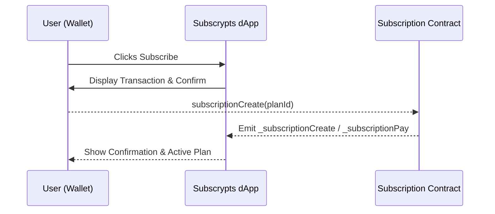

# User Experience

The [**Subscrypts dApp**](https://app.subscrypts.com) has been designed to make blockchain-based subscriptions feel as familiar as using any traditional web platform. Every action—from browsing plans to confirming transactions—has been simplified to minimize friction while preserving transparency and user control.

Below is a detailed walkthrough of the **subscriber journey** through the dApp, highlighting how each interaction connects to the blockchain in the background.

---

## Accessing the dApp and Connecting a Wallet

When users visit the [Subscrypts dApp](https://app.subscrypts.com):

1. **Connect Wallet Button:** The header of the dApp always displays a **“Connect Wallet”** button.  
   When clicked, the system initiates wallet detection and checks for installed Web3 wallets such as **MetaMask**, **Coinbase Wallet**, or **Brave Wallet**.
2. **Detection and Prompt:** After detection, the user’s wallet interface opens.  
    - If the dApp has **not been previously authorized or trusted**, the wallet shows its native **Connect Wallet** prompt asking the user to select an account and approve access.  
    - If the dApp has already been **authorized or marked as trusted**, the wallet connects directly without showing the additional prompt.
3. **Network Check:** If the connected wallet is not on **Arbitrum One**, the dApp automatically prompts the user to switch or add the correct network.
4. **Connection Established:** Once connected, the dApp displays the shortened wallet address (e.g., `0x8Ed1...3fd27`) in the navigation bar, indicating that the session is active.

All subsequent interactions within the dApp are tied to this connected address. The entire connection flow is **non-custodial**: no tokens or permissions are handled automatically, and every transaction must be explicitly approved by the user in their wallet.

> 💡 **Tip:** Subscrypts never requests personal data, email addresses, or passwords—your wallet address *is* your login identity.

---

## Browsing Subscription Plans

Users can freely browse all available subscription plans on the **plans overview** page — no wallet connection is required to view them.  
The page fetches available subscriptions directly from the blockchain via the `getPlans()` view function, ensuring all listings are live and tamper-proof.

Each plan card displays:

- **Merchant Name** and plan description.  
- **Price** in SUBS, along with an approximate **USD equivalent** (calculated using live SUBS/USDC rates from Uniswap).  
- **Billing Interval**, such as monthly or yearly.  
- A **Subscribe** button, which becomes active only when the user connects their wallet.

Users can explore plans and pricing at any time, but to **subscribe**, **renew**, or **manage subscriptions**, a wallet connection is required.

This separation allows visitors to discover available services before interacting with the blockchain, creating a frictionless browsing experience while keeping all subscription data fully on-chain.

---

## Subscribing to a Plan

When a user clicks **Subscribe**, the dApp starts a short guided process:

1. **Review and Confirm:** The dApp displays a summary of the plan details, price in SUBS (and its approximate USDC equivalent).
2. **Transaction Execution:**  
    - For **SUBS-based payments** (using `subscriptionCreate(planId)`):  
      The contract handles all logic internally using the **burn-and-mint** mechanism for `subscriptionCreate → subscriptionPay`.  
      **No token approval transaction is required**, as the payment is performed atomically within the subscription call.  
    - For **USDC-based payments** (using `paySubscriptionWithUsdc(planId)`):  
      The function includes a built-in **Permit2** signature flow. The user signs a one-time USDC spending authorization as part of the same action — there is **no separate ERC-20 approval step**.
3. **Transaction Processing:** Once confirmed, the smart contract executes the payment, records the subscription on-chain, and emits events.
4. **Success Notification:** The dApp displays a confirmation message, while the wallet provides a direct link to the transaction on **Arbiscan**.

> 🧾 The transaction emits `_subscriptionCreate` and `_subscriptionPay` events, ensuring a verifiable on-chain record for both subscriber and merchant.

---

## Managing Active Subscriptions

Once subscribed, users can access **My Subscriptions**, a personalized dashboard showing:

* **Active Subscriptions:** All plans linked to the wallet address.
* **Next Billing Date** and remaining cycles.
* **Toggle Auto-Renew:** Switch on/off recurring payments via the `subscriptionRecurringCHG()` contract call.
* **Cancel Subscription:** Stop renewals at any time—no lock-in or centralized approval needed.
* **Payment History:** View on-chain transaction hashes for every payment made.

Each update in this section reflects real-time data fetched through smart contract view calls, ensuring total accuracy.

> ⚙️ **Note:** The My Subscriptions dashboard and features such as live status tracking, cycle counters, and in-dApp payment history are part of the planned roadmap

---

## Renewals and Notifications

When a billing cycle ends, the **Subscrypts Smart Contract Suite** processes subscription renewals directly on-chain:

- If auto-renew is **enabled**, the contract uses the user’s SUBS funds to trigger the next payment automatically.  
- If **disabled**, the subscription stops until the user manually renews and emits a `_subscriptionStop` event.  
- If funds are insufficient, the renewal fails gracefully and also emits a `_subscriptionStop` event.

Renewals can be triggered through any of the collection functions — `subscriptionCollect()`, `subscriptionCollectByAddress()`, or `subscriptionCollectByPlan()` — ensuring a fully decentralized and permissionless renewal process.

This model ensures that renewals remain fully decentralized and verifiable while paving the way for seamless user notifications in future versions.

> ⚙️ **Note:** Notification features such as alerts for successful payments, expirations, or upcoming renewals are part of the planned roadmap.

---

## Managing Tokens and Swaps

Some users may not yet hold **SUBS** tokens. The built-in **Swap** page allows:

* **USDC → SUBS:** Acquire SUBS to start a subscription.
* **SUBS → USDC:** Convert back to stablecoin for convenience.

All swaps route through the **Uniswap SUBS/USDC pool** on Arbitrum, ensuring transparent pricing. This feature removes the need to visit external exchanges, streamlining the onboarding process.

For technical background, see [Smart Contract Suite – Architecture](../smart-contract/02-design.md).

---

## Access Control Integrations

If a subscribed plan is linked to a Discord community, the [Subscrypts Discord Bot](https://discord.onsubscrypts.com) can grant and revoke roles automatically:

* When payment succeeds, users receive the corresponding premium role.
* When a subscription ends or fails to renew, access is revoked.

This process is entirely automated using the contract’s emitted events (`_subscriptionCreate`, `_subscriptionPay`, `_subscriptionStop`) or data directly from the blockhain with the view functions.

For more information, see [Access Control & Outputs](08-access-control-and-outputs.md).

---

## Transparency and Verification

Every action taken in the dApp corresponds to an on-chain transaction or event that can be verified on Arbiscan:

* Subscriptions, payments, and renewals emit logs recorded publicly.
* Users can click any transaction hash to view its status.
* Merchants and subscribers both share the same source of truth: the blockchain.

This ensures that **Subscrypts remains transparent, fair, and auditable**—a core principle of its design.

---

## Summary

| Stage          | Action                            | Smart Contract Function                            | Result                                 |
| -------------- | --------------------------------- | -------------------------------------------------- | -------------------------------------- |
| Connect Wallet | Wallet authentication on Arbitrum | —                                                  | User identified and authenticated      |
| Browse Plans   | Fetch on-chain plan list          | `getPlans()`                                       | Displays subscription plan data        |
| Subscribe      | Subscribe                         | `subscriptionCreate()`                             | Payment executed, subscription created |
| Manage         | Toggle renew, cancel, or view     | `subscriptionRecurringCHG()` / `getSubscription()` | Manage lifecycle                       |
| Renew          | Automated or manual               | `subscriptionCollect()`, `subscriptionCollectByAddress()`, or `subscriptionCollectByPlan()`                            | Continues active subscription          |

---

## What’s Next

Continue to [Merchant Features](04-merchant-features.md) to see how merchants create plans, monitor subscribers, and track on-chain revenue.

For external resources, visit:

* [Subscrypts Homepage](https://subscrypts.com)
* [MiCAR Whitepaper](https://subscrypts.com/whitepaper)
* [Subscrypts ABI Reference](../smart-contract/11-abi-reference.md)
