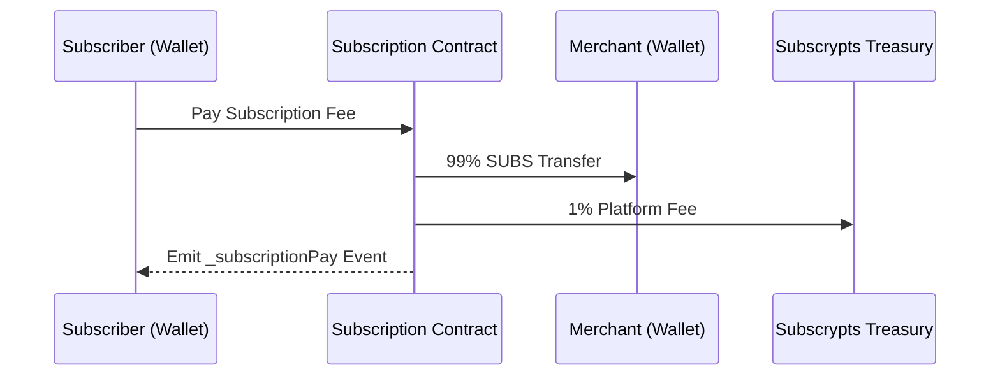

# Merchant Features

The [**Subscrypts dApp**](https://app.subscrypts.com) empowers merchants and creators to monetize their services directly through **blockchain-powered subscriptions**. Without intermediaries or payment processors, funds move directly from the subscriber’s wallet to the merchant’s wallet — instantly, transparently, and with minimal fees.

This section explains every feature available to merchants, from creating plans to tracking revenue and connecting community platforms.

---

## Creating Subscription Plans

Merchants can create and configure their own subscription plans using the **Create Plan** interface. This process uses the on-chain function `planCreate()` from the Subscrypts Smart Contract Suite, abstracted into a simple web form.

### Plan Setup Steps

1. **Set the Price:** Define the price in SUBS, or optionally peg it to a USD value using live exchange rates.
2. **Select Billing Frequency:** Choose how often subscribers will be billed (e.g., monthly, quarterly, annually), the amount is set in seconds
3. **Add a Description:** Briefly describe what the subscription provides.
4. **Enable Auto-Renew (Optional):** Allow subscribers to toggle recurring billing.
5. **Confirm Transaction:** The dApp sends the plan creation request to your wallet; confirming it broadcasts the transaction to Arbitrum.

Once the transaction completes, the plan becomes visible to users. It emits a `_planCreate` event on-chain, signaling that it is ready to accept subscribers.

For technical reference, see [Smart Contract Functions](07-smart-contract-functions.md).

> 🧾 **Note:** Plan creation may require a small setup fee to prevent spam and cover network gas costs.

---

## Managing Plans

Each plan you create is stored permanently on the blockchain and can be managed through the merchant dashboard. Key management options include:

- **Activate/Deactivate Plans:** Pause new subscriptions while keeping existing ones unaffected.  
- **Update Description:** Change the text displayed to subscribers without altering billing logic.  
- **View Plan Statistics:** Monitor the number of active subscribers and general plan activity.

All updates occur through authorized smart contract calls (where permitted) or through the Subscrypts governance interface for broader protocol-level settings.

> ⚙️ **Note:** Advanced revenue tracking — such as detailed views of **payments made**, **total SUBS earned**, and historical performance metrics — is part of the **planned roadmap**.  

---

## Monitoring Subscribers

The merchant dashboard provides full visibility into active subscribers for each plan. Each subscriber record includes:

- Wallet address of the subscriber.  
- Subscription start date and next billing date.  
- Whether **auto-renew** is enabled.  
- Total payments made in SUBS.  
- Date and amount of the **last payment**.  
- On-chain transaction IDs for verification.

This information is retrieved from view functions such as `getSubscriptionsByPlan()` and `getSubscription(subscriptionId)` in real time.

### Example Dashboard View

| Subscriber     | Status | Auto-Renew | Total Paid | Last Payment | Next Payment |
| -------------- | ------ | ---------- | ----------- | ------------- | ------------- |
| 0x8Ed1...3fd27 | Active | ✅          | 300 SUBS    | 2025-11-01    | 2025-12-01    |
| 0x7c29...A21b  | Active | ❌          | 100 SUBS    | 2025-10-30    | 2025-11-30    |

> ⚙️ **Note:** Data export options — such as **CSV or Excel downloads for analytics and accounting** — are part of the **planned roadmap** and will be available in future versions of the merchant dashboard.

---

## Revenue Collection and Transparency

Every time a subscriber pays, the smart contract executes a **direct transfer** of tokens from the subscriber to the merchant.

* The merchant instantly receives **99% of the payment** in SUBS.
* **1%** is routed to the [Subscrypts Treasury](../smart-contract/01-introduction.md) as a protocol fee.
* Payments are recorded on-chain and verifiable through events such as `_subscriptionPay`.

This event-driven model means merchants never need to request withdrawals — funds are delivered instantly and immutably.

---

## Analytics and Reporting

The dApp includes a **Merchant Dashboard** for tracking performance over time:

- **Revenue Summary:** Displays total SUBS received and total fees paid.  
- **Subscriber Growth:** Visualized charts of new vs. canceled subscriptions.  
- **Retention Insights:** Percentage of renewals vs. churn.

> ⚙️ **Note:** The **Analytics and Reporting** features are part of the **planned roadmap**.  

---

## Gifting and Promotions

The Subscrypts ecosystem allows both **merchants** and **users** to gift subscriptions to others, offering a flexible way to reward loyalty or share access.

### Merchant or Platform-Initiated Gifts
Owners of the Subscrypts subscription plan can issue complimentary subscriptions using the `subscriptionGift()` function.  
These gifts are **free** to the recipient and **no cost** is deducted from the sender.

### User-Initiated Gifts
Regular users can also gift subscriptions to others through the same `subscriptionGift()` function.  
In this case, the **subscription cost is deducted** from the gifting user’s wallet at the time of gifting.  
This allows users to purchase subscriptions on behalf of others, such as friends or community members.

### Renewals for Gifted Subscriptions
Gifted subscriptions may include **automatic renewal** depending on the configuration of the gifting transaction:
- If the **gifted user** wishes to continue the subscription and manage renewals, they must manually enable auto-renewal via the `subscriptionRecurringCHG()` function.  
- If no one renews, the subscription expires naturally and emits a `_subscriptionStop` event.

### How It Works in the dApp
Through the dApp interface:
1. Enter the recipient’s wallet address.  
2. Select the plan to gift.  
3. Confirm the transaction.

The recipient gains immediate access upon confirmation, and the subscription is recorded on-chain with a `_subscriptionCreate` event flagged as a gift.

This feature supports community-driven gifting, promotional campaigns, free trials, and customer appreciation programs — enabling both merchants and users to extend access in a transparent, blockchain-verified way.

---

## Integrating Discord and Off-Chain Services

Many merchants offer gated access to communities or content via Discord. The [**Subscrypts Discord Bot**](https://discord.onsubscrypts.com) connects directly to on-chain events to automate access management:

* **Role Assignment:** When a payment succeeds, the bot grants access to premium channels.
* **Role Revocation:** When a subscription expires, the bot removes access automatically.
* **Multi-Server Support:** Merchants can manage multiple communities linked to their plans.

To configure integration, merchants add their Discord server ID and role mappings through the dApp’s integration panel.

Learn more in [Access Control & Outputs](08-access-control-and-outputs.md).

---

## Compliance and Security

Subscrypts operates in alignment with the **EU MiCA regulation** to protect both merchants and subscribers. Key points include:

* **Transparency:** All payments and plan logic are visible on-chain.
* **Custody-Free Operation:** The protocol never holds merchant or user funds.
* **Governance Security:** Administrative functions are controlled via multi-signature wallets to prevent unilateral changes.

These design choices ensure long-term reliability for commercial use.

For more regulatory background, see the [Subscrypts MiCAR Whitepaper](https://subscrypts.com/whitepaper).

---

## Summary for Merchants

| Function           | Action                                   | Smart Contract             | Event Emitted                     |
| ------------------ | ---------------------------------------- | -------------------------- | --------------------------------- |
| Create Plan        | Define and publish subscription offering | `planCreate()`             | `_planCreate`                     |
| Gift Subscription  | Give free access to a user               | `subscriptionGift()`       | `_subscriptionCreate`             |
| Manage Subscribers | View or export current subscribers       | `getSubscriptionsByPlan()`, `getSubscriptionsByAddress()`, `getSubscriptions()`, `getSubscription()` |                                   |
| Renew      | Automated or manual            | `subscriptionCollect()`, `subscriptionCollectByAddress()`, or `subscriptionCollectByPlan()`    | `_subscriptionPay`                |

---

## What’s Next

Continue to [Wallet Connection](05-wallet-connection.md) for details on supported wallets, Arbitrum configuration, and transaction security.

For broader context, visit:

* [Subscrypts Homepage](https://subscrypts.com)
* [Smart Contract Suite Overview](../smart-contract/01-introduction.md)
* [Subscrypts ABI Reference](../smart-contract/11-abi-reference.md)
