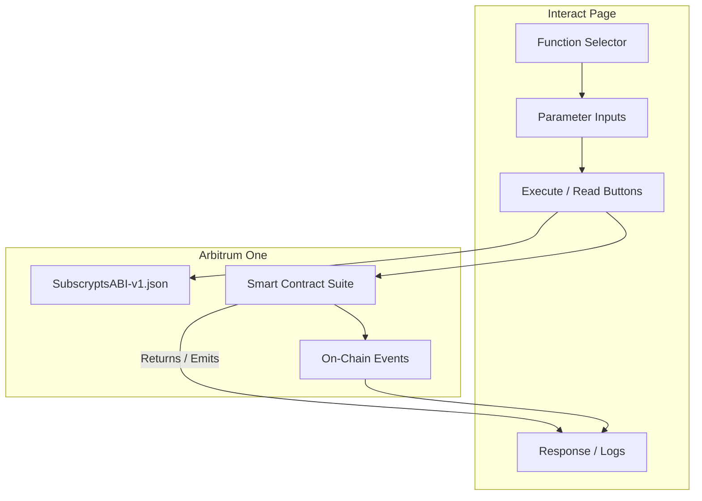

# Interact Page

The **Interact Page** within the [Subscrypts dApp](https://app.subscrypts.com) allows users — particularly merchants and advanced community managers — to directly communicate with the **Subscrypts Smart Contract Suite**.

It functions as an **on-chain console** for executing contract functions through an embedded ABI interface (`SubscryptsABI-v1.json`), removing the need for developers to use external tools like Etherscan or Remix.

This section explains how to use the Interact page, what it supports, and how it bridges user-friendly controls with full smart contract flexibility.

---

## Purpose of the Interact Page

While most Subscrypts dApp users interact through simplified UI flows (e.g., “Create Plan” or “Subscribe” buttons), the Interact page is designed for those who want **deeper control** and **direct access** to all available contract methods.

Typical use cases include:

* Testing new contract functions during development.
* Viewing real-time contract data not shown in the dashboard.
* Verifying ABI responses and events for audit purposes.

> 🧠 The Interact page reads directly from the verified contract ABI and provides a real-time, wallet-connected interface to the blockchain.

---

## How It Works

1. **Load ABI Functions:** Upon opening the Interact page, the dApp loads all available methods from `SubscryptsABI-v1.json`.
2. **Select Function:** Users select a contract function from a dropdown menu categorized by facet (e.g., `FacetSubscription`, `FacetAdmin`, `FacetPaymentUSDC`, `FacetView`).
3. **Input Parameters:** The interface dynamically displays all required parameters for the chosen function.
4. **Execute or Query:**
    - **Read-only (view)** functions can be executed without gas fees.
    - **Write (state-changing)** functions prompt a transaction through the user’s wallet.
5. **Output & Response:** The function output, transaction hash, or event logs appear in a results window for review.

All interactions follow the same non-custodial security model: transactions are only executed once the user confirms them in their wallet.

---

## Interface Overview

The Interact page is divided into three sections:

### 1. Function Selector

A list that list all available contract functions.

| Category              | Description                                                                        |
| --------------------- | ---------------------------------------------------------------------------------- |
| **FacetSubscription** | Handles plan creation, subscription lifecycle, renewals, and cancellations.        |
| **FacetPaymentUSDC**  | Enables payment using USDC as an alternative to SUBS.                              |
| **FacetAdmin**        | Provides merchant and governance-level configuration tools.                        |
| **FacetView**         | Allows read-only queries such as retrieving subscription details or plan listings. |

### 2. Parameter Form

Each function dynamically generates input fields for its parameters (string, uint256, bool, etc.). For example:

```text
Function: planCreate(uint256 price, uint256 interval, string memory name)
```

Would render as:

```
Price (in SUBS): [________]
Interval (in seconds): [________]
Plan Name: [________]
```

### 3. Result Output

After executing a function, the Interact page displays:

* **Transaction hash** (for write operations)
* **Function return data** (for read operations)
* **Decoded event logs**

A link to [Arbiscan](https://arbiscan.io) is automatically provided for verification.

---

## Example Use Case: Creating a Plan

Instead of using the “Create Plan” page, a merchant could use the Interact page to manually create a plan by calling the underlying function:

```solidity
planCreate(uint256 price, uint256 interval, string memory planName)
```

Steps:

1. Select **FacetSubscription → planCreate**.
2. Enter the price in SUBS, interval in seconds (e.g., 2592000 for 30 days), and a descriptive plan name.
3. Confirm the transaction in your wallet.
4. The dApp displays the transaction hash and emits the `_planCreate` event.

> 💡 Ideal for developers testing custom configurations or performing batch creations via external scripts.

---

## Example Use Case: Reading Subscription Details

You can also retrieve active subscription data using `getSubscription(subscriptionId)` from **FacetView**:

1. Select **getSubscription**.
2. Enter the subscription ID.
3. Click **Execute**.
4. The result displays key data, such as subscriber address, next renewal date, and plan ID.

```json
{
  "subscriber": "0x8Ed1...3fd27",
  "planId": 42,
  "nextPayment": 1733030400,
  "autoRenew": true
}
```

No gas fees are required for view operations.

---

## Advanced Operations

The Interact page supports more advanced smart contract operations for power users:

| Function                     | Description                                   | Requires Gas? |
| ---------------------------- | --------------------------------------------- | ------------- |
| `subscriptionRecurringCHG()` | Toggles auto-renew on or off                  | ✅             |
| `getPlans()`                 | Lists all plans on-chain                      | ❌             |
| `subscriptionGift()`         | Creates a gifted subscription                 | ✅             |
| `getSubscriptionsByPlan()`   | Retrieves all subscriber addresses for a plan | ❌             |

Each function is accompanied by clear tooltips describing parameters, access level, and expected result.

---

## Access Control

While most Subscrypts smart contract functions are **public** and can be called by anyone, a limited number of administrative or system-level functions are **restricted** using access control modifiers.  
These modifiers enforce role-based permissions at the contract level to protect sensitive operations.

### Restricted Functions and Their Modifiers

| Function | Access Modifier | Description |
|-----------|----------------|--------------|
| `contractFreezeAccount` | `onlyServiceAccounts` | Used to temporarily restrict an address from performing contract actions. |
| `contractFundAddressCHG` | `onlyOwner` | Updates the contract’s funding or treasury address. |
| `contractSanctionsContractCHG` | `onlyServiceAccounts` | Configures or updates the sanctions control contract. |
| `contractServiceAccountsCHG` | `onlyOwner` | Updates or assigns authorized service account addresses. |
| `mintByAdmin` | `onlyServiceAccounts` | Allows minting tokens for specific system-level operations. |
| `burnByAdmin` | `onlyServiceAccounts` | Allows burning tokens under administrative control. |
| `planChange` | `onlyServiceAccounts` | Modifies existing plan details under service account supervision. |
| `planChangeSubscriptionsBulk` | `onlyServiceAccounts` | Performs bulk plan updates for multiple subscriptions. |
| `planGoveranceCHG` | `onlyServiceAccounts` | Updates governance parameters for plan-level logic. |
| `setHaltStates` | `onlyServiceAccounts` | Halts or resumes contract operations in specific states. |
| `subscriptionCollectPassiveCHG` | `onlyServiceAccounts` | Adjusts passive collection configurations. |
| `subscriptionPayExternal` | `onlySelfProxy` | Internal-only call for proxy-triggered external payments. |

All other functions — including those related to plan creation, subscriptions, payments, and view operations — are **publicly accessible** and permissionless by design.

If a user attempts to call a restricted function without the required role, the contract reverts with an access error. The dApp captures this gracefully and displays a clear, readable message in the interface.

For more information on how access permissions and output handling are implemented, see [Access Control & Outputs](08-access-control-and-outputs.md).

---

## Example Architecture Diagram



---

## Data Validation and Feedback

The dApp validates user input against the ABI before execution:

* Ensures required fields are filled.
* Checks number formats and address validity.
* Prevents calls to non-existent functions.

Upon completion, feedback is provided as:

* ✅ **Success:** Function executed, transaction confirmed.
* ⚠️ **Warning:** Read-only call returned empty or unexpected data.
* ❌ **Error:** Transaction reverted or invalid parameters.

All feedback includes clear error messages and, for write functions, a direct [Arbiscan](https://arbiscan.io) link.

---

## Integration with ABI Reference

All function names, descriptions, and parameter definitions in the Interact page are derived from the **[Subscrypts ABI Reference](../smart-contract/11-abi-reference.md)**. This ensures one-to-one accuracy with the deployed contracts.

Developers can cross-check function details directly in the ABI documentation for a deeper understanding of their logic.

---

## Summary

| Feature                      | Description                                                |
| ---------------------------- | ---------------------------------------------------------- |
| **Direct ABI Access**        | Allows on-chain contract interaction from within the dApp. |
| **Dynamic Parameter Inputs** | Automatically adapts to selected function.                 |
| **Real-Time Feedback**       | Displays transaction status, results, and event logs.      |
| **Safe & Transparent**       | Fully wallet-signed and verified on Arbitrum.              |

---

## What’s Next

Continue to [Smart Contract Functions](07-smart-contract-functions.md) to explore how each dApp action corresponds to specific functions within the Subscrypts Smart Contract Suite.

For reference, visit:

* [Subscrypts Homepage](https://subscrypts.com)
* [MiCAR Whitepaper](https://subscrypts.com/whitepaper)
* [Smart Contract Suite Overview](../smart-contract/01-introduction.md)
