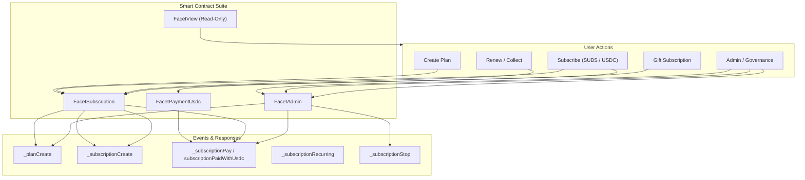

# Smart Contract Functions

The [**Subscrypts dApp**](https://app.subscrypts.com) interfaces directly with the **Subscrypts Smart Contract Suite** on **Arbitrum One**. Every button, form, and interaction in the dApp corresponds to one or more contract functions grouped into **facets**.

This page is a **practical reference** for merchants, subscribers, and integrators, explaining:

- What each **publicly callable** facet function does.
- Which functions are **guarded by access modifiers** and therefore restricted.
- Which **events** they emit and how those events appear in the dApp and integrations.

For low-level ABI details (types, full signatures, and selectors), see the  
**[Subscrypts ABI Reference](../smart-contract/11-abi-reference.md)**.

---

## Function Groups Overview

| Facet                 | Description                                                                 |
| --------------------- | --------------------------------------------------------------------------- |
| **FacetSubscription** | Core plan and subscription logic (creation, renewals, gifting, attributes). |
| **FacetPaymentUsdc**  | USDC-based subscription payments via Uniswap v3 + Permit2.                  |
| **FacetAdmin**        | Governance and system configuration for plans, DEX settings, and halt states. |
| **FacetView**         | Read-only queries for plans, subscriptions, and paginated lists.            |

> 🔒 **Access Modifiers:**  
> Some functions are restricted by modifiers such as `onlyOwner`, `onlyServiceAccounts`, or `onlySelfProxy`.  
> These functions are still *publicly callable* at the EVM level, but will revert unless the caller has the required role.

---

## FacetSubscription – Core Subscription Logic

`FacetSubscription` implements the main **subscription engine**: creating plans, creating subscriptions, collecting payments, gifting, and managing attributes and recurring settings.

### `planCreate(currency, amount, frequency, description, setAttribute, referralBonus)`

- **Purpose:** Create a new subscription plan.
- **Access:** Public (typically used by merchants via the dApp).
- **Input:**
    - `currency`: Code for the pricing currency (`0` = SUBS, `1` = USD-pegged).
    - `amount`: Amount per billing period (in SUBS or USD equivalent, depending on `currency`).
    - `frequency`: Subscription duration before the next payment is due (for example, 30 days).
    - `description`: Human-readable description of the plan.
    - `setAttribute`: Default attribute value applied to each subscription created for this plan (used for more advanced setups).
    - `referralBonus`: Extra time (duration) granted for free to the referral address when it successfully refers a new subscriber.
- **Behavior:**
    - Stores a new plan in contract storage.
    - May require a small plan creation cost, depending on current governance settings.
- **Outputs & Events:**
    - Returns the **plan ID**.
    - Emits **`_planCreate`** with full plan data.

---

### `subscriptionCreate(planId, subscriber, referral, deductFrom)`

- **Purpose:** Create (or re-activate) a subscription for a specific plan.
- **Access:** Public (typically called by the dApp on behalf of the connected wallet).
- **Input:**
    - `planId`: ID of the plan to subscribe to.
    - `subscriber`: Address that will own the subscription (usually the connected wallet).
    - `referral`: Address that receives the referral bonus for this subscription (if any), when the subscriber is new to that plan.
    - `deductFrom`: Address from which SUBS are deducted to pay for the subscription. If the caller is not the subscription owner, this falls back to `msg.sender`.
- **Behavior:**
    - Uses the **burn-and-mint** model to handle SUBS-based payments atomically (`subscriptionCreate → subscriptionPay` internally).
    - No prior SUBS token approval is required; the payment is enforced inside the call.
- **Outputs & Events:**
    - Returns `(subscriptionId, alreadyExist)` to indicate whether this is a new or existing subscription.
    - Emits **`_subscriptionCreate`** and **`_subscriptionPay`** on successful payment.

---

### `subscriptionGift(planId, subscriber, referral, giveaway, deductFrom, timeBonus)`

- **Purpose:** Create a **gifted subscription** for another wallet.
- **Access:** Public (can be called by merchants, platform accounts, or users via the dApp).
- **Input:**
    - `planId`: ID of the plan to gift.
    - `subscriber`: Address that will receive and own the gifted subscription.
    - `referral`: Address that receives the referral bonus for this subscription (if any), when the subscriber is new to that plan.
    - `giveaway`: Flag indicating whether this is a **free giveaway** (no cost charged) or a **paid gift**.
    - `deductFrom`: Address from which SUBS are deducted when `giveaway` is `false` (user-paid gift). For pure giveaways, this may be ignored or handled by platform logic.
    - `timeBonus`: Additional time added to the subscription (for example, an extra period for promotions or bonuses).
- **Behavior:**
    - Supports both **platform/merchant-initiated giveaways** and **user-paid gifts**.
    - When `giveaway` is `false`, the subscription cost is deducted from `deductFrom`.
    - When `giveaway` is `true`, the subscription is granted without charging the recipient.
    - Gifted subscriptions may be configured for **auto-renewal** by the gifting wallet, depending on how the call is made.
- **Outputs & Events:**
    - Returns `(planId, subscriber, referral, success)` to indicate the result.
    - Emits **`_subscriptionCreate`** (internally tagged as a gift).

> 🧠 If the gifted user wants to manage renewals for the gifted subscription, they must explicitly toggle recurring settings via `subscriptionRecurringCHG()`.

---

### `subscriptionCollect(indexStart, indexEnd, maxCollect)`

- **Purpose:** Perform **batched renewal / collection** of subscriptions over an index range.
- **Access:** Public – can be called by **any address** (subscriber, merchant, bot, or third party).
- **Input:**
    - `indexStart`: Starting index in the internal subscription list to process.
    - `indexEnd`: Ending index in the internal subscription list to process.
    - `maxCollect`: Maximum number of successful collections to perform in this call.
- **Behavior:**
    - Iterates over the index range `[indexStart, indexEnd]` and attempts to collect due payments.
    - Only subscriptions that are **due** and meet all conditions are renewed.
    - Stops early if `maxCollect` successful renewals have already been processed.
- **Outputs & Events:**
    - Returns `(indexStart, indexEnd, maxCollect, subscriptionRenewed)` summarizing the collection pass.
    - Emits **`_subscriptionPay`** for each successful payment.
    - Emits **`_subscriptionStop`** for subscriptions that cannot be renewed (for example, insufficient balance, disabled recurring, or exhausted cycles).

---

### `subscriptionCollectByAddress(subscriber, indexStart, indexEnd, maxCollect)`

- **Purpose:** Collect due subscriptions **for a specific subscriber** over a paginated range.
- **Access:** Public – can be called by anyone (including the subscriber, services, or third parties).
- **Input:**
    - `subscriber`: Wallet address whose subscriptions should be checked and collected.
    - `indexStart`: Starting index in the subscriber’s subscription list to process.
    - `indexEnd`: Ending index in the subscriber’s subscription list to process.
    - `maxCollect`: Maximum number of successful collections to perform in this call.
- **Behavior:**
    - Restricts processing to subscriptions owned by the `subscriber`.
    - Iterates over the requested range and attempts to collect payments for due subscriptions.
- **Outputs & Events:**
    - Returns `(subscriber, indexStart, indexEnd, maxCollect, subscriptionRenewed)`.
    - Emits **`_subscriptionPay`** for each successful payment.
    - Emits **`_subscriptionStop`** when subscriptions fail to renew and are stopped.

---

### `subscriptionCollectByPlan(planId, indexStart, indexEnd, maxCollect)`

- **Purpose:** Batch renewal for **all subscribers of a given plan** over an index range.
- **Access:** Public – can be called by any address (merchants, services, or third parties).
- **Input:**
    - `planId`: ID of the plan whose subscriptions should be processed.
    - `indexStart`: Starting index in the plan’s subscription list.
    - `indexEnd`: Ending index in the plan’s subscription list.
    - `maxCollect`: Maximum number of successful collections to perform in this call.
- **Behavior:**
    - Iterates over all subscriptions attached to `planId` within the specified index range.
    - Attempts to collect due payments for each subscription.
- **Outputs & Events:**
    - Returns `(planId, indexStart, indexEnd, maxCollect, subscriptionRenewed)`.
    - Emits **`_subscriptionPay`** for each successful payment.
    - Emits **`_subscriptionStop`** for subscriptions that cannot be renewed.

---

### `subscriptionCollectPassive(from, to)`

- **Purpose:** **Passive collector** hook executed during token movements.
- **Access:** Public (external), but generally triggered by token/proxy flows rather than directly by users.
- **Input:**
    - `from`: Address from which tokens are moving.
    - `to`: Address to which tokens are moving.
- **Behavior:**
    - When **passive collection** is enabled, this function runs collection logic whenever tokens move between addresses.
    - Attempts to opportunistically process due subscription payments tied to the involved addresses.
- **Outputs & Events:**
    - Returns `success` (bool) indicating whether passive collection logic executed successfully.
    - May emit **`_subscriptionPay`** for successful renewals.
    - May emit **`_subscriptionStop`** for subscriptions that cannot be renewed.

> 🔒 Passive collection behavior (enabled/disabled, limits) is configurable and governed by `subscriptionCollectPassiveCHG()` in **FacetAdmin**.

---

### `subscriptionAttributeCHG(subscriptionId, newAttribute)`

- **Purpose:** Change attribute flags or metadata associated with a subscription.
- **Access:** Public.
- **Input:**
    - `subscriptionId`: ID of the subscription to update.
    - `newAttribute`: New `bytes32` attribute value to store for this subscription.
- **Behavior:**
    - Updates a compact `bytes32` attribute field that can encode flags, modes, or other advanced configuration.
    - The meaning of individual bits/segments is defined by higher-level logic and integrations.
- **Outputs & Events:**
    - Returns `(success, subscriptionId, newAttribute)`.
    - Attribute changes are visible via the read functions in **FacetView**.

---

### `subscriptionRecurringCHG(subscriptionId, enabled, setCycles)`

- **Purpose:** Toggle and configure **auto-renewal** behavior for a subscription.
- **Access:** Public – typically called by the subscription owner via the dApp.
- **Input:**
    - `subscriptionId`: ID of the subscription to update.
    - `enabled`: Set to `true` to enable auto-renew, or `false` to disable it.
    - `setCycles`: Number of remaining auto-renew cycles to configure (for example, 0 = unlimited or disabled, depending on protocol rules).
- **Behavior:**
    - Updates the subscription’s **recurring flag** and, optionally, its remaining renewal cycles.
    - Affects how `subscriptionCollect*()` functions treat this subscription in future collection runs.
- **Outputs & Events:**
    - Returns `(subscriptionId, recurring, remainingCycles)`.
    - Emits **`_subscriptionRecurring`** to signal that recurring settings have changed.

> 💡 When auto-renewal fails (for example, due to insufficient funds), the subscription emits `_subscriptionStop`, sets recurring to `false`, and resets remaining cycles to `0`.

---

### `convertOtherCurrencyToToken(amountUsdc18)`

- **Purpose:** Quote how much **SUBS** corresponds to a given amount of **USDC** (18-decimal representation).
- **Access:** Public (view).
- **Input:**
    - `amountUsdc18`: Amount of USDC expressed with 18 decimals (scaled up from the standard 6-decimal USDC value).
- **Behavior:**
    - Uses DEX price data to determine the mid-market SUBS output for the given USDC amount.
- **Outputs & Events:**
    - Returns `(outputSubs18, inputUsdc18, value1UsdcInSubs)`:
        - `outputSubs18`: Calculated SUBS amount (18 decimals).
        - `inputUsdc18`: Echo of the input amount.
        - `value1UsdcInSubs`: Price of 1 USDC in SUBS (18-decimal quote).
    - No events are emitted.

---

### `convertTokenToOtherCurrency(amountSubs18)`

- **Purpose:** Quote how much **USDC** corresponds to a given amount of **SUBS**.
- **Access:** Public (view).
- **Input:**
    - `amountSubs18`: Amount of SUBS expressed with 18 decimals.
- **Behavior:**
    - Uses DEX price data to determine the mid-market USDC output for the given SUBS amount.
- **Outputs & Events:**
    - Returns `(outputUsdc18, inputSubs18, value1SubsInUsdc)`:
        - `outputUsdc18`: Calculated USDC amount (18-decimal representation).
        - `inputSubs18`: Echo of the input SUBS amount.
        - `value1SubsInUsdc`: Price of 1 SUBS in USDC (18-decimal quote).
    - No events are emitted.

---

## FacetPaymentUsdc – USDC Payments via Permit2

`FacetPaymentUsdc` provides a **USDC-based payment path** using:

- **Uniswap v3 exactOutputSingle** swaps.
- **Permit2** signature-based transfers (no manual ERC-20 approval).

### `quoteUsdcForSubs(subsOut18, feeTier)`

- **Purpose:** Quote how much **USDC (6 decimals)** is required to obtain a specified amount of **SUBS (18 decimals)** via Uniswap v3.
- **Access:** Public (non-view, because the Uniswap Quoter is non-view).
- **Input:**
    - `subsOut18`: Desired output amount in SUBS (18 decimals).
    - `feeTier`: Uniswap v3 pool fee tier (for example, `500`, `3000`, `10000`).
- **Behavior:**
    - Queries the configured Uniswap v3 Quoter to compute the USDC input needed for `subsOut18`.
- **Outputs & Events:**
    - Returns `usdcQuoted6`: Required USDC amount (6 decimals).
    - No protocol-specific events are emitted by this function.

---

### `paySubscriptionWithUsdc(planId, recurring, remainingCycles, referral, feeTier, deadline, nonce, permitDeadline, signature, maxUsdcIn6Cap)`

- **Purpose:** Pay for a subscription using **USDC**, with on-chain conversion to SUBS and settlement through the core subscription logic.
- **Access:** Public (external).
- **Input:**
    - `planId`: ID of the plan to subscribe or pay for.
    - `recurring`: Flag indicating whether the resulting subscription should be auto-renewed.
    - `remainingCycles`: Number of renewal cycles to configure for this subscription (may represent finite or special recurring behavior depending on governance rules).
    - `referral`: Address that receives the referral bonus for this subscription, if applicable.
    - `feeTier`: Uniswap v3 fee tier used for the USDC → SUBS swap.
    - `deadline`: Unix timestamp after which the swap and payment are no longer valid.
    - `nonce`: Permit2 nonce to prevent replay of the signature.
    - `permitDeadline`: Unix timestamp after which the Permit2 authorization expires.
    - `signature`: Permit2 signature authorizing USDC spending for this call.
    - `maxUsdcIn6Cap`: Maximum amount of USDC (6 decimals) that can be spent for this subscription payment (slippage / safety cap).
- **Behavior:**
    - Uses **Permit2** to authorize USDC spending via the provided `signature` — **no separate ERC-20 approval transaction** is required.
    - Executes an **exact-output** Uniswap swap to obtain the required SUBS for the subscription.
    - Calls into the core subscription logic to apply `subscriptionPay` and create or renew the subscription.
    - Any unused USDC (if the swap is cheaper than capped) is not custodially held by the contract and follows the swap logic guarantees.
- **Outputs & Events:**
    - Returns `(subId, subExist, subsPaid18, usdcSpent6)`:
        - `subId`: ID of the subscription affected.
        - `subExist`: Indicates whether the subscription already existed.
        - `subsPaid18`: Amount of SUBS used for the payment (18 decimals).
        - `usdcSpent6`: USDC actually spent (6 decimals).
    - Emits:
        - **`_subscriptionCreate`** / **`_subscriptionPay`** via the core subscription logic.
        - **`subscriptionPaidWithUsdc`** to track USDC-based settlement (`subscriptionId`, `subscriber`, `subsAmount18`, `usdcSpent6`, `feeTier`).

---

## FacetAdmin – Governance & System Controls

`FacetAdmin` contains **administrative functions** that define global governance, dex configuration, and halt states.
These functions are **publicly callable** but protected by access modifiers.

### `planGoveranceCHG(newPlanCreationCost, newPlanVerificationCost, newPlanDefaultCommission)`

- **Purpose:** Update governance parameters for plan creation and default commission.
- **Access:** Public, **guarded by `onlyServiceAccounts`** (restricted to authorized service accounts).
- **Input:**
    - `newPlanCreationCost`: New cost (in SUBS) required to create a plan.
    - `newPlanVerificationCost`: New cost (in SUBS) for plan verification.
    - `newPlanDefaultCommission`: Default commission rate for plans (for example, basis points).
- **Behavior:**
    - Updates global configuration used when new plans are created or verified.
    - Directly affects protocol economics for merchants creating or verifying plans.
- **Outputs & Events:**
    - No direct return value beyond success.
    - Emits **`PlanGovernanceChanged`** with the new governance parameters.

---

### `dexGovernanceCHG(newDexFactory, newDexRouter, newDexPair, newDexPositionManager, newDexQuoter, newDexUSDC)`

- **Purpose:** Update **DEX configuration** used for swaps and pricing.
- **Access:** Public, **guarded by `onlyServiceAccounts`**.
- **Input:**
    - `newDexFactory`: Address of the new DEX factory.
    - `newDexRouter`: Address of the new DEX router.
    - `newDexPair`: Address of the SUBS/USDC pair or pool reference used by the system.
    - `newDexPositionManager`: Address of the position manager (for Uniswap v3-style liquidity).
    - `newDexQuoter`: Address of the price quoter contract.
    - `newDexUSDC`: Address of the USDC token used for pricing and swaps.
- **Behavior:**
    - Reconfigures the contracts used for swaps and quotes.
    - Ensures that all price and swap functions (`quoteUsdcForSubs`, `paySubscriptionWithUsdc`, etc.) use updated, trusted DEX infrastructure.
- **Outputs & Events:**
    - Emits **`DexGovernanceChanged`** with the updated DEX configuration values.

---

### `setHaltStates(haltNonServiceTransfers, haltPlanCreation, haltSubscriptions, haltSubscriptionPayments, haltCurrencyUSD)`

- **Purpose:** Toggle high-level **halt switches** that can pause different parts of the protocol.
- **Access:** Public, **guarded by `onlyServiceAccounts`**.
- **Input:**
    - `haltNonServiceTransfers`: If `true`, non-service token transfers may be blocked according to the protocol’s rules.
    - `haltPlanCreation`: If `true`, creation of new plans is halted.
    - `haltSubscriptions`: If `true`, creating or renewing subscriptions is halted.
    - `haltSubscriptionPayments`: If `true`, subscription payment processing is halted.
    - `haltCurrencyUSD`: If `true`, USD/USDC-based flows are halted.
- **Behavior:**
    - Updates internal halt flags used by subscription and payment logic.
    - Can be used during emergencies, upgrades, or compliance actions.
- **Outputs & Events:**
    - Emits **`HaltStatesChanged`** with all updated halt flags.

---

### `planChange(planId, merchant, amount, frequency, description, setAttribute, verifExpDate, active)`

- **Purpose:** Modify **core details** of an existing plan.
- **Access:** Public, **guarded by `onlyServiceAccounts`**.
- **Input:**
    - `planId`: ID of the plan to modify.
    - `merchant`: New merchant address for the plan.
    - `amount`: New billing amount for the plan.
    - `frequency`: New billing frequency (duration between payments).
    - `description`: New `bytes32` description for the plan.
    - `setAttribute`: New default attribute value to apply to future subscriptions on this plan.
    - `verifExpDate`: New verification expiry date (for plan verification lifecycle).
    - `active`: Whether the plan should remain active (`true`) or be treated as inactive (`false`).
- **Behavior:**
    - Applies governance/administrative updates to a plan without changing its ID.
    - May impact how new or existing subscriptions behave, depending on internal logic.
- **Outputs & Events:**
    - Emits **`PlanChanged`** with the updated plan fields.

---

### `planChangeSubscriptionsBulk(indexStart, indexEnd, planId, amount, frequency, attribute, overrideRecurring)`

- **Purpose:** Apply **bulk updates** to multiple subscriptions attached to a plan.
- **Access:** Public, **guarded by `onlyServiceAccounts`**.
- **Input:**
    - `indexStart`: First subscription index to include in the bulk operation.
    - `indexEnd`: Last subscription index to include in the bulk operation.
    - `planId`: ID of the plan whose subscriptions are being updated.
    - `amount`: New amount setting to apply in bulk.
    - `frequency`: New frequency setting to apply in bulk.
    - `attribute`: New attribute value to apply in bulk.
    - `overrideRecurring`: If `true`, may override existing recurring settings on the affected subscriptions (implementation-specific).
- **Behavior:**
    - Iterates over a slice of subscriptions linked to `planId`.
    - Applies the provided changes uniformly according to protocol rules.
- **Outputs & Events:**
    - Emits **`PlanSubscriptionsBulkChanged`** `(indexStart, indexEnd, planId, ...)` summarizing the bulk update.

---

### `subscriptionCollectPassiveCHG(enable, newSubscriptionCollectPassiveMax)`

- **Purpose:** Configure **passive collection** behavior and limits.
- **Access:** Public, **guarded by `onlyServiceAccounts`**.
- **Input:**
    - `enable`: If `true`, enables passive collection hooks. If `false`, disables them.
    - `newSubscriptionCollectPassiveMax`: Maximum number of items the passive collector may process in a single run.
- **Behavior:**
    - Adjusts how aggressively the protocol performs passive renewal when funds move.
- **Outputs & Events:**
    - Emits **`SubscriptionCollectPassiveChanged`** with the new settings.

---

### `contractFundAddressCHG(newContractFundAddress)`

- **Purpose:** Change the **fund / treasury address** used by the protocol.
- **Access:** Public, **guarded by `onlyOwner`**.
- **Input:**
    - `newContractFundAddress`: New payable address that should receive protocol fees or funds.
- **Behavior:**
    - Updates the address to which fee flows or other protocol earnings are routed.
- **Outputs & Events:**
    - Emits **`ContractFundAddressChanged`**.

---

### `contractSanctionsContractCHG(newSanctionsCheckEnabled, newSanctionsContract)`

- **Purpose:** Configure the external **sanctions / compliance** contract and toggle sanctions checks.
- **Access:** Public, **guarded by `onlyServiceAccounts`**.
- **Input:**
    - `newSanctionsCheckEnabled`: If `true`, enables sanctions checks for relevant operations.
    - `newSanctionsContract`: Address of the sanctions contract to use when checks are enabled.
- **Behavior:**
    - Switches sanctions enforcement on or off.
    - Updates the contract used to evaluate sanctioned addresses.
- **Outputs & Events:**
    - Emits **`ContractSanctionsChanged`**.

---

## FacetAdmin – Governance & System Controls

`FacetAdmin` contains **administrative functions** that define global governance, dex configuration, and halt states.
These functions are **publicly callable** but protected by access modifiers.

### `setFacetAdmin(facetAddr)`

- **Purpose:** Update the address of the **Admin facet** in the modular proxy architecture.
- **Access:** Public, **guarded by `onlyOwner`**.
- **Input:**
    - `facetAddr`: New contract address implementing the admin facet.
- **Behavior:**
    - Rewires the diamond/proxy to use a new admin facet implementation.
- **Outputs & Events:**
    - Emits **`AdminFacetUpdated`**.

---

### `setFacetSubscription(facetAddr)`

- **Purpose:** Update the address of the **Subscription facet**.
- **Access:** Public, **guarded by `onlyOwner`**.
- **Input:**
    - `facetAddr`: New contract address implementing subscription logic.
- **Behavior:**
    - Rewires subscription-related calls to the new facet.
- **Outputs & Events:**
    - Emits **`SubscriptionFacetUpdated`**.

---

### `setFacetView(facetAddr)`

- **Purpose:** Update the address of the **View facet**.
- **Access:** Public, **guarded by `onlyOwner`**.
- **Input:**
    - `facetAddr`: New contract address implementing read-only view logic.
- **Behavior:**
    - Rewires view-related calls to the specified facet.
- **Outputs & Events:**
    - Emits **`ViewFacetUpdated`**.

---

### `setFacetPaymentUsdc(facetAddr)`

- **Purpose:** Update the address of the **USDC Payment facet**.
- **Access:** Public, **guarded by `onlyOwner`**.
- **Input:**
    - `facetAddr`: New contract address implementing USDC payment logic.
- **Behavior:**
    - Rewires USDC payment and swap calls to the new facet.
- **Outputs & Events:**
    - Emits **`PaymentUsdcUpdated`**.

---

### `setProxyLogicAddress(logicAddr)`

- **Purpose:** Update the **proxy logic address** used by the main Subscrypts UUPS / proxy architecture.
- **Access:** Public, **guarded by `onlyOwner`**.
- **Input:**
    - `logicAddr`: Address of the new core logic contract.
- **Behavior:**
    - Updates the implementation address used by the proxy.
- **Outputs & Events:**
    - Emits **`ProxyLogicUpdated`**.

---

## FacetView – Read-Only Queries

`FacetView` provides **read-only access** to structured plan and subscription data. These functions power the dApp UI and third-party analytics.

### `getPlan(planId)`

- **Purpose:** Return the full plan struct for a given plan ID.
- **Access:** Public (view).
- **Input:**
    - `planId`: ID of the plan to retrieve.
- **Behavior:**
    - Reads plan data from storage without modifying state.
- **Outputs & Events:**
    - Returns the full plan structure (including merchant, amount, frequency, attributes, and status).
    - No events are emitted.

---

### `getPlans(indexStart, indexEnd)`

- **Purpose:** Return a **paginated list** of plans.
- **Access:** Public (view).
- **Input:**
    - `indexStart`: First plan index to include.
    - `indexEnd`: Last plan index to include.
- **Behavior:**
    - Retrieves all plans within the requested index range.
- **Outputs & Events:**
    - Returns `(plans[], indexStart, indexEnd, planLength)`:
        - `plans[]`: Array of plan structures.
        - `indexStart` / `indexEnd`: Echo of the request range.
        - `planLength`: Total number of plans in storage.
    - No events are emitted.

---

### `getSubscription(subscriptionId)`

- **Purpose:** Return full details for a specific subscription.
- **Access:** Public (view).
- **Input:**
    - `subscriptionId`: ID of the subscription to retrieve.
- **Behavior:**
    - Reads subscription data from storage.
- **Outputs & Events:**
    - Returns a subscription struct (including owner, plan, status, recurrence, timestamps, and attributes).
    - No events are emitted.

---

### `getPlanSubscription(planId, subscriber)`

- **Purpose:** Return the subscription record linking a specific `planId` and `subscriber`.
- **Access:** Public (view).
- **Input:**
    - `planId`: ID of the plan.
    - `subscriber`: Wallet address to check.
- **Behavior:**
    - Looks up the subscription associated with this plan and subscriber pair.
- **Outputs & Events:**
    - Returns the matching subscription struct (or an empty/placeholder record if none exists).
    - No events are emitted.

---

### `getSubscriptions(indexStart, indexEnd)`

- **Purpose:** Return a **paginated list** of all subscriptions.
- **Access:** Public (view).
- **Input:**
    - `indexStart`: First subscription index to include.
    - `indexEnd`: Last subscription index to include.
- **Behavior:**
    - Retrieves a slice of the global subscription list.
- **Outputs & Events:**
    - Returns an array of subscription structs plus pagination metadata.
    - No events are emitted.

---

### `getSubscriptionsByAddress(subscriber, indexStart, indexEnd)`

- **Purpose:** Return a **paginated list** of subscriptions belonging to a specific address.
- **Access:** Public (view).
- **Input:**
    - `subscriber`: Wallet address whose subscriptions should be listed.
    - `indexStart`: First index in this address’s subscription list.
    - `indexEnd`: Last index in this address’s subscription list.
- **Behavior:**
    - Filters subscriptions by owner and paginates the result.
- **Outputs & Events:**
    - Returns an array of subscriptions owned by `subscriber`, plus pagination info.
    - No events are emitted.

---

### `getSubscriptionsByPlan(planId, indexStart, indexEnd)`

- **Purpose:** Return a **paginated list** of subscriptions tied to a specific plan.
- **Access:** Public (view).
- **Input:**
    - `planId`: ID of the plan.
    - `indexStart`: First index in the plan’s subscription list.
    - `indexEnd`: Last index in the plan’s subscription list.
- **Behavior:**
    - Filters subscriptions by `planId` and paginates the result.
- **Outputs & Events:**
    - Returns an array of subscriptions linked to `planId`, plus pagination information.
    - No events are emitted.

---

## Event Summary

All core interactions emit **events** that the dApp, the [Subscrypts Discord Bot](https://discord.onsubscrypts.com), and external systems can listen to.

### Subscription & Plan Events (FacetSubscription)

| Event                    | Emitted By                                           | Description                                               |
| ------------------------ | ---------------------------------------------------- | --------------------------------------------------------- |
| `_planCreate`            | `planCreate()`                                       | A new plan was created.                                   |
| `_subscriptionCreate`    | `subscriptionCreate()`, `subscriptionGift()`, USDC flow | A subscription was created or gifted.                     |
| `_subscriptionPay`       | `subscriptionCollect*()`, passive collector, USDC flow | A subscription payment was processed.                     |
| `_subscriptionRecurring` | `subscriptionRecurringCHG()`                         | Recurring / auto-renew settings changed.                  |
| `_subscriptionStop`      | Failed renewal or stop logic                         | Subscription stopped (e.g., disabled or failed renewal).  |

---

### USDC Payment Events (FacetPaymentUsdc)

| Event                     | Emitted By                  | Description                                              |
| ------------------------- | --------------------------- | -------------------------------------------------------- |
| `subscriptionPaidWithUsdc` | `paySubscriptionWithUsdc()` | A subscription was paid via USDC + Uniswap v3 + Permit2. |

This event complements `_subscriptionPay` by tracking **USDC amounts**, SUBS delivered, and the selected fee tier.

---

### Governance & Admin Events (FacetAdmin)

| Event                               | Emitted By                         | Description                                                   |
| ----------------------------------- | ---------------------------------- | ------------------------------------------------------------- |
| `PlanGovernanceChanged`            | `planGoveranceCHG()`              | Plan creation / verification / commission parameters updated. |
| `DexGovernanceChanged`             | `dexGovernanceCHG()`              | DEX configuration changed (router, quoter, USDC, etc.).       |
| `HaltStatesChanged`                | `setHaltStates()`                 | Global halt flags changed.                                    |
| `PlanChanged`                      | `planChange()`                    | An existing plan’s core parameters were modified.             |
| `PlanSubscriptionsBulkChanged`     | `planChangeSubscriptionsBulk()`   | Bulk changes applied to subscriptions for a plan.             |
| `SubscriptionCollectPassiveChanged`| `subscriptionCollectPassiveCHG()` | Passive collection configuration updated.                     |
| `ContractFundAddressChanged`       | `contractFundAddressCHG()`        | Treasury/fund address updated.                                |
| `ContractSanctionsChanged`         | `contractSanctionsContractCHG()`  | Sanctions contract or status changed.                         |
| `AdminFacetUpdated`                | `setFacetAdmin()`                 | Admin facet address updated.                                  |
| `SubscriptionFacetUpdated`         | `setFacetSubscription()`          | Subscription facet address updated.                           |
| `ViewFacetUpdated`                 | `setFacetView()`                  | View facet address updated.                                   |
| `PaymentUsdcUpdated`               | `setFacetPaymentUsdc()`           | Payment USDC facet address updated.                           |
| `ProxyLogicUpdated`                | `setProxyLogicAddress()`          | Proxy logic address updated.                                  |

These events form the **governance audit trail** for protocol configuration and upgrades.

---

## Diagram: Function Flow Overview

---

## Integration Notes

* All functions documented here come from the **facet contracts** used by the Subscrypts proxy architecture.
* The dApp uses `ethers.js` to encode/decode calls based on the deployed ABI.
* For complete, low-level details (types, indexed fields, components), see:

  * [Subscrypts ABI Reference](../smart-contract/11-abi-reference.md)
  * On-chain contract data via Arbiscan on **Arbitrum One**.

---

## Summary Table (High-Level)

| Category        | Function(s)                                                                                                       | Access                              | Result / Use Case                          |
| --------------- | ----------------------------------------------------------------------------------------------------------------- | ----------------------------------- | ------------------------------------------ |
| Plan Management | `planCreate()`                                                                                                    | Public                              | Create new plan                            |
| Subscriptions   | `subscriptionCreate()`, `subscriptionGift()`                                                                      | Public                              | Start or gift subscription                 |
| Renewals        | `subscriptionCollect*()`, `subscriptionCollectPassive()`                                                          | Public (guarded by config)          | Renew subscriptions and passive collection |
| Recurring       | `subscriptionRecurringCHG()`                                                                                      | Public                              | Toggle/adjust auto-renew                   |
| Attributes      | `subscriptionAttributeCHG()`                                                                                      | Public                              | Update subscription attributes             |
| USDC Payments   | `paySubscriptionWithUsdc()`, `quoteUsdcForSubs()`                                                                 | Public                              | Pay with USDC via Uniswap + Permit2        |
| Governance      | `planGoveranceCHG()`, `dexGovernanceCHG()`, `setHaltStates()`, `planChange*()`, `subscriptionCollectPassiveCHG()` | Restricted (`onlyServiceAccounts`)  | Global configuration and admin changes     |
| Treasury / ACL  | `contractFundAddressCHG()`, `contractSanctionsContractCHG()`                                                      | Restricted (`onlyOwner` / services) | Treasury & sanctions settings              |
| Facet Wiring    | `setFacet*()`, `setProxyLogicAddress()`                                                                           | Restricted (`onlyOwner`)            | Upgrade and wiring of facets               |
| View / Queries  | `getPlan*()`, `getSubscriptions*()`, `getPlans()`                                                                 | Public (view)                       | Power dApp dashboards and analytics        |

---

## What’s Next

Continue to **[Access Control & Outputs](08-access-control-and-outputs.md)** to see how these functions and events are surfaced in the dApp UI, how roles are enforced visually, and how on-chain events propagate into systems like the Subscrypts Discord Bot.

For additional references, see:

* [Subscrypts Homepage](https://subscrypts.com)
* [MiCAR Whitepaper](https://subscrypts.com/whitepaper)
* [Smart Contract Suite Overview](../smart-contract/01-introduction.md)
