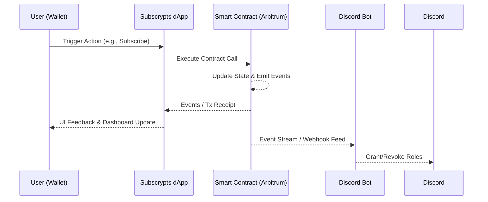

# Access Control & Outputs

Access control in the [**Subscrypts dApp**](https://app.subscrypts.com) is intentionally **open and transparent**:

- On the **blockchain level**, all externally owned accounts (EOAs) have the **same base access** to read data and call public functions.
- Only a **small set of administrative functions** is restricted by smart contract modifiers such as `onlyOwner`, `onlyServiceAccounts`, or `onlySelfProxy`.
- On the **dApp level**, the UI may present **personalized views** (for example, “My Subscriptions” or “My Plans”) based on the connected wallet, but the **underlying data is still publicly readable** by anyone via events and view functions.

This page explains:

- How on-chain permissions really work in Subscrypts.
- How the dApp presents tailored views **without creating private data silos**.
- How events and responses drive UI feedback and integrations like the Discord Bot.

---

## Open-by-Default Access Model

Unlike traditional platforms where access is tightly bound to centralized roles and accounts, Subscrypts is built on **public smart contracts** on **Arbitrum One**:

- Any address can:
    - Read plans and subscriptions via view functions.
    - Listen to events and reconstruct history (plans, subscriptions, payments).
    - Call public functions such as `planCreate(...)`, `subscriptionCreate(...)`, and the various `get*` view functions.
- The **same on-chain information** is visible to everyone, whether they are:
    - A subscriber.
    - A plan creator.
    - A third-party analytics provider.
    - A bot or integration.

The terms **“Subscriber”** and **“Merchant”** in this documentation are **conceptual roles** used to describe typical behavior:

| Conceptual Role | What it means on-chain                                                       |
| --------------- | ---------------------------------------------------------------------------- |
| **Subscriber**  | Any address that holds one or more subscription records.                    |
| **Merchant**    | Any address that has created plans or receives subscription payments.       |
| **Integrator**  | Any address reading data or calling public functions for tooling/integrations. |
| **Admin / Service Account** | Addresses that are explicitly authorized by modifiers like `onlyOwner` or `onlyServiceAccounts`. |

> 🔍 **Important:** There is **no special “merchant role”** enforced by the smart contract. A “merchant” is simply an address that created subscription plans and collects payments.  
> The only **true on-chain privilege distinction** is between normal addresses and those configured as **owner** or **service accounts**.

---

## Smart Contract Permission Layers

The Subscrypts contracts follow a **minimal, explicit permission model**:

- **Most functions** are public and callable by **any address**.
- A **limited set of sensitive functions** is guarded by modifiers like:
    - `onlyOwner`
    - `onlyServiceAccounts`
    - `onlySelfProxy`

### Public Functions

Examples of functions callable by **any address** (subject to general contract conditions):

- Plan and subscription lifecycle:
    - `planCreate(...)`
    - `subscriptionCreate(...)`
    - `subscriptionGift(...)`
    - `subscriptionRecurringCHG(...)`
    - `subscriptionCollect(...)`
    - `subscriptionCollectByAddress(...)`
    - `subscriptionCollectByPlan(...)`
- Viewing and analytics:
    - `getPlan(...)`
    - `getPlans(...)`
    - `getSubscription(...)`
    - `getSubscriptionsByAddress(...)`
    - `getSubscriptionsByPlan(...)`
- USDC payment helpers:
    - `quoteUsdcForSubs(...)`
    - `paySubscriptionWithUsdc(...)`
- Conversion helpers:
    - `convertOtherCurrencyToToken(...)`
    - `convertTokenToOtherCurrency(...)`

Any wallet, script, or service can use these functions; the protocol’s rules are enforced via **business logic**, not via per-user access roles.

---

### Guarded / Administrative Functions

A smaller set of functions **modifies global configuration or internal wiring** and is guarded by explicit modifiers. These functions are still *publicly callable at the EVM level*, but will revert unless the caller is an authorized address.

Examples (non-exhaustive):

- **Governance & configuration** (guarded by `onlyServiceAccounts`):
    - `planGoveranceCHG(...)`
    - `dexGovernanceCHG(...)`
    - `setHaltStates(...)`
    - `planChange(...)`
    - `planChangeSubscriptionsBulk(...)`
    - `subscriptionCollectPassiveCHG(...)`
    - `contractSanctionsContractCHG(...)`
- **Treasury & owner-level settings** (guarded by `onlyOwner`):
    - `contractFundAddressCHG(...)`
    - `contractServiceAccountsCHG(...)`
    - `setFacetAdmin(...)`
    - `setFacetSubscription(...)`
    - `setFacetView(...)`
    - `setFacetPaymentUsdc(...)`
    - `setProxyLogicAddress(...)`
- **Internal / proxy operations** (guarded by `onlySelfProxy`):
    - `subscriptionPayExternal(...)` (internal wiring for proxy/logic calls).

> 🔒 These modifiers **do not distinguish** between “subscriber” and “merchant” in a business sense.  
> They only distinguish **normal addresses** from **protocol-level accounts** (owner and service accounts) to protect critical configuration and upgrade paths.

If a restricted function is called by an unauthorized address:

- The transaction **reverts**.
- The dApp surfaces a clear error message when the call originated through its UI.

---

## dApp-Level Views vs. On-Chain Transparency

The [Subscrypts dApp](https://app.subscrypts.com) may present **personalized pages** such as:

- **My Subscriptions** – subscriptions where the connected wallet address is the `subscriber`.
- **My Plans** – plans where the connected wallet is the merchant / plan creator.
- **My Payments** – transaction history filtered by the connected address.

However, this personalization is **purely a UI convenience**:

- It is based on filtering **public on-chain data** for the connected wallet.
- The same underlying data can be:
    - Retrieved by **any other address** via `FacetView` functions.
    - Reconstructed by listening to **events** like `_subscriptionCreate`, `_subscriptionPay`, and `_subscriptionStop`.

There is **no private storage** and no hidden subscription data:

- Plans, subscriptions, renewals, and payments are all on-chain.
- Anyone can build their own dashboard or explorer using the same data.

> 🧠 In other words: the dApp may show **“your view on global data”**, not **“your private data”**.  
> Personalization is UX, not a permission boundary.

---

## Visual Output and Feedback

Every user action in the dApp results in **real-time feedback**, whether it succeeds or fails. This feedback combines:

- The **wallet UI** (signing / gas confirmation).
- The **transaction status** on Arbitrum.
- The **events** emitted by the contracts.

### Transaction Flow Feedback

1. **Pending:** The dApp shows something like “Waiting for wallet confirmation…” while your wallet displays the signing request.
2. **Broadcasted:** After signing, the dApp shows a transaction hash with a link to [Arbiscan](https://arbiscan.io).
3. **Confirmed:** On successful inclusion in a block, the dApp displays a success message and updates the relevant views (plans, subscriptions, etc.).
4. **Failed:** If the transaction reverts, the dApp presents a clear error message based on the revert reason.

> ⚡ Each call made through the dApp includes a **clickable transaction hash**, making it straightforward to inspect the underlying transaction and events on Arbiscan.

### Example UI Messages

| Status     | Example Message                                         |
| ---------- | ------------------------------------------------------- |
| ✅ Success  | *Subscription created successfully. View on Arbiscan →* |
| ⚠️ Warning | *Auto-renew is already enabled for this subscription.*  |
| ❌ Error    | *Transaction reverted: not enough balance to renew.*    |
| ⏳ Pending  | *Awaiting wallet confirmation…*                         |

---

## Event-Driven Outputs

Subscrypts uses an **event-driven architecture**: every important state change emits an event that can be:

- Rendered in the dApp.
- Consumed by the **Subscrypts Discord Bot**.
- Indexed by external explorers or analytics tools.

### Core Subscription and Plan Events

| Event                    | Description                                                | Typical Use in dApp                                |
| ------------------------ | ---------------------------------------------------------- | -------------------------------------------------- |
| `_planCreate`            | A new plan was created.                                    | Adds plan to overview pages and merchant views.    |
| `_subscriptionCreate`    | A subscription was created or gifted.                      | Updates subscriber and merchant dashboards.        |
| `_subscriptionPay`       | A subscription payment (initial or renewal) was processed. | Updates payment history and revenue summaries.     |
| `_subscriptionRecurring` | Recurring / auto-renew configuration changed.             | Updates UI switches for recurring status.          |
| `_subscriptionStop`      | A subscription has been stopped or failed to renew.        | Marks subscription as inactive in UI.              |
| `subscriptionPaidWithUsdc` | A subscription was settled via USDC + Uniswap + Permit2. | Shows USDC-based settlement details to integrators. |

### Governance and Configuration Events

| Event                           | Description                                      | Typical Consumer                      |
| --------------------------------| ------------------------------------------------ | ------------------------------------- |
| `PlanGovernanceChanged`         | Plan creation / verification / commission updated. | Admin dashboards, auditors.          |
| `DexGovernanceChanged`          | DEX routing and pricing configuration updated.   | Integrators, price tools.            |
| `HaltStatesChanged`             | Halt flags toggled for different protocol areas. | Monitoring, incident response.       |
| `ContractFundAddressChanged`    | Treasury / fund address changed.                 | Accounting, protocol analytics.      |
| `ContractSanctionsChanged`      | Sanctions checks and contracts updated.          | Compliance-oriented tooling.         |

### Off-Chain Synchronization (Discord Integration)

The **[Subscrypts Discord Bot](https://discord.onsubscrypts.com)** listens to the same events through a secure pipeline:

- **Grant Roles:**  
    When `_subscriptionCreate` or `_subscriptionPay` is observed for a user tied to a Discord account, the bot can grant them access or a premium role.
- **Revoke Roles:**  
    When `_subscriptionStop` is emitted, the bot can remove roles and access automatically.

This keeps Discord server access in sync with **on-chain subscription state**.

---

## Diagram: Event Flow from Chain to UI and Discord



> The same events power **multiple consumers**: the dApp, the Discord Bot, and any external indexer or analytics system.

---

## Security Considerations

Even though **data access is open**, Subscrypts still enforces clear boundaries for **who can change what**:

* **Non-Custodial:**
  The dApp never stores private keys or seeds. All signatures happen in the user’s wallet.
* **Explicit Modifiers:**
  Sensitive functions (governance, wiring, sanctions, treasury) use modifiers like `onlyOwner` and `onlyServiceAccounts` to prevent unauthorized configuration changes.
* **Event Verification:**
  Off-chain systems rely on **signed events from the deployed contracts**, not on arbitrary off-chain messages.
* **Rate Limiting & Safety:**
  Integrations like the Discord Bot implement rate-limiting and safety checks to avoid spam and misuse, even when watching very active events.

Because storage, configuration, and transactions are entirely on-chain and public, **anyone** can verify what has happened, who changed what, and when.

---

## Developer Tip: Open Data, Custom Views

Developers, merchants, and third parties can build **their own views** on top of Subscrypts by listening to the same events and calling the same view functions as the dApp:

```javascript
// Example: listen to subscription creation events
contract.on('_subscriptionCreate', (subscriptionId, subscriber, planId, timestamp, event) => {
    console.log(`New subscription ${subscriptionId} by ${subscriber} on plan ${planId} at ${timestamp}`);
});
```

With this approach you can:

* Build custom dashboards.
* Integrate subscriptions into CRMs or analytics tools.
* Run independent monitoring for your own business logic.

For event signatures, topics, and struct layouts, see the
[Subscrypts ABI Reference](../smart-contract/11-abi-reference.md).

---

## Summary

| Layer              | What It Controls                                     | How It Works                                                           |
| ------------------ | ---------------------------------------------------- | ---------------------------------------------------------------------- |
| **Smart Contract** | Who can change protocol configuration and wiring     | Open-by-default functions; admin-only functions guarded by modifiers.  |
| **On-Chain Data**  | Visibility of plans, subscriptions, and payments     | Fully public via events and `FacetView` read functions.                |
| **dApp Interface** | How data is presented to a specific connected wallet | Personalized filtering (e.g., “My Subscriptions”), no private storage. |
| **Integrations**   | Off-chain reactions to on-chain changes              | Subscribe to events (`_subscriptionCreate`, `_subscriptionPay`, etc.)  |
| **Discord Bot**    | Role assignment based on subscription status         | Listens to events and updates Discord roles accordingly.               |

---

## What’s Next

Continue to [Future Direction](09-future-direction.md) to explore how the Subscrypts dApp will continue to evolve as the main UI layer for all subscription, analytics, and PSP-style features.

For related documentation:

* [Subscrypts Homepage](https://subscrypts.com)
* [Smart Contract Functions](07-smart-contract-functions.md)
* [MiCAR Whitepaper](https://subscrypts.com/whitepaper)
