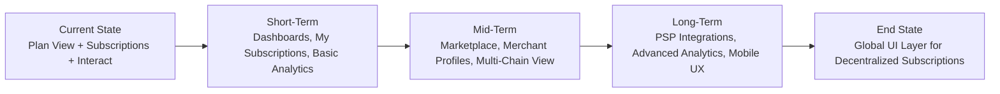

# Future Direction

The [**Subscrypts dApp**](https://app.subscrypts.com) is evolving from an early-stage, transaction-focused Web3 interface into a **complete operational hub** for on-chain subscriptions.

Today, the dApp already lets users:

- Browse and inspect on-chain plans.
- Subscribe using **SUBS** or **USDC** (via Permit2 + Uniswap).
- Create plans as a merchant.
- Interact directly with the protocol via the **Interact** page.
- Connect access control to Discord via the **Subscrypts Discord Bot**.

In the next phases, it will grow into the primary **UI layer** for the Subscrypts ecosystem — covering **operations, analytics, reporting, and integrations** — while preserving the core properties established in the protocol and smart contract documentation:

- **Non-custodial and permissionless** at the smart contract level.
- **Open-by-default data access**, with personalization only at the UI layer.
- **On-chain transparency** aligned with the [MiCAR-focused whitepaper](https://subscrypts.com/whitepaper).

---

## The Vision Ahead

At a high level, the future Subscrypts dApp is intended to function as:

- A **merchant cockpit** for plans, subscribers, and protocol-driven revenue.
- A **subscriber portal** for viewing and managing subscriptions across multiple merchants.
- A **payment and conversion interface** bridging SUBS, USDC, and (eventually) additional assets and networks.
- A **data and analytics surface** that turns raw on-chain events into understandable business metrics.

Everything remains **backed by the Smart Contract Suite** documented in the smart contract section, while the dApp becomes the main human-facing layer that makes those capabilities accessible to non-technical users.

For background, see:

- [Smart Contract Suite – Introduction](../smart-contract/01-introduction.md)  
- [Subscrypts Overview](../subscrypts/01-introduction.md)  

---

## Short-Term Roadmap (v1.x → v2.x)

Short-term work focuses on expanding what already exists in the current dApp (as described in `02–08`), and giving it the UX polish needed for day-to-day use.

### 1. UX & Interface Improvements

Planned enhancements include:

- More refined **responsive layouts** for both desktop and mobile.
- Clearer **step-by-step flows** for actions like `subscriptionCreate()` and `paySubscriptionWithUsdc()`, including progress indicators and contextual explanations.
- Improved **wallet connection UX**:
  - Better messaging for unsupported browsers vs. Web3-enabled browsers.
  - Smoother reconnect behavior when users switch accounts or networks.

These improvements build directly on the patterns described in  
[Wallet Connection](05-wallet-connection.md) and [User Experience](03-user-experience.md).

---

### 2. “My Subscriptions” – Subscriber Dashboard

Today, the underlying smart contracts already expose all subscription data via `FacetView` (for example, `getSubscriptionsByAddress()` and `getSubscription()`). Short-term dApp work will turn this into a complete **My Subscriptions** view, including:

- List of **active and inactive subscriptions** tied to the connected wallet.
- **Next billing date**, remaining cycles, and current recurring state.
- One-click **auto-renew toggles** via `subscriptionRecurringCHG()`.
- Direct links to **Arbiscan** for each `_subscriptionCreate` and `_subscriptionPay` event.

> These features are explicitly marked as **roadmap** items in  
> [Current Capabilities](02-current-capabilities.md) and [User Experience](03-user-experience.md) and will be surfaced via richer dashboards rather than new protocol logic.

---

### 3. Expanded Merchant Dashboard

On-chain, merchants already have all the information they need via view calls like `getSubscriptionsByPlan()` and `_subscriptionPay` events. Short-term dApp work will make these **business-facing**:

- **Per-Plan Views**:
  - Active subscribers count.
  - Basic volume indicators (e.g., total payments, last payment).
- **Subscriber Tables**:
  - Wallet address, recurring status, total paid, last payment, and next payment.
- Early-stage **export options** (CSV/JSON) for accounting and external analytics.

> In the existing docs, advanced revenue analytics and exports are flagged as **planned roadmap** features (see [Merchant Features](04-merchant-features.md)).  
> The goal here is to implement those in a way that stays faithful to the open-data, on-chain-first model described in [Access Control & Outputs](08-access-control-and-outputs.md).  

---

### 4. Notifications & Status Indicators

The protocol already emits events such as `_subscriptionPay`, `_subscriptionStop`, and `_subscriptionRecurring`. The short-term dApp roadmap is to surface these more clearly, without changing the underlying on-chain behavior:

- **In-dApp notifications** for:
  - Successful payments and renewals.
  - Failed renewals or stopped subscriptions.
- **Visual status indicators** in the dashboards for:
  - “Due soon”, “Stopped”, “Recurring off”, etc.
- Tighter UI hooks to the [Subscrypts Discord Bot](https://discord.onsubscrypts.com) so merchants can see how events affect Discord roles in real time.

> All renewal logic remains fully on-chain and permissionless, triggered via `subscriptionCollect()`, `subscriptionCollectByAddress()`, `subscriptionCollectByPlan()`, and optional passive collection hooks, as described in [Smart Contract Functions](07-smart-contract-functions.md).  
> The dApp’s role is to **visualize and guide**, not to centralize or replace these flows.

---

### 5. Interact Page Enhancements

The [Interact Page](06-interact-page.md) already exposes full ABI-driven control. Planned improvements include:

- Clearer grouping of functions by facet and purpose (Subscription, Payments, Admin, View).
- More contextual **helper text** describing parameters and expected outputs.
- Lightweight **presets** for common advanced actions (for example, “Bulk renewal window” or “Quote USDC for SUBS amount”).

---

## Mid-Term Roadmap (v2.x → v3.x)

Once the core dashboards and UX flows are mature, the focus shifts to expanding the dApp’s reach and making it the canonical discovery and management surface for the protocol.

### 1. Subscription Marketplace & Discovery

The contracts already support multiple merchants and plans; mid-term work is to unify this into a **marketplace-like experience**:

- A searchable, filterable **global plans directory**:
  - Categories such as Gaming, SaaS, Communities, Media, and Services.
  - Sorting by price, billing frequency, or popularity.
- Rich **plan detail pages**:
  - Merchant profile badges and verification information.
  - Clear breakdown of billing model (SUBS vs USD-pegged, frequency, referral bonus).
- Optional tags and metadata aligned with future MiCA-compliant reporting.

All data continues to come from `FacetView` and on-chain events — the dApp simply organizes it for discovery.

---

### 2. Merchant Profiles & Configuration

Mid-term enhancements will give merchants a more recognizable presence in the dApp:

- **Merchant profile pages**:
  - Publicly visible information derived from on-chain data, with optional off-chain descriptions/logo.
- **Integration settings**:
  - Discord Bot configuration inside the dApp (server IDs, role mappings).
  - Webhook endpoints or API keys for external systems (where appropriate).
- Optional structured data for **tax or invoicing metadata**, aligned with the [Subscrypts MiCAR Whitepaper](https://subscrypts.com/whitepaper).

---

### 3. Analytics Layer

Building on the event-driven architecture described in [Access Control & Outputs](08-access-control-and-outputs.md), the mid-term goal is to provide:

- **Per-merchant dashboards**:
  - Subscription counts over time.
  - Renewal vs. churn percentages.
  - Aggregate payment volume (SUBS and USDC-equivalent).
- **Subscriber-side insights**:
  - Historical list of what has been paid, where, and when (without changing the open access model).
- Optional **export tools** (CSV/JSON) for both merchants and users.

These features take the roadmap notes in [Current Capabilities](02-current-capabilities.md) and [Merchant Features](04-merchant-features.md) and turn them into concrete, navigable sections within the dApp.

---

### 4. Multi-Chain & Asset Support

In line with the broader protocol vision, the dApp roadmap includes:

- **Multi-network support** for additional EVM chains (for example, Base, Polygon, Optimism), once the Smart Contract Suite is deployed there.
- Integrated views to manage subscriptions across chains:
  - “All chains” and per-network filters.
- UI for handling **bridged SUBS** variants where applicable, while keeping the user experience consistent.

Any such expansion will mirror the smart contract deployment strategy described in  
[Smart Contract Suite – Future Development](../smart-contract/16-future-development.md).

---

## Long-Term Vision (v3.x → Beyond)

Longer term, the dApp aims to become the main entry point for **subscription-based payments** across Web3 and Web2 contexts.

### 1. PSP-Style Integrations and Merchant Tooling

- SDKs and **plug-and-play widgets** merchants can embed in their own sites, backed by the same dApp contracts and UX paradigms.
- Simple onboarding paths for Web2 merchants (for example, “Connect your wallet, configure plans, drop this button/widget on your site”).
- Bridges between on-chain subscriptions and Web2 billing systems in a **compliance-aware** way.

---

### 2. Advanced Analytics & Proof-of-Revenue

- Historical charts and **time-series metrics** based on on-chain events.
- Exportable, verifiable **Proof-of-Revenue (PoR)** views for merchants, aligned with the transparent, on-chain nature of the protocol.
- Optional predictive analytics (for example, projected recurring revenue) built on top of actual subscription history.

All of this is driven by the open events summarized in [Smart Contract Functions](07-smart-contract-functions.md) and [Access Control & Outputs](08-access-control-and-outputs.md).

---

### 3. Decentralized Merchant Discovery & Reputation

As usage grows, the dApp can provide:

- Protocol-level indicators (for example, age of merchant, total subscribers, payment history) that help users make informed choices.
- Community-driven or DAO-like mechanisms to highlight reputable merchants and flag problematic behavior (while still keeping contracts open and permissionless).
- Stronger incentive programs and referral UI built on the existing `referralBonus` and `subscriptionGift()` logic.

---

### 4. Mobile and Multi-Device Experience

While the current dApp already supports mobile Web3 browsers (see [Wallet Connection](05-wallet-connection.md)), the long-term vision includes:

- A **PWA-style experience** for quick access from home screens.
- Tight integration with mobile Web3 browsers and wallets (MetaMask Mobile, Brave, Trust, Rainbow, Opera Crypto Browser).
- Deeper use of **push notifications** (where compatible) for renewal reminders, payment confirmations, and expiring subscriptions — still rooted in on-chain events.

---

## Design Principles Going Forward

Throughout its evolution, the Subscrypts dApp will continue to follow the same principles that guide the broader project:

- **Privacy-Respecting:**  
  No accounts, emails, or passwords — the wallet address remains the only identity anchor.

- **Non-Custodial & Open:**  
  All value movement and subscription state live in the **Smart Contract Suite** on Arbitrum (and future networks). The dApp visualizes what the chain already guarantees.

- **Compliance-Aware:**  
  UI and analytics features will align with the regulatory framing from the [MiCAR Whitepaper](https://subscrypts.com/whitepaper), especially for EU-focused merchants.

- **Developer-Friendly & Extensible:**  
  Everything exposed in the dApp is backed by public ABI-defined functions and events; integrators can always build alternative dashboards or tools using the same data.

---

## Diagram: Evolving Role of the Subscrypts dApp

> The dApp is not just “a frontend” — it is the **primary human interface** to a fully on-chain, permissionless subscription protocol.

---

## Beyond the dApp: Ecosystem Synergy

The dApp will continue to evolve in lockstep with the rest of the Subscrypts ecosystem:

* **Smart Contract Upgrades**
  New facets and logic (documented in [Smart Contract Suite – Future Development](../smart-contract/16-future-development.md)) will be surfaced in a user-friendly way through the dApp and the Interact page.

* **Discord Bot & Integrations**
  Enhanced configuration screens, logs, and test tools to make event-driven role management easier for non-technical community managers.

* **Third-Party Tools**
  Documentation and UI hints aimed at encouraging external explorers, dashboards, and CRMs to integrate directly with the Subscrypts ABI and event stream.

---

## Summary

| Phase      | Focus Area                                    | Expected Outcomes                                      |
| ---------- | --------------------------------------------- | ------------------------------------------------------ |
| Short-Term | Dashboards and UX improvements                | My Subscriptions, richer merchant views, clearer flows |
| Mid-Term   | Marketplace, profiles, analytics, multi-chain | Discovery layer, protocol-wide visibility              |
| Long-Term  | PSP-style tooling, advanced analytics, mobile | Full-featured UI layer for decentralized subscriptions |

---

## Closing Thoughts

The **Subscrypts dApp** is the gateway where merchants, creators, subscribers, and integrators meet the **Subscrypts Smart Contract Suite**. Each roadmap step brings it closer to being the **default UI layer** for on-chain subscriptions — one that is open, verifiable, and powerful enough to support both Web3-native and Web2-bridged business models.

For related reading:

* [Subscrypts Homepage](https://subscrypts.com)
* [MiCAR Whitepaper](https://subscrypts.com/whitepaper)
* [Smart Contract Suite – Future Development](../smart-contract/16-future-development.md)
* [Smart Contract Functions](07-smart-contract-functions.md)
