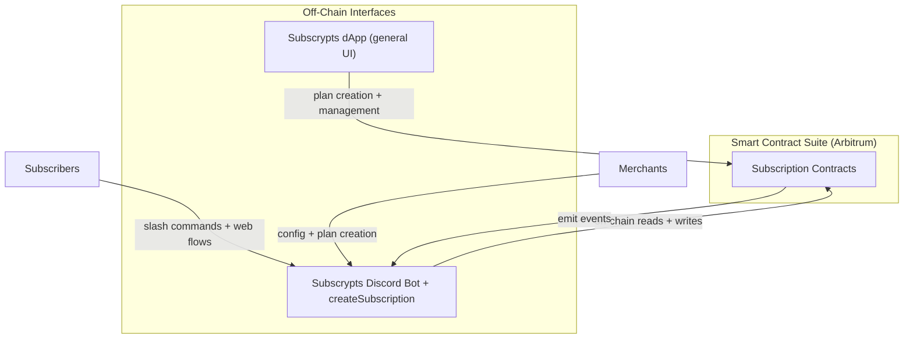

# Subscrypts Discord Bot – Introduction

The **[Subscrypts Discord Bot](https://discord.onsubscrypts.com)** is the Application Layer of the Subscrypts ecosystem — a public-facing tool that connects subscription-based blockchain logic directly to user access within Discord. It enables server owners to offer premium access tiers to members through verified, smart contract-based subscriptions on Arbitrum.

This bot allows any Discord community to operate as a **decentralized membership platform**, where access control, subscription validation, and premium roles are all enforced automatically — without relying on third-party payment processors or fragile integrations.

The **[Subscrypts Discord Bot](https://discord.onsubscrypts.com)** exposes its own HTTPS endpoints and lightweight web flows. Some of these endpoints add Discord-specific context — such as per-guild `createSubscription` links and wallet-link pages — to improve UX, but at their core they all **read from and write to the same Subscrypts smart contract suite on Arbitrum**.

The bot works in tandem with the **[Subscrypts dApp](https://app.subscrypts.com)**, which offers a more general interface and advanced tools for merchants and integrators across channels. However, Discord server owners can manage their **entire Discord integration purely through the bot and its own web flows** if they prefer; using the dApp is optional for Discord-only setups.

Together, the **[Subscrypts Discord Bot](https://discord.onsubscrypts.com)** and **[Subscrypts dApp](https://app.subscrypts.com)** form a composable access layer on top of the same smart contract suite, while the **blockchain remains the single source of truth**.

---

## What Is It?

The **[Subscrypts Discord Bot](https://discord.onsubscrypts.com)** is a **multi-tenant, smart-contract-aware automation bot** operated and maintained by Subscrypts. A single, centrally hosted instance serves **many guilds (servers)** at once. Server owners simply **add the bot** to their Discord; no self-hosting or custom deployment is required. The bot bridges **on-chain subscription state** with Discord’s roles/permissions and provides a small set of web experiences for actions that don’t fit inside the Discord client.

It uses a two-part architecture:

* **Bot logic** — Handles slash commands (e.g., `/subs link`, `/subs status`, `/subs-admin map`) and performs real-time role management per guild based on verified on-chain state. Permissions are scoped to each guild; admins can manage only their own server’s mappings and roles.
    - **Event bridge & sync** — Receives blockchain events and internal webhooks, then **assigns/revokes roles** in the correct guild with minimal delay.
* **Internal webserver** — A **multi-tenant** embedded server that exposes APIs and serves **per-guild, per-user** webpages:
    - **Dedicated create-subscription page (Discord-native entry)** — A per-guild URL such as `https://discord.onsubscrypts.com/createSubscription?guildId={guild.id}` that lets Discord admins create **Subscrypts subscription plans** directly for their server. When a plan is created via this URL, the **[Subscrypts Discord Bot](https://discord.onsubscrypts.com)** is notified and posts the newly created plan details to `#subscrypts-admin` for later reference.
    - **Personalized wallet-link pages** — Time-limited, signed deep links that let a member securely connect a wallet for a **specific guild**. Supports signature-based authentication. The bot receives a signed proof — no private keys are handled or stored.
    - **Per-guild subscription page** — Shows **only** the plans offered by that guild. Members can subscribe, renew, or toggle renewal for that community without leaving the flow.
    - **Simplified swap page (USDC ↔ SUBS)** — A lightweight swap to help members quickly obtain the tokens needed for subscriptions on Arbitrum.

**SaaS tenancy & isolation:**

* One bot instance serves multiple guilds, but **state and actions are isolated per guild** (e.g., plan→role mappings, admin scopes, audit messages).
* Endpoints are **namespaced** and verified with signed tokens that include `guildId`, `userId`, and short expiries.
* The service uses strict permission scopes to prevent cross-guild access or leakage.

> The **[Subscrypts Discord Bot](https://discord.onsubscrypts.com)** and its internal web pages can operate independently of the **[Subscrypts dApp](https://app.subscrypts.com)**, yet integrate smoothly with it for discovery, non-Discord subscriptions, and advanced management.

---

## Who Is It For?

The **[Subscrypts Discord Bot](https://discord.onsubscrypts.com)** is designed for two audiences:

* **Merchants (Discord server owners)** — who want to monetize access to channels, resources, or premium communities using non-custodial, decentralized subscriptions.
* **Subscribers (Discord members)** — who want a frictionless way to unlock benefits in a community they’ve joined — using their crypto wallet and without giving up privacy.

By connecting these two sides, the bot removes the need for spreadsheets, ad hoc bot roles, Patreon, or manual member vetting. Everything becomes automated and provable.

---

## Key Features

* 🔗 **Wallet Linking** – Users verify wallet ownership via signed messages — no passwords, emails, or custodianship.
* 🛡️ **Access Control** – Roles are granted or revoked in real time based on the user’s subscription status on-chain.
* ⚙️ **Admin Flows** – The **Admin Guide** in `#subscrypts-admin` and `/subs-admin` commands allow merchants to create plans (via `createSubscription`), link roles to plans, configure behavior, and manage subscribers.
* 🔄 **Real-Time Syncing** – Expired subscriptions trigger role removal, while renewals restore access without admin involvement.
* 📦 **Multi-plan Support** – Multiple tiers can be mapped to different roles, supporting everything from VIPs to beta testers.

---

## Ecosystem Integration

The **[Subscrypts Discord Bot](https://discord.onsubscrypts.com)** is part of the broader Subscrypts architecture, which includes the **[Subscrypts dApp](https://app.subscrypts.com)** and the on-chain smart contract suite on Arbitrum:

For Discord guilds, the **recommended plan-creation path** is the `createSubscription` endpoint surfaced by the **[Subscrypts Discord Bot](https://discord.onsubscrypts.com)** (and linked from `#subscrypts-admin`). The **[Subscrypts dApp](https://app.subscrypts.com)** offers a more general-purpose interface and is ideal for non-Discord use cases or advanced lifecycle management, but it is **not required** for Discord-only setups.

The bot reads directly from Arbitrum contracts, requiring no separate backend to store or validate subscription data. It listens to events like `_subscriptionPay` or `_subscriptionStop`, allowing it to reflect status changes with complete trustlessness.

**Performance note – smart caching without compromising correctness:**
To reduce unnecessary RPC calls and improve responsiveness, the Discord integration may employ **ephemeral, non-authoritative caches** (e.g., short-lived caches for guild plan metadata, role mappings, or recent subscription lookups). These caches:

* Use **tight TTLs** and **event-driven invalidation** (e.g., on `_subscriptionPay`/`_subscriptionStop`, mapping changes, or manual refresh).
* Are **scoped per guild** to preserve SaaS multi-tenancy isolation.
* **Never mutate subscription state** or override on-chain truth — all grant/revoke decisions are confirmed via **authoritative on-chain reads**.

This approach improves throughput, rate-limit headroom, and UX snappiness, while the **blockchain remains the single source of truth** for all subscription states.

> Learn more in [Architecture & Integration](03-architecture-and-integration.md).

---

## Why It Matters

Before Subscrypts, Discord monetization was handled through centralized platforms like Patreon, Ko-fi, or Gumroad — all of which rely on credit cards, middlemen, and trust-based gating. These models are:

* Prone to chargebacks and fraud
* Not privacy-preserving
* Unusable for many crypto-native or unbanked users

The **[Subscrypts Discord Bot](https://discord.onsubscrypts.com)** introduces:

* **Decentralized payments** in SUBS token (see the [Subscrypts Homepage](https://subscrypts.com))
* **On-chain transparency** that’s verifiable by anyone
* **Non-custodial flows** with no user data collection
* **MiCAR-aligned** architecture for EU digital-asset regulations (see the [MiCAR Whitepaper](https://subscrypts.com/whitepaper))

Communities gain full control, subscribers retain sovereignty, and the platform scales globally with zero middlemen.

## Learn More

* [Subscrypts Homepage](https://subscrypts.com)
* [MiCAR-Compliant Whitepaper](https://subscrypts.com/whitepaper)
* [Subscrypts dApp](https://app.subscrypts.com)
* [Subscrypts Discord Bot](https://discord.onsubscrypts.com)

---

Next: [Solution & Use Cases](02-solution-and-usecases.md) → Explore real-world communities using the bot today.
