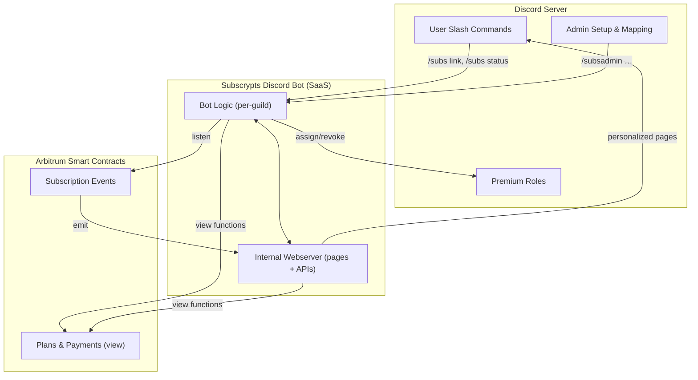
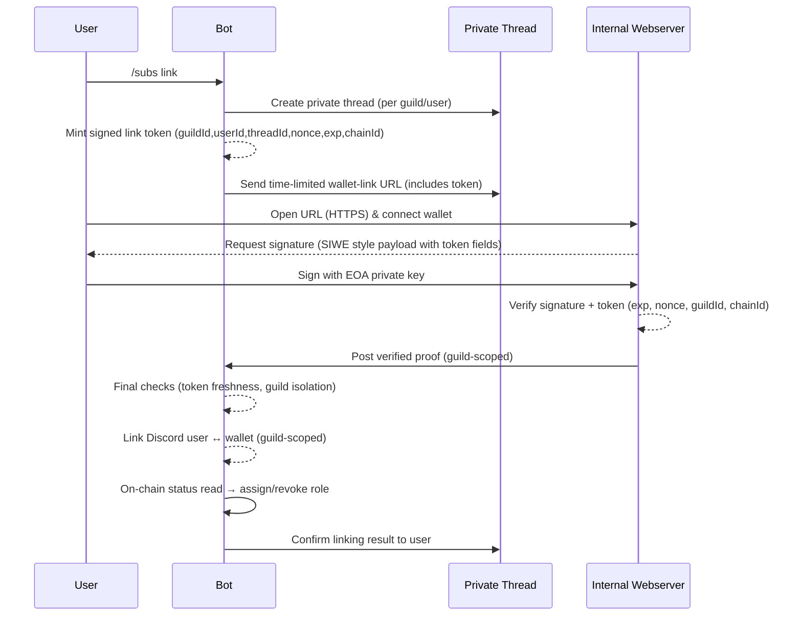

# Architecture & Integration

The Subscrypts Discord Bot (SaaS) consists of **two coordinated components** that run as a single multi-tenant service operated by Subscrypts. One centrally hosted instance manages **many guilds**, while keeping each guild’s configuration and actions isolated.

1. **Discord bot logic** — Handles slash commands, admin setup, and member interactions per guild; performs authoritative reads against the smart contracts; and assigns/revokes roles in the correct guild. It also applies light, short-lived caching for guild metadata and mappings to reduce RPC load and improve responsiveness.
2. **Internal webserver** — Serves **public and personalized pages** for actions that are inconvenient or impossible inside the Discord client:
     * **Per-guild wallet-link pages** (signed, time-limited flows tied to `guildId`/`userId`)
     * **Per-guild subscription page** (only that guild’s subscription plans)
     * **Simplified USDC ↔ SUBS swap** (to acquire tokens needed for subscriptions)

Together, these components enable a **real-time, smart-contract-aware** experience in Discord with a minimal, privacy-preserving web surface.

## High-Level Overview

### Processing model (at a glance)

1. Member runs `/subs link` → bot opens a private thread and issues a signed, short-lived link (scoped to guild/user).
2. User completes the flow via a personalised **authentication link** → webserver verifies the proof and notifies the bot.
3. On subscription create/renew/stop, chain emits events → webserver ingests → bot **verifies on-chain** and **assigns/revokes** roles.
4. Ephemeral caches (guild mappings, recent lookups) reduce RPC calls; **on-chain reads remain the source of truth** before any role change.

---

## Core Integration Points

### Discord Integration

* Built with **Pycord** and Discord's **slash command API**
* Users issue `/subs` commands to:
    * Link wallet
    * View linked accounts
    * Unlink
* Admins use `/subsadmin` commands to:
    * Apply Baseline
    * Apply Starter Template (optional
    * Map plans
    * Assign roles
    * Run guild tests

The bot validates permissions and sends ephemeral responses to prevent spam.

### Smart Contract Integration

* Bot and Webserver fetch data directly from Arbitrum smart contracts.
* No centralized backend or database stores subscription logic — all comes from view calls and events like `_subscriptionPay`, `_subscriptionStop`, etc.
* Uses **on-chain verification only**.

### Webserver Role

* Webserver, embedded within the bot’s process.
* Handles:
    * Periodic on-chain reconciliations
    * Retry logic for failed Discord role assignments
    * Signed link-token generation for secure wallet auth

---

## Wallet Linking Flow

Security model & why it’s designed this way. The sign request and link token are **bound to the specific Discord user and guild**, and are only valid for a short time. This is to protect against a range of threats:

* **Replay protection (nonce + expiry)**: Each token includes a `single-use nonce` and a `short TTL` (e.g., 5 minutes). Once redeemed, it’s invalid forever.
* **Guild & user binding**: Token carries `guildId`, `userId`, and `threadId`, preventing `cross-guild reuse` or impersonation (a token for Guild A is useless in Guild B).
* **Chain binding**: `chainId` and a domain/context string are included in the message so a signature on one network or domain `cannot be replayed` on another.
* **Origin integrity**: The link is served over `TLS` from the official bot webserver; the signed payload follows an `SIWE-style (EIP-4361)` structure with a clear statement of intent, reducing phishing and context-confusion.
* **Bot-verified callback**: The webserver sends a `server-to-server proof` to the bot; the bot re-validates token freshness, guild scope, and signature before linking — mitigating `MITM` and `tampering`.
* **No custodial risk**: Users sign a `message`, not a transaction; `private keys never leave the wallet`. The bot doesn’t handle seed phrases, keys, or funds.
* **CSRF & token theft hardening**: Tokens are short-lived, one-time, and verified against the requesting Discord user/thread; `stolen links are useless` after redemption/expiry.
* **Rate limits & logging**: The web layer applies `rate limiting`, and both sides keep minimal audit logs (token ID, guildId, timestamps) to detect abnormal patterns without storing personal data.

Bottom line: **Only the wallet owner can complete the link**, only **for the intended guild and Discord user**, and the **blockchain remains the single source of truth** before any role change.

---

## Event Listening & Role Updates

Subscrypts Discord Bot uses a **hybrid sync model**: it reacts to **on-chain events** *and* performs **authoritative view reads** from the Subscrypts FacetView to confirm and refresh state. This ensures fast reactions **and** correctness, even if an event is missed or delayed.

**The bot tracks:**

* **New subscriptions** → via events such as `_subscriptionCreate` and `_subscriptionPay`.
* **Expired/failed renewals** → via `_subscriptionStop` and subsequent state checks.
* **Role mappings** → per-guild configuration linking planIds to Discord roles.

**When updates occur (event- or user-initiated), the bot:**

1. Uses **FacetView read functions** to fetch current truth (e.g., plan metadata, subscriber status, expiration timestamps).
2. Optionally reads from a **short-lived, non-authoritative cache** (per guild) to reduce RPC load for repeat lookups; cache entries are tightly TTL’d and **invalidated on relevant events**.
3. Applies or removes roles in the corresponding Discord server **only after** a confirming **authoritative on-chain read**.
4. Posts updates in configured admin channels (if enabled) for transparency.

**Periodic reconciliation:**
In addition to event-driven updates, the bot performs **scheduled reconciliation passes** that re-read FacetView state for recent/active subscribers. This guarantees correctness if:

* An event was dropped or delayed by a relay.
* A transient Discord/API error prevented a role change earlier.
* An admin changed mappings or channel permissions.

> ✅ **Source of truth:** The blockchain—and specifically the **FacetView read functions**—remains authoritative at all times. Caches are **ephemeral hints** for performance and **never** override on-chain verification prior to any grant/revoke action.

---

## Can the Bot Work Without the dApp?

Yes. The **[Subscrypts Discord Bot](https://discord.onsubscrypts.com)** is **fully capable of operating without the** **[Subscrypts dApp](https://app.subscrypts.com)**.

For Discord guilds, the bot exposes its **own HTTPS endpoints and web flows**, including:

- A **guild-aware create-subscription page**  
  `https://discord.onsubscrypts.com/createSubscription?guildId={guild.id}`  
  This lets Discord admins create subscription plans directly for their server. Plans created this way are tied to the correct guild and logged back into `#subscrypts-admin`.

- **Wallet-link and per-guild subscription pages**  
  Members can link wallets, subscribe, renew, and manage auto-renewal from flows initiated by the bot, without ever opening the dApp.

Under the hood, all of these flows simply **read from and write to the Subscrypts smart contract suite on Arbitrum**. The blockchain is the source of truth; the bot and its web endpoints are just one client on top.

The **[Subscrypts dApp](https://app.subscrypts.com)** remains a powerful **alternative interface** for:

- Non-Discord or multi-channel subscription management  
- Advanced/technical operations (e.g., direct contract interactions, analytics, or gifting from a broader dashboard)

But it is **not required** for Discord-only setups. Advanced users can even choose to bypass both UIs and interact **directly with the smart contracts** (e.g., via scripts or other tools) as long as they use compatible functions and then supply the resulting `planId` to the bot for mapping.

---

## Summary

For Discord server owners, the high-level flow is:

1. **Add the bot** to their server.
2. **Create one or more subscription plans** using the Create Subscription link in `#subscrypts-admin`.
3. **Link each plan to one or more roles** using the Admin Guide or `/subs-admin` commands.
4. **Gate channels** behind those roles as desired.

For Discord members, the high-level flow is:

1. **Join the server** as usual.
2. **Link their wallet** with `/subs link` (in a private thread) for that specific guild.
3. **Open the per-guild subscribe link/page**, choose a plan, and confirm the on-chain subscription.
4. **Receive or lose access automatically** as the bot grants or revokes roles based on on-chain status.

To get started as an admin, visit [Getting Started for Admins](04-getting-started-for-admins.md).

To see the user experience, visit [Getting Started for Members](05-getting-started-for-members.md).
