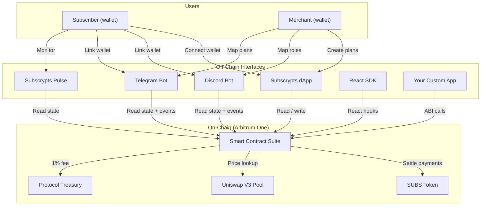

# What is Subscrypts?

**Subscrypts is a blockchain-based subscription management protocol deployed on Arbitrum One (Ethereum Layer 2).** It enables merchants to offer recurring payment services using the **SUBS** ERC-20 utility token, with every payment automated by smart contracts. The protocol requires no personal data, charges only a 1% platform fee, and is aligned with the EU Markets in Crypto-Assets Regulation (MiCAR).

Think of it as **Stripe for Web3** — the same concept of automated recurring billing, but instead of credit cards and bank accounts, payments flow directly between crypto wallets using smart contracts on a public blockchain.

---

## How It Works — In 30 Seconds

1. A **merchant** creates a subscription plan on-chain (e.g., "$10/month for premium access")
2. A **subscriber** connects their wallet and subscribes — one transaction, no personal data
3. The **smart contract** automatically processes payments each billing cycle
4. The merchant receives **99% of each payment** in SUBS tokens; 1% goes to the protocol treasury
5. Integrated services (like the **Discord Bot**, **Telegram Bot**, and **Pulse**) instantly grant or revoke access, or notify you, based on subscription status

That's it. No intermediaries, no chargebacks, no credit card processors.

---

## The Ecosystem

Subscrypts is more than one contract — it's a complete ecosystem for managing subscriptions:

| Component | What It Does |
|---|---|
| **[Smart Contract Suite](../smart-contract/introduction.md)** | On-chain engine for plan creation, payment processing, renewals, and governance. Uses a UUPS proxy with modular facets. |
| **[Subscrypts dApp](../dapp/introduction.md)** | Web interface at [app.subscrypts.com](https://app.subscrypts.com) where merchants create plans and subscribers manage their subscriptions. |
| **[Discord Bot](../discord-bot/introduction.md)** | Multi-tenant bot at [discord.onsubscrypts.com](https://discord.onsubscrypts.com) that automatically grants and revokes Discord roles based on on-chain subscription state. |
| **[Telegram Bot](../telegram-bot/introduction.md)** | Multi-tenant bot at [telegram.onsubscrypts.com](https://telegram.onsubscrypts.com) that automatically manages Telegram group membership based on on-chain subscription state. |
| **[Subscrypts Pulse](../pulse/introduction.md)** | Real-time subscription monitoring PWA at [pulse.subscrypts.com](https://pulse.subscrypts.com) with push notifications, multi-wallet support, and balance tracking. |
| **[React SDK](../sdk/index.md)** | Open-source library (`@subscrypts/subscrypts-sdk-react`) with hooks, components, and wallet connectors for building subscription-powered React apps. |
| **SUBS Token** | ERC-20 utility token on Arbitrum One. Fixed supply of 120 million. Used for all subscription payments and platform settlements. |

---

## Key Numbers

| Metric | Value |
|---|---|
| **Network** | Arbitrum One (Ethereum Layer 2, Chain ID 42161) |
| **Token** | SUBS — ERC-20 utility token, 18 decimals |
| **Total supply** | 120,000,000 SUBS (fixed at Token Generation Event) |
| **Platform fee** | 1% per payment (configurable, max 5%) |
| **Plan creation cost** | ~$0.01 in ETH (gas fee) |
| **Personal data required** | None |
| **Compliance** | MiCAR-aligned (EU Markets in Crypto-Assets Regulation) |
| **Payment methods** | SUBS direct or USDC (atomically swapped via Uniswap V3) |
| **Pricing options** | Fixed SUBS amount or fiat-denominated (USD-pegged via on-chain oracle) |

---

## What Makes Subscrypts Different?

### Compared to Traditional Platforms (Stripe, Patreon, PayPal)

- **1% fee** instead of 2.9% + $0.30 (Stripe) or 5–12% (Patreon)
- **No personal data** — no names, emails, card numbers, or addresses collected
- **No chargebacks** — payments are final and settled on-chain
- **Global access** — anyone with a crypto wallet can subscribe, regardless of country or banking status
- **Instant settlement** — merchants receive funds immediately, not in 2–7 business days
- **Full transparency** — every transaction is verifiable on the public blockchain

### Compared to Other Web3 Solutions

- **Discrete billing cycles** (monthly, quarterly, yearly) rather than continuous token streaming
- **Fiat-denominated pricing** — merchants can price plans in USD while settling in SUBS
- **Community-native integrations** — the only protocol with built-in, multi-tenant bots for both Discord and Telegram community monetization, plus a dedicated subscription monitoring PWA
- **MiCAR compliance** — designed from day one for EU regulatory alignment
- **Non-custodial USDC payments** — subscribers can pay with USDC, which is atomically swapped to SUBS in a single transaction via Permit2 + Uniswap V3

---

## How Payments Work

Subscrypts uses a **burn-and-mint settlement model**:

1. When a subscriber pays, the contract **burns** the required SUBS from their wallet
2. It then **mints** 99% to the merchant and 1% to the protocol treasury
3. This atomic operation means the merchant receives funds in the same transaction — no intermediaries, no delays

For **USD-denominated plans**, the smart contract checks the real-time SUBS/USDC exchange rate from the Uniswap V3 pool and calculates how many SUBS are needed to match the dollar amount.

Subscribers who hold **USDC instead of SUBS** can still pay directly — the contract uses Permit2 for gasless approval, swaps USDC to SUBS via Uniswap V3, and completes the subscription in a single transaction.

---

## Who Is Subscrypts For?

**Merchants and creators** who want to:

- Accept recurring crypto payments with minimal fees
- Monetize Discord and Telegram communities with automated access control
- Reach a global audience without banking restrictions

**Subscribers** who want to:

- Subscribe to services without sharing personal data
- Stay in full control of their payments (cancel anytime, no lock-in)
- Use crypto wallets instead of credit cards

**Developers** who want to:

- Build subscription-powered applications with the React SDK
- Listen for on-chain events to automate access and fulfillment
- Integrate decentralized billing into existing platforms

---

## Next Steps

-   [:octicons-arrow-right-24: **For Subscribers**](for-subscribers.md) — Set up your wallet and subscribe

-   [:octicons-arrow-right-24: **For Merchants**](for-merchants.md) — Start accepting crypto subscriptions

-   [:octicons-arrow-right-24: **For Developers**](for-developers.md) — Integrate the SDK or ABI

-   [:octicons-arrow-right-24: **Tokenomics**](../subscrypts/tokenomics.md) — Dive into the SUBS token model

