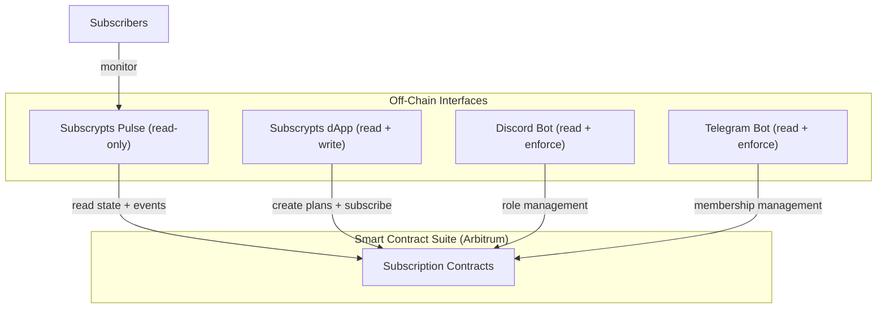

# Subscrypts Pulse -- Introduction

**[Subscrypts Pulse](https://pulse.subscrypts.com)** is a real-time subscription monitoring application for the Subscrypts protocol on Arbitrum One. It provides a dashboard for tracking active subscriptions, monitoring token balances, and receiving push notifications for important events — all from a lightweight, installable Progressive Web App (PWA).

Pulse is designed for subscribers who want **visibility and control** over their on-chain subscriptions without needing to check block explorers or manually track renewal dates.

---

## What Is It?

Subscrypts Pulse is a **read-only monitoring application** that connects to the Subscrypts smart contracts on Arbitrum One and presents subscription data in an easy-to-use interface. It:

* **Monitors subscriptions** — Tracks all subscriptions associated with your wallet addresses
* **Aggregates balances** — Shows your SUBS and USDC balances across multiple wallets
* **Sends push notifications** — Alerts you to payments, expirations, and low balances
* **Works on any device** — Installable as a PWA on iOS, Android, and desktop browsers

Pulse is **custodian-free**: it reads public blockchain data to display your subscription status. It never asks for private keys, seed phrases, or transaction signing. You provide your public wallet address — Pulse does the rest.

---

## Who Is It For?

**Subscribers** who want to:

* See all their Subscrypts subscriptions in one dashboard
* Get notified before a subscription expires so they can renew on time
* Track balances and upcoming payments across multiple wallets
* Monitor subscriptions that gate access to Discord, Telegram, websites, or other services

**Merchants** who want to:

* Monitor subscription activity for their plans
* Track payment events in real time
* Stay informed about subscriber trends

---

## Key Features

* **Dashboard** — Total balance display, active/expiring/expired subscription counts, upcoming payments, and system health indicator
* **Subscription List** — All subscriptions across monitored wallets, filterable by status (active, expired, all)
* **Push Notifications** — Six event types: payment collected, new subscription, subscription stopped, expiring soon, expired, and low balance
* **Multi-Wallet Support** — Monitor up to 20 wallet addresses with optional labels
* **PWA** — Installable on iOS, Android, and desktop without an app store. Works offline with cached data.
* **Notification Preferences** — Per-type toggles, quiet hours, configurable expiry warning thresholds, and low balance alerts
* **Privacy-First** — No private keys, no personal data, complete data erasure on unregister

---

## Ecosystem Integration

Subscrypts Pulse is part of the broader Subscrypts architecture. Unlike the dApp, Discord Bot, and Telegram Bot which can read **and write** to the blockchain, Pulse is **read-only** — it observes subscription state but never initiates transactions.

!!! info "Cross-Platform Monitoring"
    Pulse monitors **all** your Subscrypts subscriptions, regardless of where they were created or what they gate. Whether your subscription unlocks a Discord server, a Telegram group, a website, or all three — Pulse tracks them all from one dashboard.

---

## Why It Matters

Without a dedicated monitoring tool, subscribers need to manually check renewal dates, watch their wallet balances, and remember when to top up their SUBS tokens. A missed renewal means losing access — sometimes without warning.

Pulse solves this by:

* **Proactive notifications** — Get alerted before a subscription expires, not after
* **Balance monitoring** — Know when your SUBS balance is getting low before it affects your subscriptions
* **Centralized visibility** — One dashboard for all your subscriptions across all platforms
* **No app store required** — Install directly from the browser, with fewer permissions than native apps

---

## How It Works

1. **Visit** [pulse.subscrypts.com](https://pulse.subscrypts.com) and complete the onboarding wizard
2. **Add your wallet address** — Pulse only needs your public address (no private keys)
3. **Enable push notifications** — Choose which events you want to be notified about
4. **Monitor** — Pulse continuously tracks your subscriptions and balances, alerting you to important changes

Pulse reads subscription data directly from the Subscrypts smart contracts on Arbitrum. When an on-chain event occurs (payment, expiration, etc.), Pulse detects it and sends you a notification. Scheduled scans run hourly to catch upcoming expirations and low balances.

!!! ecosystem "Subscrypts Ecosystem"
    Pulse is a monitoring companion to the [Subscrypts dApp](../dapp/introduction.md), the [Discord Bot](../discord-bot/introduction.md), and the [Telegram Bot](../telegram-bot/introduction.md). It reads from the same [Smart Contract Suite](../smart-contract/introduction.md) on Arbitrum — the blockchain is the shared source of truth.

---

## Learn More

* [Subscrypts Homepage](https://subscrypts.com)
* [Subscrypts Pulse](https://pulse.subscrypts.com)
* [Subscrypts dApp](https://app.subscrypts.com)

---

## Related Topics

- [Features & Dashboard](features.md) -- Explore the dashboard, subscription list, and balance tracking
- [Push Notifications](notifications.md) -- Configure alerts for payments, expirations, and low balances
- [Installation](installation.md) -- Install Pulse as a PWA on your device
- [Privacy & Data](privacy-and-data.md) -- Custodian-free design and data handling
- [Smart Contract Suite](../smart-contract/introduction.md) -- The on-chain subscription logic Pulse reads from
