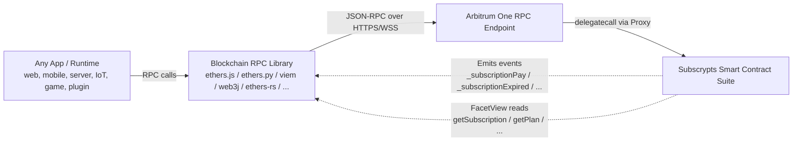

# Platform-Agnostic Protocol

Subscrypts is a **protocol, not a product**. The SUBS token and the Smart Contract Suite deployed on Arbitrum One are the protocol; everything else — the [dApp](https://app.subscrypts.com), the [Discord Bot](https://discord.onsubscrypts.com), the [Telegram Bot](https://telegram.onsubscrypts.com), [Pulse](https://pulse.subscrypts.com), and the [React SDK](../sdk/index.md) — is a *client* of that protocol. This distinction matters. It means Subscrypts is not confined to the integrations Subscrypts itself builds: any application, service, or device that can make JSON-RPC calls to an Arbitrum node can read subscription state, react to events, and transact against the same on-chain source of truth.

---

## The Blockchain Is the Settlement Truth

Every Subscrypts subscription — its plan, its payment history, its `nextPaymentDate`, its active or expired state — lives on-chain, inside the `SubscryptsStorage` of the proxy contract. Every client reconciles against that state. There is no private database, no hidden subscriber list, no off-chain ledger that needs to be synchronized between integrations. What the blockchain says is authoritative.

This has two direct consequences:

1. **Any correct client produces the same answer.** A custom-built Go service running on a private server reading the same `FacetView` functions as the official Discord Bot sees exactly the same subscription state. The protocol does not favour its own clients.
2. **The protocol outlives any particular integration.** If the Subscrypts dApp goes offline tomorrow, every subscription still exists, every `_subscriptionPay` event still fires, every merchant can still be paid, and every third-party integration keeps working. The official tooling is convenience; the protocol is permanent.

---

## Official Integrations as Adoption Accelerators

Subscrypts develops and operates a growing set of first-party integrations. These exist to **accelerate adoption** — to give merchants and subscribers immediate, batteries-included entry points without writing a line of Solidity or Web3 glue code. They are not the only way to use Subscrypts, and they are not intended to be.

| Official Client | What It Offers | What It Trades Off |
|---|---|---|
| **[Subscrypts dApp](../dapp/introduction.md)** | Ready-made web UI for plan creation, subscription management, USDC auto-swap payments | Hosted front-end; fixed UX; a dependency on Subscrypts-operated infrastructure |
| **[Discord Bot](../discord-bot/introduction.md)** | Drop-in Discord role gating based on subscription state | Hosted bot; centralized event listener; fixed command surface |
| **[Telegram Bot](../telegram-bot/introduction.md)** | Telegram group / channel membership gating with single-use invite links | Hosted bot; specific to Telegram's permission model |
| **[Pulse](../pulse/introduction.md)** | Read-only subscription monitoring PWA with push notifications | Read-only by design; opinionated notification UX |
| **[React SDK](../sdk/index.md)** | Hooks, components, and wallet connectors for building React apps against Subscrypts | React-only; opinionated provider model |

Choosing an official integration is the fastest path to production. Choosing to build your own is the most flexible path. The protocol supports both equally.

---

## Build Your Own Middleware

Any runtime that can make JSON-RPC calls to an Arbitrum node can integrate Subscrypts. That includes essentially every modern programming language and every networked environment. The integration ingredients are small and language-agnostic:

1. **The published Subscrypts ABI** — the machine-readable contract interface. See [ABI Reference](../smart-contract/abi-reference.md).
2. **The contract address** — the proxy address on Arbitrum One. See [Deployment](../smart-contract/deployment.md).
3. **An Arbitrum RPC endpoint** — a public or private Arbitrum One JSON-RPC URL.
4. **A blockchain client library** — any library in any language that understands Ethereum-compatible RPC.

The library is a developer preference, not a protocol constraint. Real-world options include:

| Language / Runtime | Library examples |
|---|---|
| **JavaScript / TypeScript (Node, browser, edge)** | ethers.js, viem, web3.js |
| **Python** | ethers.py, web3.py |
| **Rust** | ethers-rs, alloy |
| **Go** | go-ethereum (`go-ethereum/ethclient`) |
| **Java / Kotlin / Android** | web3j |
| **Swift / iOS** | web3.swift |
| **C# / .NET / Unity** | Nethereum |
| **Dart / Flutter** | web3dart |
| **PHP / Ruby / Elixir / etc.** | Various community-maintained Ethereum RPC libraries |

Because the protocol only requires RPC compatibility, the range of places where Subscrypts can land is much wider than the official integrations suggest. Potential integration surfaces include — but are in no way limited to — server-side microservices, REST and GraphQL APIs, mobile apps (iOS, Android, Flutter), game servers (Unity, Unreal, custom), IoT and embedded devices, WordPress and Shopify plugins, in-house merchant dashboards, billing pipelines, analytics tools, CI/CD gating systems, and custom Discord / Telegram / Slack / Matrix bots that go beyond what the official bots offer.

This is the practical meaning of **platform-agnostic**: if it has an internet connection and a usable blockchain library, it can be a Subscrypts integration.

---

## Typical Custom Integration Shape

No code in this page intentionally — the integration patterns, concrete code samples, and event reference live in the materials listed under [Related Topics](#related-topics) at the bottom, and are deliberately centralized there so they stay in one place as the protocol evolves.

---

## One Subscription, Many Platforms

A direct corollary of the platform-agnostic model — and one of the flagship selling features of Subscrypts — is that **a single on-chain subscription can gate access across every platform a merchant integrates, simultaneously**. Because the subscription record is a shared source of truth, every integrated surface reads the same row. One payment unlocks everything the merchant has wired up; one expiration cascades everywhere at once. No cross-system reconciliation, no per-platform subscriber database, no webhook spaghetti.

### Example Scenario

A content creator sells a single **"Premium"** subscription plan on Subscrypts. They wire the same plan into:

- **Their Discord server** — via the official Discord Bot, granting a "Premium" role.
- **Their Telegram channel** — via the official Telegram Bot, granting invite access.
- **Their web app** — via the React SDK, unlocking gated articles and tools.
- **Their iOS and Android apps** — via a custom web3.swift / web3dart integration sharing the same contract reads.
- **Their game server** — via a custom Go service that listens to `_subscriptionPay` / `_subscriptionExpired` events and toggles an in-game cosmetic perk.
- **Their merchant analytics dashboard** — via a custom ethers.js backend reading `getMerchantSubscriptions()`.

A subscriber pays once. All six surfaces recognize them as active in the same block. When the subscription expires — whether through cancellation or a lapsed renewal cycle — all six surfaces revoke access without any synchronization code between them, because they all derive access from the same `nextPaymentDate` on-chain.

This is structurally different from traditional per-platform subscription services. Stripe-based access on a web app, a separate Discord subscription bot, a separate Telegram payment bot, and an in-app purchase on iOS all maintain their own siloed subscriber lists, each with their own billing, fraud, and reconciliation logic. Subscrypts collapses that into a single on-chain row.

For merchants building around multiple platforms, this is not just a technical convenience — it's a fundamentally simpler product. One plan, one subscription, everywhere.

---

## When to Use Official Tools vs. Build Your Own

There is no "correct" choice — each path fits different constraints. Rough guidance:

| Prefer an Official Client When… | Prefer Building Your Own Middleware When… |
|---|---|
| You want the shortest possible time-to-production. | You need a runtime or platform the official clients don't cover (mobile, game server, IoT, custom plugin, backend-only). |
| Your integration surface matches one the official client already targets (Discord role, Telegram group, web dashboard). | You need business logic or UX beyond what the official client exposes. |
| You're comfortable with a Subscrypts-hosted dependency in your stack. | You want zero third-party dependencies in your access-control path. |
| You're happy with the opinionated UX. | You need full control over UX, branding, and failure handling. |
| You don't want to maintain your own RPC endpoint, event listener, or wallet integration. | Your organization already operates blockchain infrastructure and prefers full ownership. |
| Your compliance posture accepts a hosted third-party in the access path. | Your compliance posture requires that access-enforcement code be fully auditable and self-operated. |

A common pattern in practice is **mixing** the two: use the official Discord Bot for community gating, use the React SDK for your customer-facing web app, and write a custom backend listener for your game server or mobile app — all gating against the same subscription.

---

## See This Model In Practice

The Subscrypts **[Discord Bot architecture](../discord-bot/architecture.md)** is the clearest existing example of a correctly written Subscrypts client: it subscribes to events (`_subscriptionPay`, `_subscriptionExpired`, etc.), keeps its own read cache by calling `FacetView`, and uses `nextPaymentDate` as the authoritative signal for access state. A custom middleware targeting any other platform — a game server, a mobile app, a WordPress plugin — follows the same shape, differing only in *what* it does when state changes (assign a role, send a push, unlock a perk, update a database row), not in *how* it derives state from the protocol.

---

## Related Topics

- [For Developers — Integration Paths](../getting-started/for-developers.md) — concrete code examples for React SDK, direct ABI + ethers.js, and event listening
- [ABI Reference](../smart-contract/abi-reference.md) — the full Subscrypts ABI, download link, and supported RPC libraries
- [Smart Contract Core Logic](../smart-contract/core-logic.md) — subscription lifecycle, events, and the `nextPaymentDate` contract every middleware must respect
- [Smart Contract Suite Introduction](../smart-contract/introduction.md) — the on-chain foundation every client reads from
- [Subscrypts Architecture](architecture.md) — on-chain + off-chain component overview
- [Discord Bot Architecture](../discord-bot/architecture.md) — a worked example of a correctly written Subscrypts client

!!! ecosystem "Related Components"
    - [dApp Access Control](../dapp/access-control.md)
    - [SDK Quick Start](../sdk/quick-start.md)
    - [Events & Integrations](../smart-contract/events-integrations.md)
