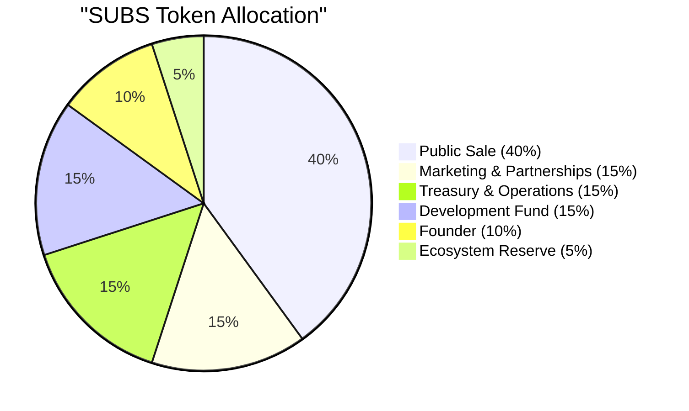

# Tokenomics

## SUBS Token Supply

The total supply of SUBS is **120 million tokens**, all of which were created at the **Token Generation Event (TGE)** when the [Subscrypts](https://subscrypts.com) platform launched. This is the initial and maximum supply unless changed by a future governance decision.

While the token's smart contract includes the technical capability to mint or burn tokens, any such change would require robust multi-signature approval, on-chain governance actions, and regulatory disclosure. No supply changes are planned at launch. For practical and economic purposes, **120 million SUBS represents the fixed supply cap**.

---

## Distribution & Vesting

The 120 million SUBS supply is allocated across multiple stakeholder groups and ecosystem purposes. The distribution model is designed to align long-term incentives, prevent early concentration of tokens, and ensure sustainable ecosystem growth through clearly defined lock-up and vesting schedules.

### Token Allocation

### Allocation Breakdown

**Public Sale (IDO): 40% -- 48.0 million SUBS**
This allocation is offered to the public through the initial DEX offering (IDO) on Uniswap.

* **10% of total supply (12.0 million SUBS)** is unlocked at TGE to provide initial liquidity and circulating supply.
* The remaining **30% (36.0 million SUBS)** vests linearly over **12 months**, releasing approximately **3.0 million SUBS per month**.

This structure ensures early market liquidity while preventing sudden oversupply.

---

**Founder: 10% -- 12.0 million SUBS**
Founder allocation is structured to strongly align long-term incentives with the success of the protocol.

* **2.5% of total supply (3.0 million SUBS)** is unlocked at TGE.
* The remaining **7.5% (9.0 million SUBS)** is locked and vests linearly over **36 months**.

---

**Marketing & Partnerships: 15% -- 18.0 million SUBS**
Allocated for user acquisition, ecosystem growth, and strategic partnerships.

* Locked for **12 months**
* Vests linearly over the following **24 months**

This ensures marketing tokens are deployed gradually and strategically.

---

**Treasury & Operations: 15% -- 18.0 million SUBS**
Reserved for operational expenses including infrastructure, legal, compliance, and ongoing platform maintenance.

* Locked for **12 months**
* Vests over the subsequent **12 months**

---

**Development Fund: 15% -- 18.0 million SUBS**
Dedicated to protocol development, audits, tooling, and long-term feature expansion.

* Locked for **12 months**
* Vests linearly over **24 months**

This allocation ensures sustained funding for technical evolution without short-term pressure.

---

**Ecosystem Reserve: 5% -- 6.0 million SUBS**
A strategic reserve for future ecosystem initiatives, liquidity support, or unforeseen requirements.

* Locked for **12 months**
* Vests over **24 months**

---

### Circulating Supply Overview

Although all **120 million SUBS** are minted at TGE, only approximately **12.5% (15.0 million SUBS)** enter circulation at launch. This consists of:

* **10.0% (12.0 million SUBS)** from the public sale
* **2.5% (3.0 million SUBS)** from the founder allocation

Within the first year, no more than **42.5% (51.0 million SUBS)** will be in circulation. The remaining **57.5%** is released gradually over multi-year vesting schedules.

This controlled emission model is designed to support long-term price stability, ecosystem growth, and responsible market dynamics.

---

## Token Utility

SUBS is a **utility token** that functions as the settlement and access token for subscription services on the [Subscrypts](https://subscrypts.com) platform.

* Subscribers use SUBS to pay for recurring services.
* Merchants receive subscription revenue in SUBS.
* Platform fees are collected in SUBS.

SUBS does **not** represent equity, ownership rights, dividends, or governance voting power. Its value is derived exclusively from **platform usage and demand** for decentralized subscription services.

Future utility extensions (such as loyalty mechanisms or ecosystem incentives) may be introduced only with full transparency and, where applicable, updates to the [whitepaper](https://subscrypts.com/whitepaper).

---

## Why a Custom Settlement Token?

A common and fair question is: *why does Subscrypts use its own token instead of settling directly in USDC or another existing ERC-20?*

The short answer is that SUBS is not a branding exercise — it is an architectural decision that enables a fundamentally different (and safer) payment model than what standard ERC-20 tokens allow. Below are the specific technical reasons, followed by an honest look at the trade-offs.

### Burn-and-Mint with Per-Subscription Authorization

Traditional ERC-20 payment flows require users to call `approve()`, granting a smart contract permission to spend tokens from their wallet via `transferFrom()`. This creates a **blanket allowance** — one approval gives the contract access to the approved amount regardless of purpose.

SUBS replaces this model entirely. The Subscrypts smart contract uses a **burn-and-mint** mechanism: when a payment is due, the contract burns SUBS from the subscriber's wallet and mints 99% to the merchant and 1% to the protocol treasury — all in a single atomic transaction.

Crucially, the contract can only execute this burn when the on-chain `Subscription` record permits it. Each subscription has its own `isRecurring` flag and `remainingCycles` counter. The payment function checks these fields before any deduction occurs:

- **Subscription A** cannot trigger a payment meant for **Subscription B**, even though the same contract manages both.
- There is no shared allowance pool that multiple subscriptions draw from.
- Authorization lives in the subscription record itself, not in a blanket token approval.

This per-subscription authorization model is only possible because Subscrypts controls the SUBS token contract. A standard ERC-20 like USDC has no concept of per-subscription scoping — `approve()` is all-or-nothing.

### User Wallet Protection

Because SUBS uses burn-and-mint instead of `approve`/`transferFrom`, users **never grant the Subscrypts contract spending permission on their USDC, DAI, or other stablecoin holdings**. Their stablecoin balances remain completely untouched by the contract.

Why this matters: in a hypothetical smart contract exploit, an attacker who compromises a traditional subscription contract could drain the approved token balance from every user who ever called `approve()`. With the SUBS model, only the SUBS tokens within a user's wallet are within scope — their stablecoins and other assets are not exposed to the contract at all.

This creates a clear **isolation boundary** between the subscription system and the rest of a user's portfolio.

### Independence from External Contracts

If Subscrypts relied on USDC (or any third-party token) as its settlement currency, the protocol's core functionality would be subject to decisions made by that token's issuer. This is not a theoretical concern:

- Circle (USDC issuer) has frozen addresses and blacklisted wallets in the past.
- USDC's smart contract has been upgraded, changing its behavior.
- Regulatory changes could force an issuer to add restrictions, modify compliance rules, or alter transfer logic.

Because all core subscription settlement happens in SUBS, none of these external decisions can interrupt Subscrypts' primary payment flows. The protocol's ability to process subscriptions has **zero dependency on third-party token governance**.

### Resilience Against External Exploits

If an external token were compromised — through a minting exploit, unauthorized freeze, pause, or any other breach — and Subscrypts depended on that token for settlement, the entire subscription system would halt with no recourse.

With SUBS as the settlement layer, external token issues are **contained**. The smart contract includes a `contractHaltCurrencyUSD` flag that allows administrators to immediately disable USDC-based payments while all SUBS-based subscriptions continue operating normally. This is not a theoretical safeguard — the emergency halt mechanism is deployed and ready in the live contract.

### Flexible Multi-Token Payments

Using SUBS as a unified settlement layer makes it straightforward to accept payments in **any** ERC-20 token. Adding support for a new payment token (such as DAI or WETH) only requires adding a swap path through a decentralized exchange — the settlement logic remains unchanged.

The existing [USDC integration](../smart-contract/payment-conversion.md) proves this pattern works: subscribers can pay with USDC, which is atomically swapped to SUBS via Uniswap V3 before settlement. Merchants always receive SUBS regardless of what the subscriber originally paid with, ensuring consistent accounting.

### Native Background Settlement

Because Subscrypts controls the SUBS token contract, the passive subscription collection function (`subscriptionCollectPassive`) is embedded directly into every contract interaction — swaps, transfers, and manual payments. Expired or due subscriptions are collected as a **side effect of normal platform activity**, creating an always-on background settlement engine.

If the protocol relied on an external token, triggering recurring payments would require dependency on external hooks, keeper networks, or separate automation services — adding complexity, cost, and potential points of failure. With SUBS, the settlement process runs natively within the contract itself, delivering a subscription experience as seamless as traditional recurring billing.

For the full mechanics — the blockchain-mutation problem this solves, the social/network effect, per-transaction caps, the three manual collection functions, the middleware contract around `nextPaymentDate` and emitted events, and the scalability ceiling — see [Passive Batch Renewal and Settlement Semantics](../smart-contract/core-logic.md#passive-batch-renewal-and-settlement-semantics).

### Trade-offs

Transparency matters, and the SUBS settlement model does introduce real costs:

- **Additional step for new users** — Subscribers need to acquire SUBS before paying, or use the built-in [USDC auto-swap](../smart-contract/payment-conversion.md) which handles conversion in a single atomic transaction.
- **Price volatility** — SUBS is more volatile than stablecoins. This is mitigated by [fiat-denominated pricing](solution.md): merchants can price plans in USD, and the smart contract calculates the equivalent SUBS amount at the real-time market rate via Uniswap V3 for each payment.
- **Liquidity dependency** — Settlement quality depends on the depth of the SUBS/USDC liquidity pool on Uniswap. Shallow liquidity could result in higher slippage for USDC-to-SUBS conversions.
- **Extra gas for conversions** — Payments made in USDC incur additional gas for the on-chain swap compared to direct SUBS payments.

These trade-offs are the cost of the architectural benefits described above. The design philosophy is that **security, independence, and user protection** outweigh the additional friction — especially given that the USDC auto-swap and fiat-denominated pricing mitigate the most visible impact on end users.

---

## Use of Proceeds

Funds raised during the SUBS token sale (via USDC, ETH, or other crypto-assets) are transferred directly to the **[Subscrypts](https://subscrypts.com) treasury**, which is secured by a multi-signature wallet.

Treasury funds are used exclusively for:

* Platform development and security audits
* Marketing and strategic partnerships
* Infrastructure and operational costs
* Legal, regulatory, and compliance activities
* Team compensation related to platform delivery

No portion of sale proceeds is distributed as dividends or personal profit to founders or insiders. The token sale exists solely to fund platform development and long-term ecosystem sustainability.

!!! ecosystem "Related Components"
    - [SUBS Token Integration](../smart-contract/token-integration.md) — Technical details of the ERC-20 token contract
    - [Smart Contract Access Control](../smart-contract/access-control.md) — Multi-sig governance protecting token operations

---

## Related Topics

- [SUBS Public Sale (IDO)](public-sale.md) — Detailed IDO mechanics, release schedule, and proceeds
- [Subscrypts MiCAR Compliance](compliance.md) — Regulatory classification and risk disclosures for SUBS
- [How Subscrypts Works](solution.md) — How SUBS is used in subscription payment flows
- [Subscrypts Architecture Overview](architecture.md) — System design including token contract interactions
- [Subscrypts Roadmap](roadmap.md) — Planned staking and incentive features
