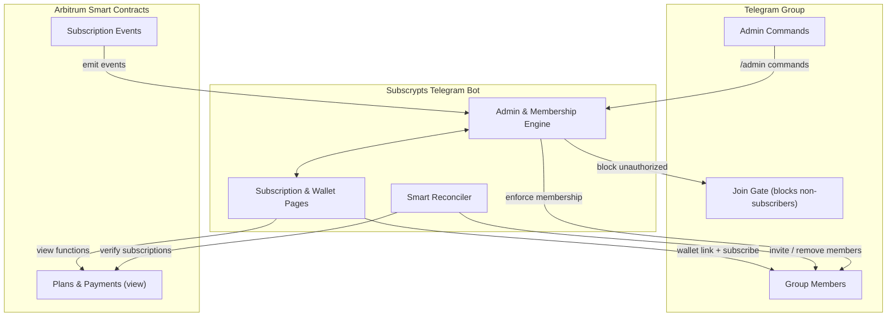
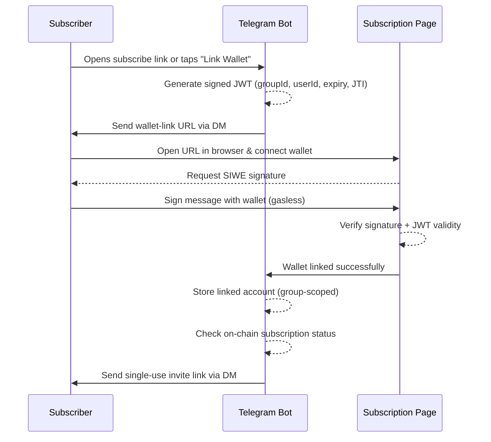

# Architecture & Integration

The Subscrypts Telegram Bot is a **multi-tenant integration** operated by Subscrypts. One centrally hosted instance manages **many groups**, while keeping each group's configuration and actions isolated.

The integration provides:

* **Admin commands** in Telegram — Group setup, stats, reconciliation, and membership management via `/admin` commands
* **Join gate & reconciler** — Real-time access control and periodic membership verification against on-chain state
* **Wallet linking** — Secure SIWE (Sign-In with Ethereum) flows for proving wallet ownership
* **Per-group subscription pages** at [telegram.onsubscrypts.com](https://telegram.onsubscrypts.com) — Each group gets its own page showing only its plans, where members can subscribe and pay with SUBS or USDC
* **Plan creation** — Merchants connect their wallet and create subscription plans on-chain for their group

Together, these capabilities enable a **real-time, smart-contract-aware** membership experience in Telegram with a minimal, privacy-preserving web surface.

## High-Level Overview

### Processing model (at a glance)

1. Merchant adds the bot to their group and runs `/admin setup` to check configuration.
2. Merchant creates subscription plans at [telegram.onsubscrypts.com](https://telegram.onsubscrypts.com), mapping them to the group.
3. Subscriber opens the per-group subscribe page, selects a plan, and completes an on-chain payment.
4. Subscriber links their wallet via a signed, time-limited SIWE flow.
5. The bot verifies the subscription on-chain and sends a **single-use invite link** via Telegram DM.
6. On subscription expiry, the reconciler detects the change and removes the member from the group.

---

## Core Integration Points

### Telegram Integration

* Built with the **grammY** framework and Telegram's Bot API
* Receives updates via **webhooks** (not polling) for low-latency response
* Admin commands are scoped to group context — only group administrators can run `/admin` commands
* The bot operates in **privacy mode**: it only receives commands directed to it, not general chat messages

### Smart Contract Integration

* Fetches data directly from Arbitrum smart contracts via **ethers.js**
* Uses the same Subscrypts smart contract suite as the dApp and Discord Bot
* All membership decisions are confirmed via **authoritative on-chain reads**
* Listens for blockchain events such as `_subscriptionPay` and `_subscriptionStop` for near-real-time updates

### Web Pages at telegram.onsubscrypts.com

* Serves wallet linking, subscription purchasing, and plan creation flows
* Handles USDC fallback payments via **Uniswap V3 Permit2** (atomic swap in a single transaction)
* Session-based wallet management with **CSRF protection** and **rate limiting**

---

## Membership Enforcement Model

The Telegram Bot uses a **two-layer enforcement model** to keep group membership in sync with on-chain state:

### Layer 1: Join Gate (real-time)

When a user attempts to join a gated group:

* The bot checks whether the user has a linked wallet with an active subscription
* If not, the join attempt is **blocked** — the user is removed before they can access group content
* This prevents unauthorized access in real time, even during periods between reconciliation cycles

### Layer 2: Smart Reconciler (periodic)

A background reconciler runs on a configurable interval to verify all linked members:

* For each linked member, it checks on-chain subscription status
* Members with active subscriptions far from expiry are **skipped** (no API call needed), reducing Telegram API usage
* Members whose subscriptions have expired are **removed** from the group and notified via DM with a link to resubscribe
* Members who have renewed are **re-invited** automatically

The reconciler is **self-correcting**: if an event was missed, a member was manually added, or the bot was temporarily offline, the next reconciliation cycle will bring the group back in line with blockchain state.

---

## Wallet Linking Flow

The wallet linking flow uses **SIWE (Sign-In with Ethereum)** — a gasless signature that proves wallet ownership without exposing private keys.

Key security properties:

* **JWT tokens** are time-limited, single-use, and bound to a specific group and user
* **SIWE signatures** prove wallet ownership without private key exposure
* **Cryptographically signed** communication between all internal services prevents tampering
* **Single-use invite links** expire after one use and cannot be shared

---

## Subscription Caching & Efficiency

To reduce RPC calls to the blockchain, the bot uses a **multi-layer caching strategy**:

### Subscription Index (Layer 1)

* An in-memory index of all active subscriptions, refreshed periodically from the smart contract
* Provides near-instant lookups for "does wallet X have an active subscription for plan Y?"
* Reduces RPC calls by approximately 95%

### Multicall Batching (Layer 2)

* For cache misses, multiple contract view calls are batched into a single RPC request using Multicall
* Reduces network overhead for bulk verification

### Direct Contract Call (Layer 3)

* Fallback for individual lookups when the index and multicall are unavailable

All caches are **short-lived and non-authoritative** — membership decisions are always confirmed against on-chain state before granting or revoking access.

---

## Migration Mode

For groups with existing free members who need to transition to subscription-gated access, the bot provides a **migration mode**:

1. **Admin starts migration** with a configurable grace period (1–90 days)
2. **Bot pins an announcement** with Subscribe and Link Wallet buttons
3. **Member discovery** — Admin can upload a member list or members self-register via a verification button
4. **Grace period countdown** — Automated reminders are posted at strategic intervals
5. **Enforcement** — After the deadline, known members without linked wallets and active subscriptions are removed

During the grace period, the **join gate** is active for new members — only existing members get the grace window.

See the [Admin Setup Guide](admin-setup-guide.md) and [Best Practices](best-practices.md) for detailed migration guidance.

---

## Scale & Performance

The bot is designed for high-scale operation:

| Metric | Capability |
|--------|------------|
| **Groups served** | 100,000+ per bot instance |
| **Users managed** | 1,000,000+ per bot instance |
| **Reconciler skip rate** | ~95% (users far from expiry are skipped) |
| **Subscription index refresh** | Configurable (default: every few minutes) |
| **Join gate latency** | Near-instant (blocks unauthorized joins in real time) |

The reconciler is **expiry-aware**: users whose subscriptions are not close to expiring consume zero Telegram API calls during routine checks. This allows the bot to efficiently manage very large groups without hitting Telegram's API rate limits.

!!! ecosystem "Subscrypts Ecosystem"
    The bot, the [Subscrypts dApp](../dapp/introduction.md), the [Discord Bot](../discord-bot/introduction.md), and the [Subscrypts SDK](../sdk/index.md) are all clients of the same [Smart Contract Suite](../smart-contract/introduction.md) on Arbitrum. Any plan created through one interface is usable by the others.

---

## Related Topics

- [Admin Setup Guide](admin-setup-guide.md) -- Step-by-step configuration for Telegram group owners
- [Member Guide](member-guide.md) -- The subscriber wallet-linking and access experience
- [Subscription Synchronization](subscription-sync.md) -- Deep dive into the reconciler and membership engine
- [Security & Trust](security-and-trust.md) -- Privacy model, wallet linking security, and data minimization
- [Smart Contract Suite](../smart-contract/introduction.md) -- On-chain subscription logic powering the bot
