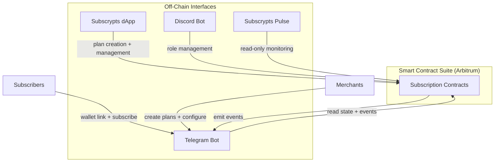

# Subscrypts Telegram Bot -- Introduction

The **[Subscrypts Telegram Bot](https://telegram.onsubscrypts.com)** is the Telegram integration layer of the Subscrypts ecosystem — a public-facing tool that connects subscription-based blockchain logic directly to group membership within Telegram. It enables group and channel owners to offer premium access through verified, smart contract-based subscriptions on Arbitrum.

This bot allows any Telegram community to operate as a **decentralized membership platform**, where access control, subscription validation, and membership enforcement are all handled automatically — without relying on third-party payment processors or manual management.

Together with the **[Subscrypts dApp](https://app.subscrypts.com)** and the **[Discord Bot](https://discord.onsubscrypts.com)**, the Telegram Bot forms part of a composable access layer on top of the same smart contract suite, while the **blockchain remains the single source of truth**.

---

## What Is It?

The **[Subscrypts Telegram Bot](https://telegram.onsubscrypts.com)** is a **multi-tenant, smart-contract-aware** integration operated and maintained by Subscrypts. A single, centrally hosted instance serves **many groups** at once. Group owners simply **add the bot** to their Telegram group; no self-hosting or custom deployment is required. The integration bridges **on-chain subscription state** with Telegram group membership.

Key capabilities:

* **Admin commands** — Handles group setup and management commands (e.g., `/admin setup`, `/admin stats`, `/admin reconcile`). Permissions are scoped to each group; admins can manage only their own group's configuration.
* **Join gate & reconciler** — Blocks unauthorized join attempts in real time and periodically verifies that all linked members still hold active subscriptions. Members whose subscriptions have expired are removed automatically.
* **Wallet linking** — Secure, time-limited flows where members prove wallet ownership via SIWE (Sign-In with Ethereum) signatures. No private keys are handled or stored — it's a gasless signature for authentication.
* **Per-group subscription pages** — At [telegram.onsubscrypts.com](https://telegram.onsubscrypts.com), each group gets its own subscription page showing **only** the plans offered by that group. Members can subscribe, choose billing cycles, and complete payments using SUBS or USDC.
* **Plan creation** — Merchants connect their wallet and create subscription plans on-chain for their Telegram group.

**Multi-tenancy & isolation:**

* One instance serves multiple groups, but **state and actions are isolated per group** (e.g., plan mappings, linked accounts, membership decisions).
* All endpoints are **namespaced** and verified with signed tokens that include group identifiers and short expiries.
* The service uses strict permission scopes to prevent cross-group access or leakage.

---

## Who Is It For?

The **[Subscrypts Telegram Bot](https://telegram.onsubscrypts.com)** is designed for two audiences:

* **Merchants (Telegram group owners)** — who want to monetize access to their groups and channels using non-custodial, decentralized subscriptions.
* **Subscribers (Telegram users)** — who want a straightforward way to unlock access to premium Telegram communities — using their crypto wallet and without giving up privacy.

By connecting these two sides, the bot removes the need for manual membership vetting, spreadsheets, or centralized payment tools. Everything becomes automated and provable.

---

## Key Features

* **Wallet Linking** -- Users verify wallet ownership via SIWE (Sign-In with Ethereum) signatures — no passwords, emails, or custodianship. Linking is gasless (no transaction fees).
* **Automated Access Control** -- Group membership is granted or revoked automatically based on the user's subscription status on-chain.
* **Join Gate** -- Non-subscribers are blocked from joining gated groups in real time.
* **Smart Reconciler** -- The bot periodically verifies all linked members against on-chain state and removes those whose subscriptions have expired.
* **Multi-Plan Support** -- Multiple subscription plans can be mapped to a single group, offering different pricing tiers or billing cycles.
* **Migration Mode** -- Existing groups with free members can transition to subscription-gated access with configurable grace periods, member discovery tools, and automated reminders.
* **USDC Fallback** -- Subscribers who hold USDC instead of SUBS can still pay — the integration handles an atomic Uniswap swap in the same transaction.
* **Single-Use Invite Links** -- After linking and verifying a subscription, the bot sends a single-use, time-limited invite link via DM. Links cannot be shared or reused.

---

## Ecosystem Integration

The **[Subscrypts Telegram Bot](https://telegram.onsubscrypts.com)** is part of the broader Subscrypts architecture, which includes the **[Subscrypts dApp](https://app.subscrypts.com)**, the **[Discord Bot](https://discord.onsubscrypts.com)**, and the on-chain smart contract suite on Arbitrum:

!!! info "Cross-Platform Subscriptions"
    Subscrypts subscriptions are **cross-platform**. A subscriber with an active on-chain subscription can use that same subscription to access gated content across Discord, Telegram, websites, and any other service integrated with the Subscrypts protocol. The blockchain is the shared source of truth — each platform simply reads the same on-chain state.

The bot reads directly from Arbitrum contracts, requiring no separate backend to store or validate subscription data. It listens to events like `_subscriptionPay` or `_subscriptionStop`, allowing it to reflect status changes with minimal delay.

---

## Why It Matters

Before Subscrypts, Telegram monetization was handled through centralized payment bots, manual invite management, or third-party tools — all of which rely on trust-based gating and often require personal data collection. These models are:

* Prone to invite link sharing and freeloading
* Not privacy-preserving
* Limited to fiat payment methods, excluding crypto-native users
* Dependent on manual administration for membership changes

The **[Subscrypts Telegram Bot](https://telegram.onsubscrypts.com)** introduces:

* **Decentralized payments** in SUBS token (see the [Subscrypts Homepage](https://subscrypts.com))
* **On-chain transparency** that's verifiable by anyone via [Arbiscan](https://arbiscan.io) or other block explorers
* **Non-custodial flows** with no user data collection
* **MiCAR-aligned** architecture for EU digital-asset regulations (see the [MiCAR Whitepaper](https://subscrypts.com/whitepaper))

Communities gain full control, subscribers retain sovereignty, and the platform scales globally with zero middlemen.

!!! ecosystem "Subscrypts Ecosystem"
    The Telegram Bot is one interface in the broader Subscrypts ecosystem. For deeper context, explore the [Smart Contract Suite](../smart-contract/introduction.md), the [Subscrypts dApp](../dapp/introduction.md), the [Discord Bot](../discord-bot/introduction.md), [Subscrypts Pulse](../pulse/introduction.md), and the [Subscrypts SDK](../sdk/index.md).

## Learn More

* [Subscrypts Homepage](https://subscrypts.com)
* [MiCAR-Compliant Whitepaper](https://subscrypts.com/whitepaper)
* [Subscrypts dApp](https://app.subscrypts.com)
* [Subscrypts Telegram Bot](https://telegram.onsubscrypts.com)

---

## Related Topics

- [Solution & Use Cases](solution-and-usecases.md) -- Real-world monetization scenarios for Telegram
- [Architecture & Integration](architecture.md) -- Technical overview of the integration and data flow
- [Admin Setup Guide](admin-setup-guide.md) -- Step-by-step setup for Telegram group owners
- [Smart Contract Suite](../smart-contract/introduction.md) -- The on-chain subscription logic powering the bot
- [Subscrypts dApp](../dapp/introduction.md) -- The general-purpose web interface for Subscrypts
