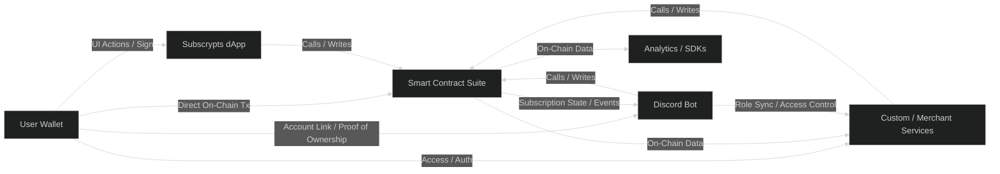

# Introduction — Subscrypts Smart Contract Suite

The **Subscrypts Smart Contract Suite** forms the **foundation of trust and automation** within the Subscrypts ecosystem. It serves as the on-chain execution engine that governs subscription creation, management, and payments using **Ethereum smart contracts** deployed on **Arbitrum One**.

This suite ensures that all interactions between merchants, subscribers, and integrated systems (like the [Subscrypts dApp](https://app.subscrypts.com) and [Subscrypts Discord Bot](https://discord.onsubscrypts.com)) are **transparent, verifiable, and autonomous**.

---

## Role in the Subscrypts Ecosystem

The Smart Contract Suite operates as the **core execution layer** connecting every component of the Subscrypts ecosystem. It defines the on-chain logic that governs subscription creation, validation, renewal, and access control, while allowing any authorized service or application to interact directly with it.

| Layer                        | Description                                                                                                                                                                                                                                                                                                                                   |
| ---------------------------- | --------------------------------------------------------------------------------------------------------------------------------------------------------------------------------------------------------------------------------------------------------------------------------------------------------------------------------------------- |
| **Smart Contracts**          | Provide the verifiable foundation of subscription logic, ensuring trustless, fair, and auditable transactions across all components.                                                                                                                                                                                                          |
| **dApp**                     | A web-based interface where merchants and users interact with the blockchain to create subscription plans, manage payments, and view active subscriptions. ([Subscrypts dApp](https://app.subscrypts.com))                                                                                                                                    |
| **Discord Bot**              | Extends on-chain logic into community environments, automating role assignments and permissions based on real-time subscription states. ([Subscrypts Discord Bot](https://discord.onsubscrypts.com))                                                                                                                                          |
| **Third-Party Integrations** | Custom-developed interfaces, merchant dashboards, or external applications can be built directly on top of the Subscrypts Smart Contract Suite, enabling developers to integrate blockchain-based subscription management into their own platforms or services without relying on the official [Subscrypts dApp](https://app.subscrypts.com). |

---

## Purpose and Functionality

The Smart Contract Suite automates key on-chain processes:

* **Plan Creation:** Merchants can create subscription plans defining price, duration, and payment token.
* **Subscription Management:** Subscribers can initiate, renew, or cancel subscriptions directly on-chain.
* **Payment Automation:** Payments are processed automatically in **SUBS**, using USDC as the reference currency.
* **Governance and Upgrades:** On-chain governance supports controlled upgrades via the **UUPS modular proxy pattern**.

---

## Connections Between Components

The Smart Contract Suite acts as the **bridge** between user-facing and system-facing components:

---

## High-Level Objectives

* **Automation:** Fully automate subscription logic, renewals, and payment flows.
* **Transparency:** Ensure all operations are public, traceable, and verifiable on-chain.
* **Compliance:** Include built-in mechanisms for sanctions, freeze controls, and [MiCAR](https://subscrypts.com/whitepaper)-aligned governance.
* **Upgradeability:** Enable iterative evolution through **UUPS proxy**-based modular architecture.

---

## Why On-Chain Subscriptions?

Traditional subscription models rely on centralized intermediaries for payment processing, customer data, and renewal control. Subscrypts replaces these with **self-executing smart contracts**, ensuring:

* No personal data is required for payments or renewals.
* Subscription logic is immutable and transparent.
* Merchants retain direct custody of revenue streams.
* Users maintain full ownership and control of their payment identity.

---

## Key Takeaways

* The Smart Contract Suite powers every on-chain interaction in Subscrypts.
* It is modular, upgradeable, and fully verifiable on **Arbitrum One**.
* It connects seamlessly with the [Subscrypts dApp](https://app.subscrypts.com) and [Subscrypts Discord Bot](https://discord.onsubscrypts.com) for a complete Web3 subscription experience.
