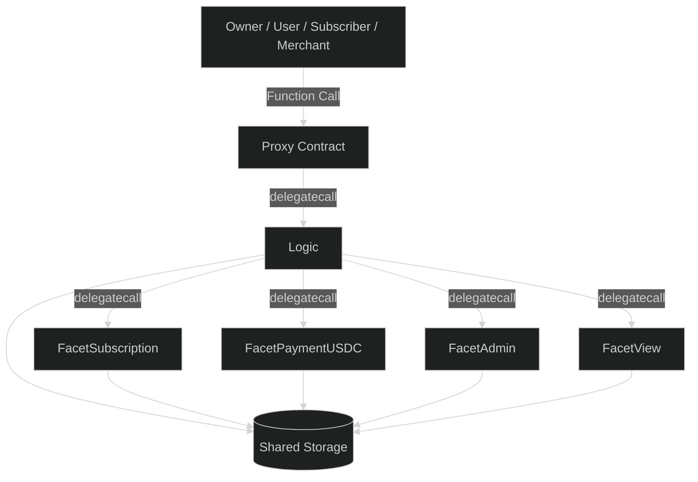
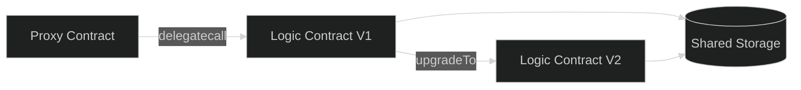
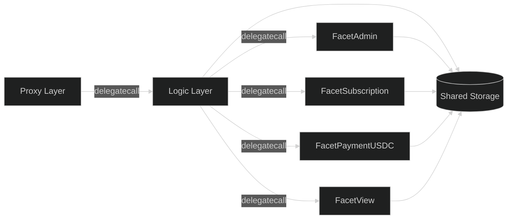

# Design Philosophy — Subscrypts Smart Contract Suite

The **Subscrypts Smart Contract Suite** embodies a principle-driven engineering approach designed to achieve long-term maintainability, verifiable transparency, and trustless operation. The system architecture merges the **UUPS (Universal Upgradeable Proxy Standard)** with a **modular multi-facet design**, allowing individual components to evolve independently without redeploying the entire protocol. This hybrid model provides a strong balance between decentralization, flexibility, and security.

Readers—whether developers, merchants, or analysts—should gain a clear understanding of *why* each design decision was made and *how* these choices support the platform’s overall mission of creating a sustainable, upgradeable blockchain infrastructure for subscription-based commerce.

---

## Decentralization — Ownership at the Edge

Subscrypts is fully decentralized in its execution and data handling. All subscription plans, user balances, and payment transactions are handled **on-chain** through verifiable smart contracts. No centralized service or API can modify or intercept payment flows.

Unlike traditional SaaS billing systems, Subscrypts shifts ownership outward: merchants directly own their subscription logic and revenue channels. The system enforces a strict separation of duties through role-based access control baked into the contracts.

**Core mechanisms:**
The **proxy contract** serves as the immutable entry point for all interactions. **Admin and service roles** govern upgrades and maintenance, ensuring no off-chain party can alter business logic. Each merchant retains complete sovereignty over their data and on-chain subscription plans.

This model ensures that even if Subscrypts ceases operation as a company, the deployed contracts remain functional and verifiable—an essential quality of a decentralized protocol.

---

## Transparency — Verifiable and Compliant by Design

Transparency is not an afterthought; it is integral to the protocol. Every action — from creating a plan to processing a renewal — is recorded on-chain and can be verified through transaction logs and emitted events.

While the full source code and compiled bytecode are not publicly distributed, the **ABI definitions** of the deployed contracts are made available. This allows external parties to interact with the contracts and inspect on-chain events for independent verification of key operations. Events such as `PlanGovernanceChanged`, `SubscriptionCollectPassiveChanged`, and `FacetSelectorUpdated` provide a cryptographically verifiable trail of operational integrity.

This model supports **[MiCAR](https://subscrypts.com/whitepaper)-aligned compliance** by enabling transparent reporting and independent validation, while maintaining intellectual property protection over the implementation logic.

---

## Upgradeability — Controlled Evolution

At the heart of the system lies the **UUPS proxy pattern**, which enables logic upgrades while preserving data stored in the proxy contract. This allows the protocol to evolve with minimal friction and zero data loss.

The upgrade path follows a *two-tier model*:

1. **Facet-level upgrades** — individual modules (e.g., Subscription or Payment logic) can be redeployed independently.
2. **Core proxy upgrade** — the main proxy implementation can be swapped to a new version using `upgradeTo()` or `upgradeToAndCall()` under strict `onlyOwner` control.

**Design safeguards:**

* Persistent storage defined in `Subscrypts Storage` ensures no data loss across upgrades.
* Storage follows an *append-only* model with reserved slots to prevent state collision.
* All upgrades emit on-chain `Upgraded` and `FacetSelectorUpdated` events for transparency.

This controlled upgradeability ensures continuous innovation without breaking historical state integrity.

---

## Scalability — Built for L2 and Beyond

Subscrypts is optimized for **Arbitrum One**, leveraging its low gas fees and high transaction throughput. The architecture is modular, enabling new payment methods and integrations to be introduced as independent facets.

Scalability in the contract layer is achieved through:

* **Gas-efficient mappings and delegatecalls** for low-cost logic routing.
* **Passive collection routines** (e.g., `subscriptionCollectPassive`) that batch multiple renewals within a single transaction.
* **Composable logic** via interchangeable facets—allowing vertical scaling without redeploying the proxy.

This enables the ecosystem to scale horizontally across merchants and users while maintaining operational efficiency on-chain.

---

## Security — Immutable Integrity and Access Control

Security principles are embedded in both architecture and process. Each facet enforces **least-privilege access**, and all sensitive operations are gated by modifier-based authorization (`onlyOwner`, `onlyServiceAccounts`, `onlySelf`).

Key security layers:

* **Multi-tiered access model** for admins, service accounts, and system-level logic.
* **Reentrancy protection** and **delegatecall confinement** to prevent recursive exploit patterns.
* **Account freezing and sanction controls**, allowing compliance-oriented blocking of malicious or blacklisted entities.
* Use of **OpenZeppelin’s audited base libraries** (`OwnableUpgradeable`, `ReentrancyGuardUpgradeable`, `UUPSUpgradeable`) as security primitives.

Together, these measures ensure that even though the system is upgradeable, it remains tamper-resistant and auditable at every layer.

---

## Modular Architecture — The Case for Facets

Traditional monolithic contracts are rigid, costly to upgrade, and limited by EVM bytecode constraints. Subscrypts overcomes this by introducing **facet-based modularization**, where each functional domain—Admin, Subscription, Payment, and View—operates as an independent smart contract connected through the proxy.

Each facet can be replaced or extended independently without disrupting other components, allowing targeted improvements while keeping gas usage predictable.

**Benefits:**

* Isolation of logic domains for maintainability.
* Rapid upgrade cycles through individual facet replacement.
* Enhanced auditability and security via smaller, well-scoped codebases.

---

## Standards and Compliance Alignment

Subscrypts adheres to the leading Ethereum improvement proposals (EIPs) and recognized security frameworks:

* **EIP-1822** — Universal Upgradeable Proxy Standard (UUPS)
* **ERC-1967** — Storage slot standard for proxies
* **EIP-2535 (inspired)** — Modular facet architecture pattern
* **[MiCAR](https://subscrypts.com/whitepaper)** & GDPR-aligned operational transparency and minimal data exposure

By combining proven open-source standards with internal security layers, Subscrypts maintains compliance-ready interoperability across all contract layers.

---

## Summary

The Subscrypts design philosophy represents a fusion of **Ethereum-native innovation** and **real-world usability**. Through modular proxy logic, persistent storage, and verifiable governance, it delivers a framework that can evolve without fragmentation.

Developers gain a maintainable architecture.
Merchants retain direct ownership of their ecosystem.
Users benefit from transparency, privacy, and safety.
