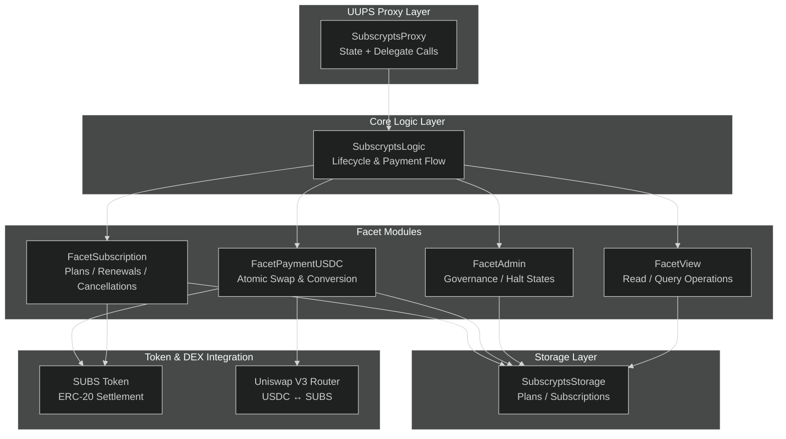
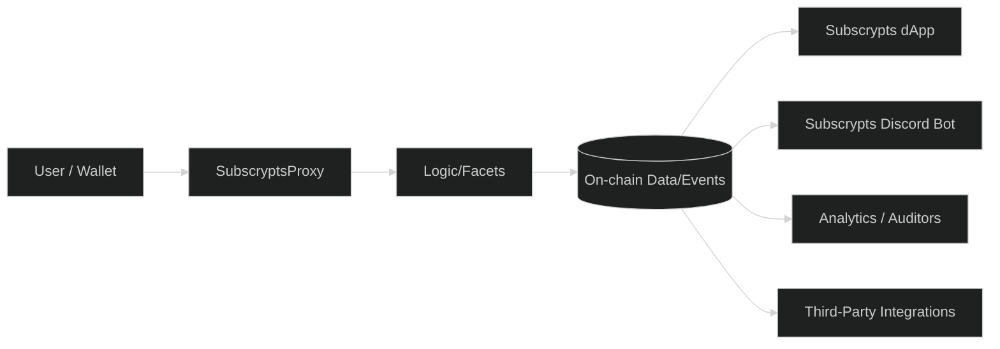

# Architecture Overview — Modular UUPS Proxy Design

The **Subscrypts Smart Contract Suite** is built upon a **modular upgradeable proxy system** that separates **state**, **logic**, and **functionality** into well-defined components. This approach ensures long-term maintainability, transparent upgrades, and consistent on-chain behavior without redeploying core contracts or losing stored data.

At its core, Subscrypts follows a hybrid between the **UUPS (Universal Upgradeable Proxy Standard)** and a **facet-based modular pattern**, allowing different parts of the business logic to evolve independently while sharing a single state layer.

---

## Architectural Goals

The system architecture was designed with four primary goals:

1. **Persistence** — Contract addresses remain immutable while logic evolves.
2. **Modularity** — Each business domain (subscriptions, payments, admin, etc.) is isolated in a facet.
3. **Transparency** — Every logic upgrade is recorded and verifiable on-chain.
4. **Efficiency** — Logic calls are routed dynamically through low-cost `delegatecall` operations.

---

## Core Layers

The Subscrypts architecture consists of multiple interacting layers. Each layer serves a distinct purpose while remaining interoperable across modules.

| Layer             | Component                                                          | Responsibility                                                                                   |
| ----------------- | ------------------------------------------------------------------ | ------------------------------------------------------------------------------------------------ |
| **Proxy Layer**   | `SubscryptsProxy`                                                  | Entry point for all calls, delegating execution to logic contracts. Stores all persistent state. |
| **Logic Layer**   | `SubscryptsLogic`                                                  | Core execution layer implementing subscription lifecycle management and payment orchestration.   |
| **Facet Modules** | `FacetSubscription`, `FacetPaymentUSDC`, `FacetAdmin`, `FacetView` | Modular logic components responsible for domain-specific functionality.                          |
| **Storage Layer** | `SubscryptsStorage`                                                | Centralized data structure shared across all facets. Preserves state through upgrades.           |
| **Token Layer**   | `SUBSToken`                                                        | Native ERC-20 settlement token enabling payment settlement and protocol utility.                 |
| **DEX Layer**     | `Uniswap V3 Router`, `Quoter`, `Position Manager`                  | Provides decentralized liquidity and real-time quoting for SUBS ↔ USDC conversions.              |

---

## Routing and Execution Flow

Function calls made to the proxy are resolved using **selector-to-facet mapping**, allowing the proxy to determine which module (facet) should handle the request. This mapping ensures isolated upgradeability — meaning only the targeted facet must be replaced when logic changes.

### Execution Process

1. A user interacts with the proxy (e.g., to create a plan or renew a subscription).
2. The proxy identifies the correct facet via `getFacetSelector()`.
3. It forwards the call to the facet using `delegatecall()`.
4. The facet executes the logic within the shared storage context.
5. Results or state changes are emitted as on-chain events.

---

## Advantages of the Modular UUPS System

This hybridized architecture provides a combination of flexibility, efficiency, and immutability that would be difficult to achieve in a monolithic contract design.

### Key Benefits

* **Immutable Proxy**: The proxy address never changes, ensuring all integrations remain valid.
* **Granular Upgrades**: Each facet can be independently updated without redeploying the entire suite.
* **Shared Storage**: Maintains cross-version data integrity across all upgrades.
* **Transparent Governance**: Upgrades emit `Upgraded` and `FacetSelectorUpdated` events on-chain.
* **Simplified Integration**: [Subscrypts dApp](https://app.subscrypts.com), [Subscrypts Discord Bot](https://discord.onsubscrypts.com), and SDKs communicate with a single proxy endpoint.

---

## Proxy vs. Transparent Proxy

While both patterns allow upgradeable logic, Subscrypts chose **UUPS** over **Transparent Proxy** due to its gas efficiency and simplicity. In Transparent Proxies, the admin logic and user logic are handled separately, increasing call overhead. UUPS streamlines this by keeping a single upgrade function within the logic contract, controlled by access restrictions.

| Feature       | Transparent Proxy        | UUPS Proxy (Subscrypts)         |
| ------------- | ------------------------ | ------------------------------- |
| Upgrade Logic | Separated admin contract | Embedded in logic contract      |
| Gas Cost      | Higher                   | Lower                           |
| Upgrade Risk  | Moderate                 | Low (strict role-based control) |
| Governance    | Off-chain-heavy          | Fully on-chain                  |

---

## Governance and Upgrade Path

Upgrades follow a clear governance process managed through `FacetAdmin`. Only verified admin addresses can execute `upgradeToAndCall()` or `registerFacetSelector()` operations. Each upgrade is recorded on-chain, ensuring traceability.

**Upgrade Lifecycle:**

1. Developer deploys a new facet contract (e.g., `FacetPaymentUSDCv2`).
2. Admin calls `registerFacetSelector()` on the proxy to map new function selectors.
3. Old selectors can be unregistered via `unregisterFacetSelector()`.
4. Events `FacetSelectorUpdated` confirm success.

---

## System Resilience and Fault Isolation

Because each module runs independently, a fault or bug in one facet does not compromise the others. The proxy continues to route unaffected functions, maintaining operational continuity.

In case of emergency, administrators can:

* Trigger **halt states** via `FacetAdmin` (e.g., `contractHaltPlanCreation`).
* Freeze malicious accounts using `contractFreezeAccount()`.
* Roll back to a verified previous facet version.

---

## Integration with Off-Chain Components

The architecture was designed for seamless interoperability between on-chain and off-chain systems. The [Subscrypts dApp](https://app.subscrypts.com), [Subscrypts Discord Bot](https://discord.onsubscrypts.com), and external analytics or integration services all communicate with the same Smart Contract Suite through the shared **ABI interface**, ensuring consistent behavior across every layer.

Off-chain synchronization is achieved through two complementary mechanisms:

1. **Event-Driven Updates** — Contracts emit structured events such as `_planCreate`, `_subscriptionPay`, and `PlanGovernanceChanged`. These can be monitored in real time by external systems to capture state changes as they occur on-chain.
2. **State Queries via View Facet** — Off-chain components can retrieve the latest on-chain data directly through read-only functions in the `FacetView`, ensuring data accuracy even if an event was missed or delayed.

Together, these methods enable reliable two-way interoperability — event streams provide instant reactivity, while view calls guarantee data integrity during reconciliation or recovery processes.

This unified approach allows ecosystem tools to remain consistent regardless of future upgrades.

---

## Summary

The Subscrypts modular UUPS proxy architecture creates a resilient, flexible foundation for blockchain-based subscriptions. By combining UUPS upgradeability with facet modularity, it achieves three core outcomes:

* **Technical longevity** through isolated upgrades and stable storage.
* **Operational transparency** through on-chain governance and verifiable events.
* **Scalable integration** with the broader Subscrypts ecosystem.
