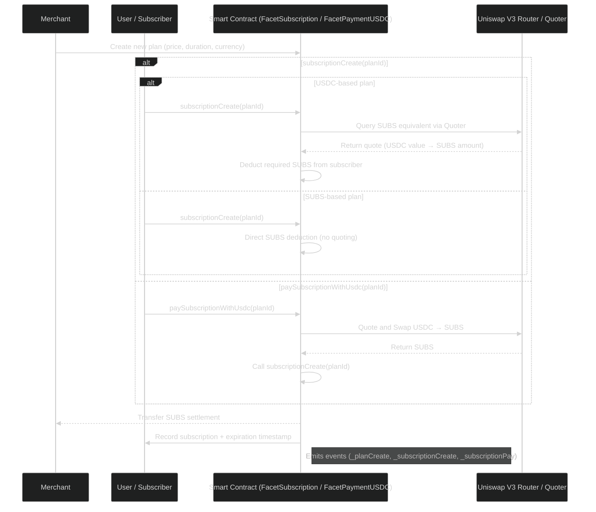

# Core Logic — Subscription Lifecycle

The **Subscrypts Smart Contract Suite** automates the full lifecycle of a subscription — from **plan creation** by merchants to **renewal and expiration** for subscribers. This process is entirely executed on-chain, ensuring that subscription logic is transparent, verifiable, and self-enforcing.

At the center of this lifecycle lies the **`FacetSubscription`** and **`FacetPaymentUSDC`** modules, which together handle all logic for plan management, quoting, conversion, and payment settlement.

---

## Overview of the Subscription Lifecycle

A subscription in Subscrypts follows a deterministic and fully automated on-chain flow, ensuring consistent and verifiable outcomes for both merchants and subscribers.

1. **Merchant creates a plan** with defined parameters — price, duration, currency type (SUBS or USDC), and metadata.
2. **Subscriber subscribes** to the plan by invoking `subscriptionCreate(planId)` or `paySubscriptionWithUsdc(planId)`.
3. If the plan is **USDC-based** and `subscriptionCreate()` is used, the contract calls **Uniswap’s Quoter** to determine how many SUBS are required to match the USDC value, and then deducts that amount directly from the subscriber’s SUBS balance.
4. If the plan is **SUBS-based**, payment is performed directly in SUBS without quoting or conversion.
5. If the subscriber uses **`paySubscriptionWithUsdc()`**, the contract performs an **on-chain USDC → SUBS swap** via **Uniswap Router**, then calls `subscriptionCreate()` internally to complete the payment and activate the subscription.
6. The contract stores and tracks **renewal and expiration timestamps**, enabling both active (manual) and passive (automated) renewal methods.
7. Upon expiration or cancellation, the subscription becomes inactive, and access is revoked across integrated systems.

This lifecycle guarantees transparent, atomic, and non-custodial execution — all payments ultimately settle in **SUBS**, ensuring predictable merchant revenue and full on-chain verifiability.

---

## Plan Creation

Plans are created by merchants using the `planCreate()` function.
Each plan defines the full economic and operational model of a subscription — including pricing, currency, duration, referral incentives, and lifecycle management attributes.

When a plan is deployed, it becomes part of the immutable **SubscryptsStorage**, ensuring continuity and upgrade-safe persistence across all contract versions.

### Plan Structure

| Field                      | Type      | Description                                                                                                                                          |
| -------------------------- | --------- | ---------------------------------------------------------------------------------------------------------------------------------------------------- |
| **id**                     | `uint256` | Auto-incremented unique identifier assigned to each plan.                                                                                            |
| **merchantAddress**        | `address` | Ethereum address of the merchant that owns and manages the plan.                                                                                     |
| **currencyCode**           | `uint256` | Defines the payment currency (`0` for SUBS, `1` for USDC, extendable for other ERC-20 tokens).                                                       |
| **subscriptionAmount**     | `uint256` | Amount to be paid by the subscriber per billing cycle, denominated in the plan’s base currency.                                                      |
| **paymentFrequency**       | `uint256` | Duration of one billing cycle, expressed in seconds. Determines renewal intervals.                                                                   |
| **referralBonus**          | `uint256` | Optional reward allocated to referrers for bringing new subscribers.                                                                                 |
| **commission**             | `uint256` | Optional commission percentage or flat amount reserved for partner integrations or affiliates.                                                       |
| **description**            | `bytes32` | Short metadata field describing the plan’s purpose or tier name. Stored as `bytes32` for gas efficiency.                                             |
| **defaultAttributes**      | `bytes32` | Encoded configuration data (e.g., access level, tier flags, or role mapping) used for role synchronization.                                          |
| **verificationExpiryDate** | `uint256` | Timestamp after which the plan requires re-verification or compliance renewal (supports KYC / [MiCAR](https://subscrypts.com/whitepaper) alignment). |
| **subscriberCount**        | `uint256` | Real-time counter of active subscribers linked to this plan. Updated on each subscription and renewal.                                               |
| **isActive**               | `bool`    | Flag indicating whether the plan is currently available for new subscriptions. Merchants can deactivate or pause plans.                              |

### Synchronization and Off-Chain Access

When a new plan is created, the contract emits the `_planCreate` event.
This event allows any listening service — such as the **[Subscrypts dApp](https://app.subscrypts.com)**, **[Subscrypts Discord Bot](https://discord.onsubscrypts.com)**, or **third-party merchant integrations** — to update their interfaces and maintain real-time state synchronization.

In addition to event-driven updates, components can **query the on-chain data directly** via read-only functions in the `FacetView` contract, ensuring data consistency even if events were missed or delayed.

This dual access model (event stream + view queries) provides both **reactivity** and **verifiable accuracy** for all connected systems.

---

## Plan Management

After a plan is created by a merchant using `planCreate()`, it becomes a persistent, upgrade-safe record within **SubscryptsStorage**.
While plan data is immutable in structure, certain parameters can be modified by the merchant to reflect evolving business needs or promotional adjustments.

### Editable Plan Fields

Merchants can modify the following plan parameters after creation:

| Field                    | Description                                                                                          |
| ------------------------ | ---------------------------------------------------------------------------------------------------- |
| **`description`**        | The text label or short description of the plan (e.g., *“Premium Tier”*, *“Pro License”*).           |
| **`defaultAttributes`**  | Encoded plan metadata, often representing access tier, role mapping, or feature flags.               |
| **`referralBonus`**      | The optional incentive percentage or amount offered to referrers for bringing new subscribers.       |
| **`subscriptionAmount`** | The recurring price of the plan. Adjusting this field impacts active automatic renewals (see below). |

All updates emit a `_planUpdated` event, allowing dApps, the Discord Bot, and external dashboards to synchronize the latest plan details in real time.

### Impact of Subscription Amount Changes

When a merchant updates a plan’s **`subscriptionAmount`**, existing subscriptions linked to that plan are **not immediately altered**.
Instead, the change takes effect **on the next renewal interaction**, ensuring backward compatibility and billing consistency.

This mechanism works as follows:

1. Each subscription record stores the `subscriptionAmount` from the moment it was created.
2. On the next payment — whether triggered manually or automatically — the smart contract checks if the plan’s `subscriptionAmount` differs from the stored value in the subscription.
3. If a difference is detected, the subscription is automatically updated — including setting **`isRecurring`** to `false` — to reflect the updated amount and plan conditions.
4. This ensures that all future renewals align with the most current pricing logic without retroactively altering ongoing billing cycles.

> ⚠️ **Important:**
> When a merchant changes the `subscriptionAmount`, **all linked subscriptions with automatic renewal enabled** will have
> `isRecurring` set to **false** and `remainingCycles` reset to **0**.
> Subscribers must **manually re-enable automatic renewal** to continue recurring payments.
> This safeguard prevents merchants from silently raising subscription prices to excessive levels without user consent.
> Merchants are strongly advised to **communicate pricing changes transparently and in advance** to maintain trust and avoid unexpected service interruptions.

### Subscription Gifting

The plan owner (merchant) can grant complimentary subscriptions to users via the `subscriptionGift()` function in **FacetSubscription**.
This allows merchants to provide free access to specific users — for instance, during promotional campaigns, support cases, or partner programs.
The gifted subscription is recorded like any regular one, excluding payment settlement (the user only pays the blockchain gas fee for the transaction).

### Plan Verification and Future Enhancements

A placeholder field called **`verificationExpiryDate`** exists within every plan record.
While currently not in use, future protocol iterations may allow merchants to verify their plans to unlock additional platform-level benefits — for example, **reduced commission rates**, **enhanced discoverability**, or **priority support**.

These verification mechanics are part of the **Subscrypts roadmap** and are designed to align with [MiCAR](https://subscrypts.com/whitepaper)-compliant merchant registration and service accountability.

### Summary

Plan management in Subscrypts offers a balance between flexibility and integrity:

* Merchants can modify key descriptive and commercial parameters.
* Subscribers remain protected through version-aware renewal logic.
* The system maintains a transparent audit trail via emitted events and persistent on-chain records.

This ensures that the plan ecosystem remains **dynamic**, **compliant**, and **self-synchronizing** across all connected components.

---

## Subscription Creation

Subscribers initiate a new subscription using the `subscriptionCreate(planId)` function.
Before creating the record, the contract enforces multiple layers of validation to ensure compliance and data integrity:

* **Plan validity** — Confirms the selected plan is active and not halted.
* **Merchant status** — Ensures the merchant is verified and not frozen.
* **Sanctions compliance** — Verifies both the merchant and subscriber are permitted to transact under applicable regulatory rules.

Once validated, the contract retrieves the associated plan parameters and — depending on the plan’s currency — either processes a **direct SUBS payment** or performs a **USDC → SUBS** qoute or conversion before settlement.
Every successful subscription is assigned an **auto-incremented ID** and linked to both the merchant and subscriber wallets for traceability.

### Subscription Structure

| Field                  | Type      | Description                                                                                          |
| ---------------------- | --------- | ---------------------------------------------------------------------------------------------------- |
| **id**                 | `uint256` | Auto-incremented unique identifier assigned to each subscription.                                    |
| **merchantAddress**    | `address` | The merchant’s wallet that owns the subscription plan. Used for revenue routing.                     |
| **planId**             | `uint256` | Identifier referencing the associated plan in `SubscryptsStorage`.                                   |
| **subscriberAddress**  | `address` | Wallet address of the user subscribing to the plan.                                                  |
| **currencyCode**       | `uint256` | Indicates the payment currency (`0` for SUBS, `1` for USDC). Defines how settlement is processed.    |
| **subscriptionAmount** | `uint256` | Amount charged per billing cycle, denominated in the plan’s base currency.                           |
| **paymentFrequency**   | `uint256` | Duration of one billing cycle in seconds. Determines when renewals are due.                          |
| **isRecurring**        | `bool`    | Defines whether the subscription renews automatically (`true`) or requires manual renewal (`false`). |
| **remainingCycles**    | `uint256` | Counter tracking how many renewal cycles remain before expiration or cancellation.                   |
| **customAttributes**   | `bytes32` | Optional metadata field for merchant-defined attributes (e.g., user tier, external ID).              |
| **lastPaymentDate**    | `uint256` | Timestamp of the most recent successful payment.                                                     |
| **nextPaymentDate**    | `uint256` | Scheduled timestamp for the next payment attempt or renewal cycle.                                   |

### Synchronization and Off-Chain Access

Every new subscription triggers a `_subscriptionCreate` event, and subsequent actions such as renewals or cancellations emit additional events (`_subscriptionPay`, `_subscriptionCancel`, etc.).
These events can be monitored by any off-chain service — including the **[Subscrypts dApp](https://app.subscrypts.com)**, **[Subscrypts Discord Bot](https://discord.onsubscrypts.com)**, or **third-party merchant integrations** — to maintain synchronized user and plan data in real time.

In addition, off-chain systems can retrieve subscription details directly through read-only functions in the `FacetView` contract.
This allows components to verify active status, remaining cycles, or renewal timestamps without relying solely on event streams.

This dual access approach — **events for reactivity** and **FacetView queries for state validation** — ensures reliable synchronization across decentralized and off-chain layers.

---

## Payment and Settlement Logic

The **`FacetPaymentUSDC`** contract handles all payment routing and settlement logic. It integrates with **Uniswap V3** to determine real-time SUBS↔USDC conversion rates using the router and quoter contracts.

The flow consists of:

1. Quoting the SUBS equivalent using `quoteUsdcForSubs()`.
2. Performing an atomic swap using `paySubscriptionWithUsdc()`.
3. Transferring the converted SUBS directly to the merchant’s wallet.

By design, **Subscrypts never takes custody** of user or merchant funds. All transfers occur between user-owned wallets and merchant addresses.

---

## Subscription Record Management

Every successful payment — whether an initial subscription or a renewal — is tied to a single persistent on-chain record within **SubscryptsStorage**.
This record links the subscriber, merchant, and plan and is continuously updated throughout the subscription’s lifecycle.

### Record Creation and Updates

* When a subscriber joins a plan for the first time, a new subscription record is created.
* The record stores the subscriber’s address, the associated plan ID, payment parameters, and the initial **`lastPaymentDate`** and **`nextPaymentDate`** values.
* For subsequent renewals or recurring payments, the same record is updated rather than recreated, ensuring efficient indexing and continuity across billing cycles.

### Renewal and Time Adjustment Logic

* On each successful payment, the contract updates the existing record’s **`lastPaymentDate`** and **`nextPaymentDate`**.
* If the payment occurs **before** the scheduled `nextPaymentDate`, the system **extends the nextPaymentDate** by one full `paymentFrequency` period — ensuring that subscribers do not lose any prepaid time.
* If the subscription has **expired** and `nextPaymentDate` is already in the past relative to the current block timestamp, the contract sets the new **`nextPaymentDate`** as the current block time **plus one paymentFrequency period**, effectively restarting the cycle from the time of renewal.
* Adjustments to automatic renewals, cycle frequency, or plan modifications all update the same record rather than creating duplicates.

This architecture guarantees data consistency, minimizes storage overhead, and provides an immutable audit trail of the entire subscription history — from creation through renewal and expiration.

---

## Renewal and Expiration

Each subscription maintains its own **next payment date** and **expiration timestamp**, ensuring precise and independent lifecycle tracking per user.
Renewals can occur through two distinct mechanisms:

* **Active Renewal:** The subscriber manually triggers renewal by calling `subscriptionCollectByAddress()`.
* **Passive Collection:** Renewals are executed in batches via `subscriptionCollectPassive()`, typically initiated by an automation or authorized service account.

When a subscription reaches its expiration threshold (for example, when payment is missed or the renewal window lapses), the system automatically marks it as **inactive** in on-chain storage.
This state change emits a `_subscriptionExpired` event that can be captured by **any off-chain system** — including the **[Subscrypts dApp](https://app.subscrypts.com)**, **[Subscrypts Discord Bot](https://discord.onsubscrypts.com)**, or **third-party merchant integrations** — to update user access or permissions in real time.

In addition to event-driven monitoring, external integrations can directly query the latest subscription state through **FacetView read-only functions**, verifying active status, renewal timestamps, or cycle counts.
This dual synchronization approach ensures that access management across all connected services remains consistent, even if an event listener misses a blockchain update.

---

## Event Emission and Off-Chain Synchronization

Every major on-chain action emits events that off-chain systems can subscribe to via Web3 listeners, SDKs, or webhook-based automation.
These events form the foundation for real-time synchronization across the Subscrypts ecosystem.

| Event                                   | Trigger                                      | Purpose                                                                        |
| --------------------------------------- | -------------------------------------------- | ------------------------------------------------------------------------------ |
| **`_planCreate`**                       | When a merchant creates a plan               | Updates dApp interfaces, analytics dashboards, and merchant UIs                |
| **`_subscriptionCreate`**               | When a subscriber joins a plan               | Triggers user access updates in the Discord Bot and other integrated platforms |
| **`_subscriptionPay`**                  | Upon successful payment or renewal           | Used for compliance reporting, billing reconciliation, and transaction history |
| **`_subscriptionRecurring`**            | On automatic renewal (passive or active)     | Enables financial analytics and revenue forecasting tools                      |
| **`SubscriptionCollectPassiveChanged`** | When the passive collection state is toggled | Used by automation services or schedulers to manage batch renewals             |

While event streams provide immediate updates, **external components are not limited to event listeners**.
They can also query contract state directly through **FacetView read-only functions** such as `getPlan()`, `getSubscription()`, or `getMerchantSubscriptions()` to	verify active statuses, renewal timestamps, or billing data.

This dual synchronization model — combining **event-driven reactivity** with **state-based verification** — ensures that all ecosystem components, including the **[Subscrypts dApp](https://app.subscrypts.com)**, **[Subscrypts Discord Bot](https://discord.onsubscrypts.com)**, and **third-party merchant integrations**, maintain accurate, up-to-date information even if an event is missed or delayed.

---

## Compliance and Sanctions Enforcement

All subscription and payment actions integrate with the protocol’s compliance layer. The following features ensure regulatory alignment:

* `subCheckSanctions()` — verifies that neither participant is flagged in the sanctions registry provided by the chainalysis oracle.
* `contractFreezeAccount()` — allows authorized roles to temporarily block malicious or compromised wallets.
* `contractHaltSubscriptionPayments()` — emergency safeguard halting global payment processing.

These measures ensure the protocol adheres to [MiCAR](https://subscrypts.com/whitepaper) and AML obligations while maintaining full decentralization.

---

## Error Handling and Resilience

The contract suite uses custom errors (as seen in the ABI) for efficient gas usage and detailed failure reasons, such as:

* `ERC20InsufficientBalance`
* `UUPSUnauthorizedCallContext`
* `ERC1967InvalidImplementation`

This structured approach ensures predictable handling during edge cases while keeping gas costs minimal.

---

## Summary

The **Core Logic Layer** in Subscrypts represents the automated heart of the protocol — enforcing trustless subscription management directly on-chain. By merging transparent lifecycle tracking with atomic token settlement, Subscrypts eliminates the need for intermediaries while ensuring compliance and scalability.
