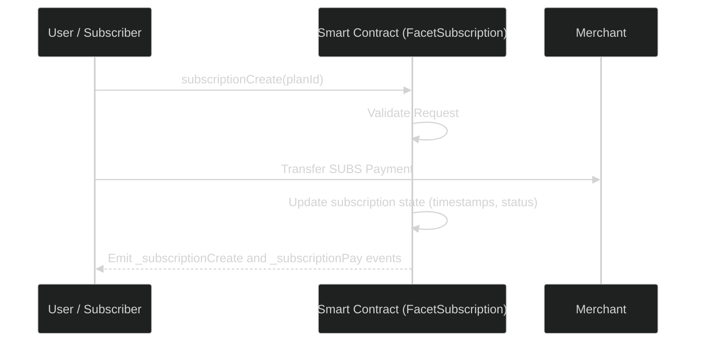
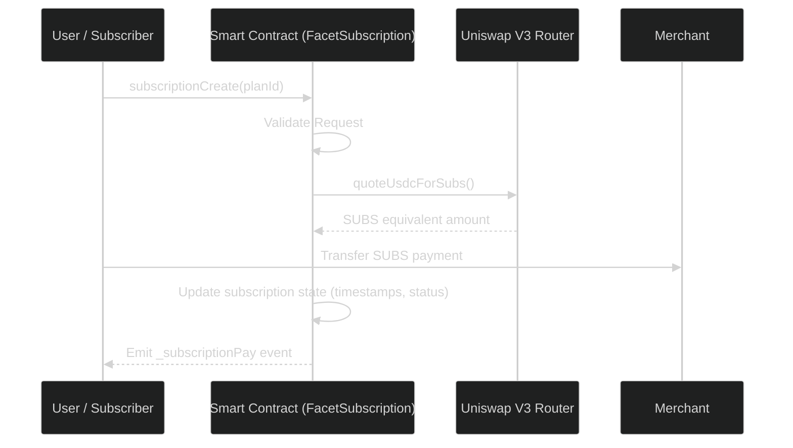
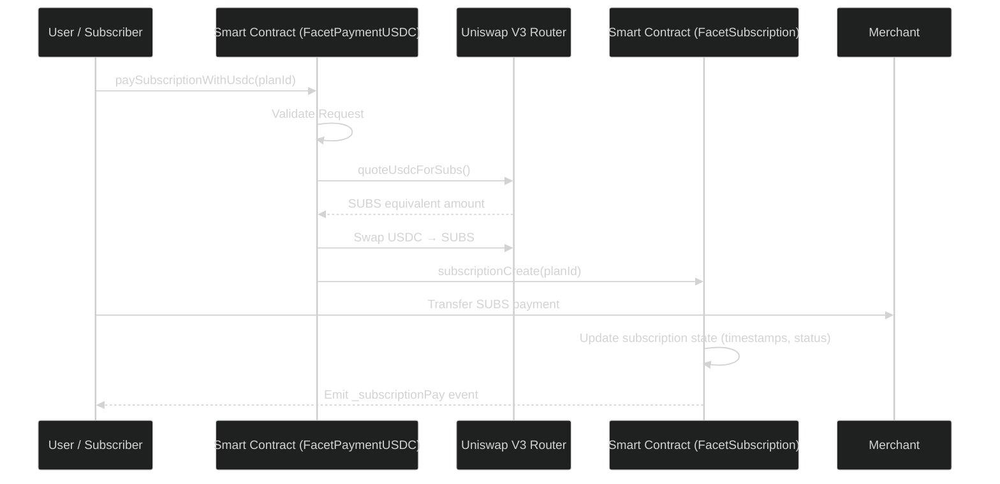
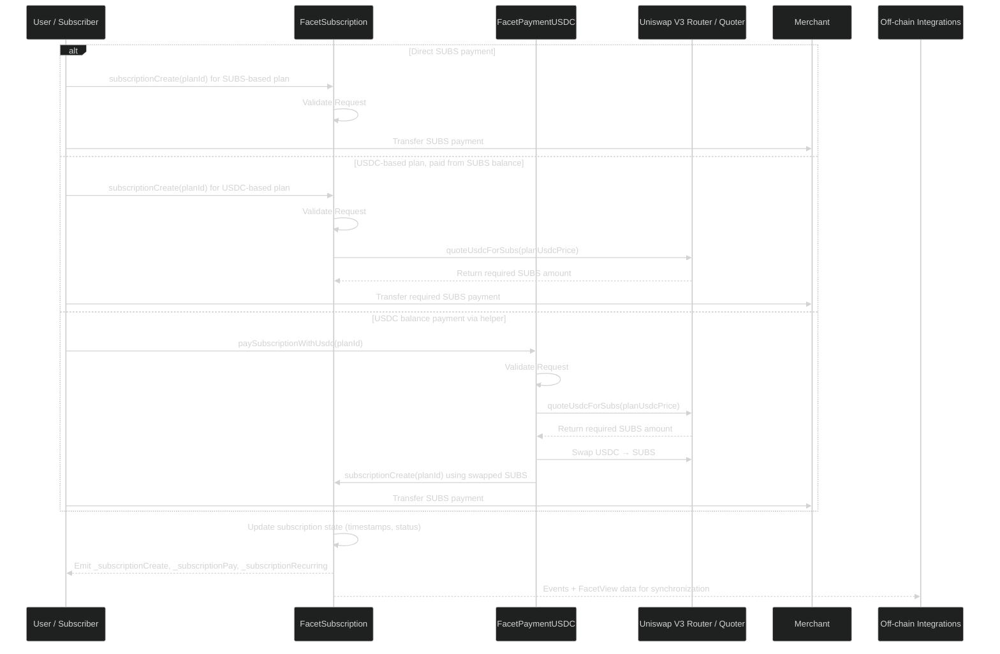

# Payment & Conversion Mechanics

The **Subscrypts Smart Contract Suite** supports subscriptions priced in either **SUBS** or **USDC**, ensuring flexibility for merchants and users while maintaining unified settlement logic across the ecosystem.

All settlements are performed **in SUBS**, the native ERC-20 utility token of the Subscrypts ecosystem. This ensures a consistent and transparent token economy, while allowing merchants to define pricing in fiat-equivalent USDC terms if desired.

---

## Dual-Currency Subscription Model

Subscriptions created by merchants can be denominated in **SUBS** or **USDC**:

* **SUBS-based subscriptions** — The subscription price and settlement both occur in SUBS.
* **USDC-based subscriptions** — The subscription amount is defined in USDC for fiat-equivalent pricing, but settlement still occurs in SUBS.

When a plan is USDC-based, the amount due in SUBS is calculated dynamically at the time of payment using the real-time conversion rate from **Uniswap V3**.
Subscribers must therefore hold the equivalent value in SUBS to complete the payment, based on the current market rate.

---

## Payment for SUBS Based Subscriptions

For plans priced directly in **SUBS**, the payment path is the most direct and gas-efficient.
No quoting or Uniswap interaction is required — the subscriber pays in SUBS, and the merchant receives SUBS as settlement.

The **FacetSubscription** contract coordinates payment and state updates, using the `SUBS` ERC-20 token for transfer and on-chain storage for lifecycle tracking.

The flow consists of:

1. Validating the plan and merchant status.
2. Charging the subscriber in SUBS via `subscriptionCreate()`
3. Transferring the SUBS amount directly to the merchant’s wallet.
4. Recording subscription state (timestamps, status, cycles) and emitting events for off-chain listeners.

By design, Subscrypts never takes custody of user or merchant funds beyond the transaction context. Settlement occurs directly between subscriber and merchant addresses under verifiable on-chain rules.

---

## Payment for USDC Based Subscriptions - Quoting Logic

The **quoting process** ensures that a given USDC price translates fairly into the correct SUBS amount at current market rates. The contract calls **Uniswap’s Quoter** to retrieve the live conversion rate, factoring in pool liquidity, price impact, and slippage tolerance.

**Functions involved:**

* `quoteUsdcForSubs(uint256 usdcAmount)` — retrieves the real-time quote from the Uniswap V3 Quoter.
* `convertOtherCurrencyToToken()` — standard utility that performs rate translation for additional supported tokens.

All quotes are **stateless** — meaning no liquidity is moved during quoting, only data is retrieved, reducing gas usage and ensuring speed.

---

## USDC Balance Payments Feature

To simplify the user experience, the Subscrypts Smart Contract Suite includes an **optional payment helper**:

This function allows users to pay directly with their **USDC balance**, regardless of whether the subscription is priced in SUBS or USDC.
The contract automatically:

1. Calculates the amount of SUBS required for the subscription using the live Uniswap V3 conversion rate.
2. Performs a **USDC → SUBS swap** within the same transaction.
3. The contract immediately calls `subscriptionCreate()` from the `FacetSubscription` contract to complete the payment and activate the subscription.
4. **Return of Remaining USDC** — If the swap results in any unused USDC, the remaining balance is automatically transferred back to the subscriber’s wallet.

The only benefit to the user here is **convenience** — the user no longer needs to manually perform the swap and then call `subscriptionCreate()` separately.

This process is fully atomic, meaning all steps (swap, conversion, and payment) occur within a single blockchain transaction.

> ⚙️ **Note:** The `paySubscriptionWithUsdc()` helper is optional. Direct payments in SUBS remain the default and most efficient path. Pay directly with USDC balance is not yet supported with automated subscriptions renewals. the subscriber will need enough SUBS balance in their wallet for automated renewals.

### Overview

When using `paySubscriptionWithUsdc()`, the protocol automatically converts the user’s USDC to SUBS and completes the payment.
Otherwise, subscribers can pay directly in SUBS, bypassing any conversion.

Regardless of the chosen path, all settlements follow the same on-chain lifecycle, ensuring:

* Transparent accounting.
* Predictable merchant revenue.
* Full interoperability with off-chain integrations such as the **[Subscrypts dApp](https://app.subscrypts.com)**, **[Subscrypts Discord Bot](https://discord.onsubscrypts.com)**, and **third-party systems**.

### Conversion Logic — Atomic Settlement

Once a quote is approved, payment execution begins through the **`FacetPaymentUSDC`** contract, which manages the **atomic swap** from USDC to SUBS before the actual subscription payment is finalized.

The sequence occurs as follows:

1. **Transfer of USDC** — The subscriber transfers the specified USDC amount to the contract for conversion.
2. **Uniswap V3 Swap** — The contract executes the USDC → SUBS swap through the Uniswap V3 Router, using live on-chain quoting to ensure accurate conversion.
3. **Receipt of SUBS by Subscriber** — The converted SUBS tokens are sent to the subscriber’s wallet.
4. **Subscription Finalization** — The contract immediately calls `subscriptionCreate()` from the `FacetSubscription` contract to complete the payment and activate the subscription.
5. **Return of Remaining USDC** — If the swap results in any unused USDC, the remaining balance is automatically transferred back to the subscriber’s wallet.

All operations occur within a single transaction sequence, ensuring **atomicity** — either the full swap and payment process succeeds or the transaction reverts entirely, leaving no residual balances or partial state.

This design eliminates custody risk: the contracts **never retain user or merchant funds** beyond the active transaction lifecycle, while maintaining transparent, verifiable settlement directly on-chain.

### Slippage and Price Protection

To ensure merchant and user protection, the payment logic integrates **slippage controls** and **minimum output guarantees**. These parameters prevent users from overpaying or merchants from under-receiving SUBS due to volatile price movements.

Key protection mechanisms:

* Minimum SUBS output threshold verified after swap.
* Transaction reverts if deviation exceeds allowed tolerance.
* Pool path hardcoded to validated Uniswap V3 pairs to prevent routing attacks.

These measures maintain **predictability and fairness** without requiring an off-chain oracle or centralized price feed.

---

## Contract Integration — Roles and Responsibilities

| Module                         | Purpose                 | Description                                                                                                                                                                   |
| ------------------------------ | ----------------------- | ----------------------------------------------------------------------------------------------------------------------------------------------------------------------------- |
| **`FacetSubscription`**        | Subscription management | Handles creation, renewal, and cancellation of subscriptions. Executes direct SUBS-based payments and manages state updates in `SubscryptsStorage`.                           |
| **`FacetPaymentUSDC`**         | Payment orchestration   | Performs on-chain quoting and executes USDC → SUBS swaps using Uniswap V3. Calls `subscriptionCreate()` from `FacetSubscription` to finalize payment in the same transaction. |
| **`SubscryptsStorage`**        | State persistence       | Maintains all plan, subscription, and merchant records, ensuring upgrade-safe data continuity across facets.                                                                  |
| **`SUBSToken`**                | Settlement token        | ERC-20 utility token used for all settlements, ensuring transparent and traceable payments between users and merchants.                                                       |
| **Uniswap V3 Router / Quoter** | Liquidity & pricing     | Provides decentralized liquidity, price quoting, and token swap execution for USDC ↔ SUBS conversions.                                                                        |

By clearly separating payment orchestration, subscription management, and liquidity interaction, Subscrypts ensures modularity, clean upgradeability, and strong isolation of responsibilities across its smart contract suite.

---

## Gas Efficiency and Scalability

To minimize cost and latency, the payment module employs several gas optimizations:

* Reuses calldata for quote and swap operations.
* Uses low-level `delegatecall` and compact structs for execution.
* Avoids storage writes where possible during quoting.

On **Arbitrum One**, an average conversion and payment transaction costs **less than 5%** of equivalent mainnet gas usage, making it ideal for recurring payments at scale.

---

## Security Considerations

Security within the conversion pipeline focuses on preventing liquidity manipulation and unauthorized swaps:

* **Access Control:** Only valid functions within `FacetPaymentUSDC` can trigger swaps.
* **Reentrancy Protection:** Guarded through `ReentrancyGuardUpgradeable` modifiers.
* **DEX Governance:** Router, pair, and quoter addresses are stored in controlled state variables that can only be updated through the admin facet, emitting `DexGovernanceChanged` events.

In the event of an exploit or market instability, admins can immediately halt conversions by setting `contractHaltCurrencyUSD` to `true`.

---

## Example Flow — Subscription Payment

The **Subscrypts Smart Contract Suite** supports two payment paths — **direct SUBS payments** and **optional USDC payments** — both resulting in on-chain settlement in SUBS.
Regardless of the method used, funds always move directly between user and merchant wallets, ensuring full transparency and non-custodial execution.

**Flow overview:**

1. The subscriber initiates a payment through the **[Subscrypts dApp](https://app.subscrypts.com)**, **[Subscrypts Discord Bot](https://discord.onsubscrypts.com)**, or another integrated service.
2. If paying in SUBS, the dApp calls `subscriptionCreate(planId)` directly on **FacetSubscription**.
3. If paying with USDC, the dApp calls `paySubscriptionWithUsdc(planId)` on **FacetPaymentUSDC**, which:
   Retrieves a real-time quote from **Uniswap Quoter**,
   Executes a **USDC → SUBS swap** via the **Uniswap Router**,
   Then calls `subscriptionCreate()` in **FacetSubscription** to finalize payment.
4. The **FacetSubscription** contract transfers SUBS to the merchant and records the subscription state.
5. Events like `_subscriptionPay`, `_subscriptionCreate`, and `_subscriptionRecurring` are emitted.
6. Off-chain components such as the **[Subscrypts dApp](https://app.subscrypts.com)**, **[Subscrypts Discord Bot](https://discord.onsubscrypts.com)**, and third-party services synchronize using these events or by querying **FacetView** functions.

---

## Summary

The **Payment and Conversion** architecture underpins Subscrypts’ hybrid model of fiat stability and tokenized settlement. Through seamless Uniswap integration and atomic execution, it enables:

* Reliable and transparent pricing.
* Fully decentralized swaps with zero custodial risk.
* Audit-ready conversion logic.

This system bridges traditional financial expectations with blockchain-native integrity — creating a subscription payment engine that is efficient, verifiable, and self-sustaining.
