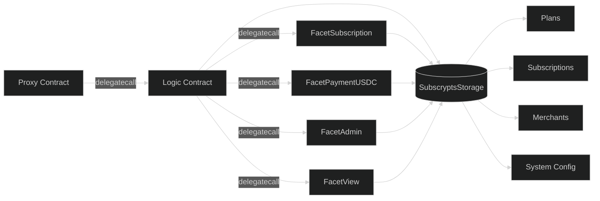

# Data Structures & Storage

The **Subscrypts Smart Contract Suite** relies on a unified and persistent storage layer, designed to survive upgrades, maintain performance, and ensure data integrity. All state data — including plans, subscriptions, merchants, and governance configurations — is stored in a single structure known as **`SubscryptsStorage`**, which acts as the canonical record for the entire protocol.

This architecture provides **full persistence across upgrades**, ensuring that every version of the logic contracts continues operating on the same data without migration or data loss.

---

## Storage Architecture Overview

Unlike traditional monolithic contracts that store variables within multiple contract scopes, Subscrypts centralizes all state data within a dedicated storage contract. This design enables safe upgrades under the **UUPS pattern**, where the proxy holds state and delegates logic calls to upgradable contracts.



Each logic or facet contract accesses the same **`SubscryptsStorage`** through internal references. This ensures all modules share consistent and synchronized state data.

---

## Key Structs

The storage contract defines several core **Solidity structs**, representing the fundamental entities of the Subscrypts ecosystem.

### `Plan`

Represents a merchant-defined subscription plan.

| Field                    | Type      | Description                                |
| ------------------------ | --------- | ------------------------------------------ |
| `id`                     | `uint256` | Unique plan identifier (auto-incremented). |
| `merchantAddress`        | `address` | Creator and owner of the plan.             |
| `currencyCode`           | `uint256` | Base currency for quoting.                 |
| `subscriptionAmount`     | `uint256` | Price per subscription cycle.              |
| `paymentFrequency`       | `uint256` | Duration of one billing period in seconds. |
| `referralBonus`          | `uint256` | Optional incentive for referrals.          |
| `commission`             | `uint256` | Platform fee percentage.                   |
| `description`            | `bytes32` | Encoded textual metadata.                  |
| `defaultAttributes`      | `bytes32` | Key attributes or plan tags.               |
| `verificationExpiryDate` | `uint256` | Expiration timestamp of verified status.   |
| `subscriberCount`        | `uint256` | Number of active subscribers.              |
| `isActive`               | `bool`    | Whether the plan is active and available.  |

### `Subscription`

Tracks the relationship between a subscriber and a plan.

| Field                | Type      | Description                                     |
| -------------------- | --------- | ----------------------------------------------- |
| `id`                 | `uint256` | Unique subscription ID (auto-incremented).      |
| `merchantAddress`    | `address` | Merchant receiving the payment.                 |
| `planId`             | `uint256` | Linked plan reference.                          |
| `subscriberAddress`  | `address` | Address of the subscriber.                      |
| `currencyCode`       | `uint256` | Currency used for quoting.                      |
| `subscriptionAmount` | `uint256` | Amount billed per cycle.                        |
| `paymentFrequency`   | `uint256` | Duration of one billing cycle in seconds.       |
| `isRecurring`        | `bool`    | Indicates if subscription renews automatically. |
| `remainingCycles`    | `uint256` | Remaining renewals for finite subscriptions.    |
| `customAttributes`   | `bytes32` | Optional custom data provided by merchant.      |
| `lastPaymentDate`    | `uint256` | Timestamp of last successful payment.           |
| `nextPaymentDate`    | `uint256` | Timestamp of next due payment.                  |

---

## Indexed Views and Query Functions

The `FacetView` module provides **read-only access** to stored data without modifying state. Common functions include:

| Function                      | Description                                               |
| ----------------------------- | --------------------------------------------------------- |
| `getPlans()`                  | Returns all subscrypts merchant plans.                    |
| `getSubscriptions()`          | Returns all subscrypts subscriber subscriptions globally. |
| `getSubscriptionsByAddress()` | Lists all subscriptions for a specific user/subscriber.   |
| `getSubscriptionsByPlan()`    | Lists subscriptions under a specific merchant plan.       |
| `getPlan()`                   | Retrieves full plan details.                              |
| `getSubscription()`           | Retrieves individual subscription data.                   |

Each function returns structured data compatible with Web3.js, ethers.js, and SDK consumers for seamless integration with the **[Subscrypts dApp](https://app.subscrypts.com)**, **[Subscrypts Discord Bot](https://discord.onsubscrypts.com)**, or any other off-chain component.

---

## Auto-Incrementing Counters

The system maintains internal auto-increment counters for plans and subscriptions through two functions:

* `_planAutoIncrement()`
* `_subscriptionAutoIncrement()`

These ensure unique identifiers across versions while preventing collisions or data loss during upgrades.

---

## Data Persistence Across Upgrades

Under the **UUPS architecture**, the storage contract is referenced via fixed storage slots defined in **`ERC-1967`**. Logic contracts can be replaced, but the data stored in the proxy’s slot remains untouched. This ensures full backward compatibility and safe version evolution.

Key considerations:

* New struct fields are appended to preserve layout order.
* Storage slots are declared explicitly to prevent overwriting.
* A reserved `_gap` array is implemented in **`SubscryptsStorage`** to allow appending future variables without shifting existing storage layout.
  This `_gap` acts as a placeholder for future state variables introduced in later releases, ensuring that upgrades remain fully **layout-safe**.

By maintaining consistent slot alignment and using the `_gap` pattern, Subscrypts guarantees that contract upgrades can introduce new data fields without risking corruption of previously stored values.

---

## Design Principles for Data Integrity

1. **Single Source of Truth** — All modules reference `SubscryptsStorage`, preventing state duplication.
2. **Predictable Layout** — Struct fields are ordered for deterministic mapping.
3. **Auditable Changes** — Any modification emits a corresponding event for external validation.
4. **Compatibility-First Evolution** — New features are always introduced as additive fields, never by overwriting existing ones.

---

## Query Example (Developers)

Developers can easily fetch data using `ethers.js` by calling the view functions exposed through the ABI:

```js
import { ethers } from "ethers";

const rpcUrl = "https://your-rpc-url";
const provider = new ethers.JsonRpcProvider(rpcUrl);

const subscryptsAddress = "0xYourContractAddress";
const subscryptsAbi = [/* ... ABI here ... */];

async function fetchSubscryptsData() {
  const subscrypts = new ethers.Contract(subscryptsAddress, subscryptsAbi, provider);

  // Example pagination window
  const indexStart = 0n;
  const indexEnd = 10n;

  // Fetch plans
  const plans = await subscrypts.getPlans(indexStart, indexEnd);

  // Fetch subscriptions for a specific user
  const subscriberAddress = "0xSubscriberWalletAddress";
  const userSubs = await subscrypts.getSubscriptionsByAddress(
    subscriberAddress,
    indexStart,
    indexEnd
  );

  console.log("Plans:", plans);
  console.log("User subscriptions:", userSubs);
}

fetchSubscryptsData().catch(console.error);
```

---

## Summary

The **SubscryptsStorage** contract is the backbone of the entire protocol, ensuring consistent and verifiable data access across all modules. By centralizing state within a proxy-managed, upgrade-safe storage contract, Subscrypts achieves data durability, transparency, and modular extensibility without compromising upgrade flexibility.
