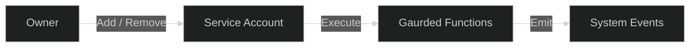

# Access Control & Roles

The **Subscrypts Smart Contract Suite** uses a lightweight and deterministic access control model designed for operational safety, transparency, and upgrade resilience. Instead of relying on multiple hierarchical roles (like merchants or subscribers), the system enforces permissions exclusively through Solidity modifiers that restrict critical operations to verified entities.

All non-restricted functions are **publicly callable**, ensuring openness while maintaining strong internal safeguards for sensitive logic.

---

## Access Modifiers

Subscrypts enforces access boundaries through three primary modifiers:

```solidity
modifier onlyOwner() {
    require(msg.sender == owner(), "Not authorized: owner required");
    _;
}

modifier onlyServiceAccounts() {
    require(contractServiceAccounts[msg.sender], "Not a service account");
    _;
}

modifier onlySelf() {
    require(msg.sender == address(this), "External caller");
    _;
}
```

### Description

| Modifier                  | Access Level                          | Purpose                                                                              |
| ------------------------- | ------------------------------------- | ------------------------------------------------------------------------------------ |
| **`onlyOwner`**           | Contract Owner                        | Full governance permissions including upgrades and global configuration.             |
| **`onlyServiceAccounts`** | Verified Automation / System Accounts | Allows execution of authorized maintenance or automation routines.                   |
| **`onlySelf`**            | Internal Contract Calls               | Restricts function execution to the contract itself during internal logic execution. |

All other visible functions within the suite are **open to public execution** unless explicitly restricted by one of these modifiers.

---

## Guarded Functions

The following core functions are protected by modifier-based access restrictions:

| Function                        | Modifier              | Purpose                                                                             |
| ------------------------------- | --------------------- | ----------------------------------------------------------------------------------- |
| `contractFreezeAccount`         | `onlyServiceAccounts` | Temporarily freezes user wallets under compliance or abuse detection.               |
| `contractFundAddressCHG`        | `onlyOwner`           | Updates the funding address used for protocol-level fees or allocations.            |
| `contractSanctionsContractCHG`  | `onlyServiceAccounts` | Updates the external sanctions contract reference.                                  |
| `contractServiceAccountsCHG`    | `onlyOwner`           | Adds or removes registered service accounts.                                        |
| `mintByAdmin`                   | `onlyServiceAccounts` | Allows system-level token minting operations under predefined conditions.           |
| `burnByAdmin`                   | `onlyServiceAccounts` | Allows controlled token burning to maintain balance integrity.                      |
| `planChange`                    | `onlyServiceAccounts` | Modifies existing plan data within authorized automation or verification processes. |
| `planChangeSubscriptionsBulk`   | `onlyServiceAccounts` | Updates multiple subscription records in batch operations.                          |
| `planGoveranceCHG`              | `onlyServiceAccounts` | Adjusts plan-level governance or parameters.                                        |
| `setHaltStates`                 | `onlyServiceAccounts` | Enables or disables global halt states (payments, plan creation, etc.).             |
| `subscriptionCollectPassiveCHG` | `onlyServiceAccounts` | Triggers automated subscription renewals in passive collection mode.                |
| `subscriptionPayExternal`       | `onlySelf`            | Internal call used by the contract to process delegated payment execution securely. |

This limited and explicit modifier-based control model ensures predictable authorization flows and minimizes governance surface area.

---

## Service Accounts — Automation Layer

**Service Accounts** represent off-chain automation identities or system-managed agents responsible for maintaining operations such as passive collection, compliance updates, or plan synchronization.

* Added or removed through `contractServiceAccountsCHG()`.
* Tracked in the on-chain mapping `contractServiceAccounts[address]`.
* Emit `ServiceAccountChanged` events upon modification.

Typical automation tasks include:

* Executing batch subscription renewals (`subscriptionCollectPassiveCHG`).
* Updating halted states or verification processes.
* Performing routine maintenance under limited authority.



---

## Governance Control — Owner Role

The **Owner** represents the highest authority within the Subscrypts ecosystem, typically assigned to the deployment governance entity. The owner’s responsibilities include:

* Managing service account access.
* Updating fund allocation addresses.
* Overseeing upgrade logic and proxy management.
* Approving or disabling global halt states.

This role is enforced through the `onlyOwner` modifier and follows the **OpenZeppelin OwnableUpgradeable** standard for secure and transferable ownership.

---

## Public Access

All non-restricted functions in the suite — such as plan creation, subscription management, payments, and view queries — are **publicly callable**. This ensures:

* Full decentralization: merchants, subscribers, or third parties can interact freely.
* Transparency: every call and state mutation is visible on-chain.
* Extensibility: new interfaces (e.g., **[Subscrypts dApp](https://app.subscrypts.com)**, **[Subscrypts Discord Bot](https://discord.onsubscrypts.com)**, custom dashboards) can integrate directly without private keys or admin APIs.

---

## Summary

Subscrypts maintains a minimalist and auditable access control framework where **ownership and automation** are clearly defined, and all other functions remain open to the public. This ensures security without compromising decentralization — every transaction, whether governance-level or user-initiated, is **fully verifiable on-chain**.
