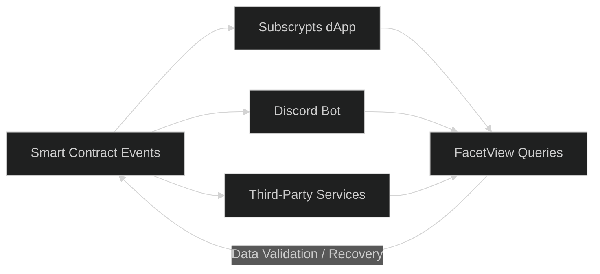

# Events & Off-Chain Integrations

The **Subscrypts Smart Contract Suite** connects on-chain actions with off-chain systems through an **event and view-function model**. Each state change within the ecosystem emits structured events while the `FacetView` module allows direct querying of live contract data.

This dual approach ensures that the **[Subscrypts dApp](https://app.subscrypts.com)**, **[Subscrypts Discord Bot](https://discord.onsubscrypts.com)**, and **third-party integrations** can synchronize data in real time without depending exclusively on events.

---

## Event and View Function Model

Subscrypts uses both **events** and **read-only view functions** to maintain data consistency across connected systems.

| Integration Type | Description                                                                                                                                                                                                                                          |
| ---------------- | ---------------------------------------------------------------------------------------------------------------------------------------------------------------------------------------------------------------------------------------------------- |
| **Event-based**  | Components subscribe to Ethereum logs (e.g., via WebSocket or RPC) and react instantly to state changes like new plans, payments, or renewals.                                                                                                       |
| **View-based**   | Components query `FacetView` functions such as `getPlans()` or `getSubscription()` to fetch current data or verify missed updates.                                                                                                                   |
| **Hybrid**       | Most off-chain integrations (like the **[Subscrypts dApp](https://app.subscrypts.com)** and **[Subscrypts Discord Bot](https://discord.onsubscrypts.com)**) use both methods — events for responsiveness, view calls for validation and persistence. |

This design ensures **resilience** — even if an event listener misses a blockchain log, any off-chain system can re-sync data directly from on-chain state.

---

## Event Overview

The following table summarizes all events implemented in the **Subscrypts Smart Contract Suite**.

### Logic Contract

| Event                                                  | Description                                                       |
| ------------------------------------------------------ | ----------------------------------------------------------------- |
| `FacetSelectorUpdated(bytes4 selector, address facet)` | Logs when a function selector’s facet mapping changes.            |
| `ServiceAccountChanged(address account, bool enabled)` | Service account added or removed.                                 |
| `FrozenFunds(address target, bool frozen)`             | Indicates a KYC or compliance-related account freeze.             |
| `MintByAdmin(address to, uint256 amt)`                 | Notifies when tokens are minted by an authorized service account. |
| `BurnByAdmin(address from, uint256 amt)`               | Notifies when tokens are burned by an authorized service account. |

### FacetAdmin

| Event                                                                | Description                                                                               |
| -------------------------------------------------------------------- | ----------------------------------------------------------------------------------------- |
| `PlanGovernanceChanged(...)`                                         | Updates plan governance variables (creation cost, verification cost, default commission). |
| `DexGovernanceChanged(...)`                                          | Logs new DEX router, quoter, or factory configuration.                                    |
| `HaltStatesChanged(...)`                                             | Tracks operational halts such as payment or plan creation suspension.                     |
| `PlanChanged(...)`                                                   | Logs updates to existing plan parameters.                                                 |
| `PlanSubscriptionsBulkChanged(...)`                                  | Logs batch updates for multiple subscriptions linked to a plan.                           |
| `SubscriptionCollectPassiveChanged(bool newEnabled, uint256 newMax)` | Indicates passive collection configuration changes.                                       |
| `ContractFundAddressChanged(address newFundAddress)`                 | Updates the treasury or funding address.                                                  |
| `ContractSanctionsChanged(bool enabled, address sanctionsContract)`  | Updates sanctions check contract configuration.                                           |
| `AdminFacetUpdated(address facetAddr)`                               | Records facet address updates for Admin logic.                                            |
| `SubscriptionFacetUpdated(address facetAddr)`                        | Records facet address updates for Subscription logic.                                     |
| `ViewFacetUpdated(address facetAddr)`                                | Records facet address updates for View logic.                                             |
| `PaymentUsdcUpdated(address facetAddr)`                              | Records facet address updates for Payment logic.                                          |
| `ProxyLogicUpdated(address logicAddr)`                               | Records logic address upgrades.                                                           |

### FacetSubscription

| Event                                                                                                                                        | Description                                   |
| -------------------------------------------------------------------------------------------------------------------------------------------- | --------------------------------------------- |
| `_planCreate(uint256 id, uint256 currency, uint256 amount, uint256 frequency)`                                                               | Emitted when a new plan is created.           |
| `_subscriptionCreate(uint256 subscriptionId, uint256 planId, address subscriber, bool recurring, uint256 remainingCycles, address referral)` | Logs subscription creation.                   |
| `_subscriptionPay(uint256 subscriptionId, uint256 planId, address subscriber, uint256 amount)`                                               | Emitted upon successful payment.              |
| `_subscriptionRecurring(uint256 subscriptionId, address merchant, uint256 planId, address subscriber, bool enabled)`                         | Logs recurring subscription state changes.    |
| `_subscriptionStop(uint256 subscriptionid, address merchant, uint256 planfk, address subscriber)`                                            | Logs subscription termination or stop events. |

### FacetPaymentUSDC

| Event                                                                                                                            | Description                                   |
| -------------------------------------------------------------------------------------------------------------------------------- | --------------------------------------------- |
| `subscriptionPaidWithUsdc(uint256 subscriptionId, address subscriber, uint256 subsAmount18, uint256 usdcSpent6, uint24 feeTier)` | Logs a payment settled via USDC swap to SUBS. |

---

## How Integrations Use Events and Views Together

Off-chain systems interact with the Subscrypts contracts using a **hybrid sync model**:

1. **Listen for events** to detect changes as they happen (e.g., `_subscriptionPay` triggers access renewal in **[Subscrypts Discord Bot](https://discord.onsubscrypts.com)**).
2. **Query FacetView functions** such as `getSubscription(subscriptionId)` to confirm details or recover missed updates.
3. **Aggregate or store** relevant plan and subscription data in local databases or dashboards.

This ensures both **real-time responsiveness** and **data consistency** across decentralized and off-chain components.



---

## Developer Example — Listening and Querying

Developers can integrate Subscrypts events and view functions seamlessly using Web3.js or ethers.js:

```js
import { ethers } from "ethers";

const rpcUrl = "https://your-rpc-endpoint";
const provider = new ethers.JsonRpcProvider(rpcUrl);

// Addresses
const subscryptsAddress = "0xSubscryptsProxyAddress";

// ABIs (simplified – replace with your full ABIs)
const subscryptsAbi = [
  "event _subscriptionPay(uint256 subscriptionId, uint256 planId, address subscriber, uint256 amount)",
];

const subscryptsViewAbi = [
  "function getPlans(uint256 indexStart, uint256 indexEnd) view returns (tuple(uint256 id, address merchantAddress, uint256 currencyCode, uint256 subscriptionAmount, uint256 paymentFrequency, uint256 referralBonus, uint256 commission, bytes32 description, bytes32 defaultAttributes, uint256 verificationExpiryDate, uint256 subscriberCount, bool isActive)[] plans)",
  "function getSubscriptionsByAddress(address subscriber, uint256 indexStart, uint256 indexEnd) view returns (tuple(uint256 id, address merchantAddress, uint256 planId, address subscriberAddress, uint256 currencyCode, uint256 subscriptionAmount, uint256 paymentFrequency, bool isRecurring, uint256 remainingCycles, bytes32 customAttributes, uint256 lastPaymentDate, uint256 nextPaymentDate)[] subs)",
];

async function main() {
  const subscrypts = new ethers.Contract(subscryptsAddress, subscryptsAbi, provider);
  const subscryptsView = new ethers.Contract(subscryptsAddress, subscryptsViewAbi, provider);

  // 1) Listen to payment events
  subscrypts.on("_subscriptionPay", (subscriptionId, planId, subscriber, amount, event) => {
    console.log(
      `Payment received — subscriptionId: ${subscriptionId.toString()}, planId: ${planId.toString()}, ` +
      `subscriber: ${subscriber}, amount: ${amount.toString()} SUBS`
    );
  });

  // 2) Use view functions to fetch on-chain data
  const indexStart = 0n;
  const indexEnd = 10n;

  const plans = await subscryptsView.getPlans(indexStart, indexEnd);

  const subscriberAddress = "0xSubscriberAddress";
  const subs = await subscryptsView.getSubscriptionsByAddress(
    subscriberAddress,
    0n,
    10n
  );

  console.log("Plans:", plans);
  console.log("Subscriptions for subscriber:", subs);
}

main().catch(console.error);
```

---

## Key Benefits

* **Real-Time Updates:** Events broadcast all key on-chain actions instantly.
* **State Validation:** View functions guarantee data integrity even if events are missed.
* **Transparency:** All emitted logs are permanently recorded on-chain.
* **Resilience:** Any system can re-sync using `FacetView` data.
* **Extensibility:** Third-party developers can use events, view calls, or both depending on use case.

---

## Summary

Subscrypts’ hybrid integration model combines **event-based reactivity** with **state-based validation** via `FacetView`. This ensures the **[Subscrypts dApp](https://app.subscrypts.com)**, **[Subscrypts Discord Bot](https://discord.onsubscrypts.com)**, and external integrations remain synchronized, reliable, and independently verifiable — providing transparency and operational stability across the entire ecosystem.
