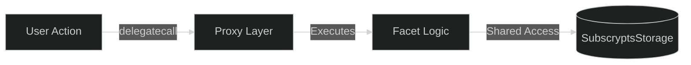
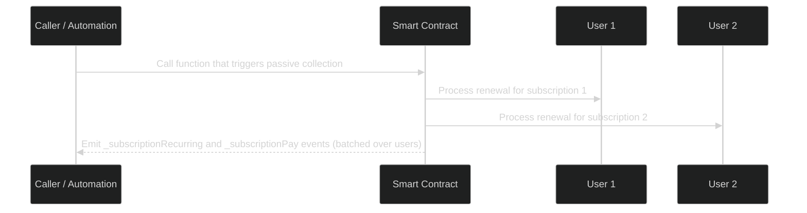

# Gas Optimization & Scalability

The **Subscrypts Smart Contract Suite** is optimized for **Arbitrum One**, an Ethereum Layer 2 network that combines high throughput with low transaction fees. This section explains how Subscrypts achieves gas efficiency at the code, architecture, and operational levels while remaining scalable to thousands of merchants and subscribers.

---

## Design Objectives

Gas efficiency is not just a cost consideration—it directly affects scalability, accessibility, and adoption. The goal of Subscrypts’ optimization strategy is to:

* Minimize the gas footprint of recurring operations (plan creation, renewals, and payments).
* Reduce unnecessary storage writes.
* Batch operations when possible without sacrificing transparency.
* Scale to high transaction volumes while maintaining user-level affordability.

---

## Architectural Efficiency

The modular UUPS architecture provides inherent gas efficiency by:

* **Separating logic from state:** delegate calls between the proxy and facets reuse the same storage layout, avoiding redundant data handling.
* **Reducing contract redeployment:** upgrades modify logic only, not state.
* **Reusing structs and mappers:** multiple modules share references to `SubscryptsStorage`, preventing data duplication.

By limiting storage complexity and maintaining a unified memory layout, gas costs are reduced across function calls and cross-facet operations.

---

## Function-Level Optimizations

### 1. Reduced Storage Writes

Many Solidity operations write to storage unnecessarily. Subscrypts minimizes this by:

* Using in-memory computations for temporary data.
* Writing only essential changes to storage after successful validation.
* Using mappings (e.g., `mapping(uint256 => Subscription)`) instead of deeply nested structs to keep writes targeted.

### 2. Storage Layout Awareness

The Solidity compiler stores data in 32-byte slots. Subscrypts’ storage layout is designed with this in mind:

* Related `bool` flags (e.g., halt states) are grouped together so they share a single storage slot.
* Struct fields are appended in a predictable order to keep the layout stable across upgrades.
* A `_gap` array is reserved at the end of `SubscryptsStorage` to allow adding future variables without shifting existing slots.

This approach doesn’t aggressively micro-pack every field, but it **avoids unnecessary slots** and keeps the layout upgrade-safe and gas-conscious.

### 3. Event Batching

Certain repetitive operations (like multiple renewals in `subscriptionCollectPassive`) can be processed in batches, reducing total gas while maintaining auditability.

### 4. Low-Level Calls

Critical functions such as token transfers and DEX interactions can leverage low-level calls where appropriate to avoid redundant overhead from higher-level wrappers.

---

## Payment and Renewal Efficiency

The **`FacetPaymentUSDC`** and **`FacetSubscription`** modules are optimized for repeated use:

* Quoting via Uniswap’s **Quoter** uses `staticcall`, which consumes no gas for state modification.
* Subscription renewals can be processed in **passive collection** mode, allowing multiple subscriptions to be updated within a single transaction.
* Plan verification and expiration checks occur off-chain via event listeners in the **[Subscrypts dApp](https://app.subscrypts.com)** or **[Subscrypts Discord Bot](https://discord.onsubscrypts.com)** where possible, reducing redundant contract reads.

**Batch Renewal Example:**
Any operation that routes through the internal subscription update flow (e.g. passive collection helpers or automated runners) can trigger the passive renewal logic. When this path is executed in batch mode, it processes up to **N** subscriptions in one call, amortizing gas cost per user.

---

## 9.5 Arbitrum One — Layer 2 Scalability

Subscrypts is deployed on **Arbitrum One**, chosen for its high throughput and EVM compatibility. Key benefits include:

* **Low gas fees:** up to 90% lower than Ethereum mainnet.
* **Optimistic rollup technology:** batches multiple transactions for faster execution.
* **Seamless interoperability:** fully compatible with existing Ethereum tools, wallets, and libraries.

Arbitrum’s rollup model compresses Subscrypts’ recurring transactions (like renewals and swaps), allowing thousands of users to interact simultaneously without congestion.

---

## Caching and Query Optimization

Read operations through `FacetView` are optimized using indexed views and pagination:

* Functions like `getPlans()` and `getSubscriptions()` support **offset and limit** arguments to reduce payload size.
* Front-end and SDK consumers, including the **[Subscrypts dApp](https://app.subscrypts.com)**, are encouraged to **cache state** locally using emitted events rather than calling view functions repeatedly.

This hybrid approach reduces on-chain load and improves overall performance across analytics and dashboards.

---

## Scalability Beyond Arbitrum

The architecture is **chain-agnostic** and ready for cross-rollup or multi-chain deployment. Future scaling paths could include:

* **Cross-chain deployments** on Base, zkSync, or Optimism.
* **Bridged state architecture** allowing subscription data replication across chains.
* **Oracle-assisted sync** for pricing and accounting consistency across ecosystems.

Each chain would retain the same UUPS-based modular logic, differing only in DEX integration or native token mapping.

---

## Developer Recommendations

For third-party developers integrating or extending Subscrypts:

* Use batched write operations whenever possible.
* Avoid redundant read calls; subscribe to events instead.
* Cache active plans and subscriptions client-side for low-latency experiences.
* Benchmark contracts on L2 testnets to ensure gas predictability.

---

## Summary

Subscrypts achieves efficiency and scalability through a combination of **modular architecture**, **optimized Solidity engineering**, and **Layer 2 deployment**. By carefully minimizing gas-heavy operations and leveraging batch renewals, it delivers a system that can scale to enterprise-level usage without centralization or performance degradation.
