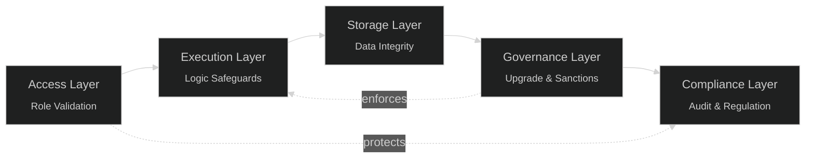

# Security & Auditing

Security is a foundational pillar of the **Subscrypts Smart Contract Suite**. Every component—from core logic to payment routing—has been engineered with the principle of *minimum trust, maximum verifiability*. The suite leverages industry-standard patterns, rigorous internal testing, and OpenZeppelin-based security frameworks to ensure reliable and tamper-resistant operations.

This section outlines the system’s layered security design, defensive coding practices, and audit procedures that protect merchants, subscribers, and the broader ecosystem.

---

## Security Objectives

The security model is built on five key objectives:

1. **Integrity:** Guarantee that no unauthorized entity can modify on-chain logic or data.
2. **Resilience:** Ensure protocol functionality persists even under network or system stress.
3. **Transparency:** Make all administrative and upgrade actions publicly verifiable.
4. **Compliance:** Integrate sanction and freeze mechanisms that align with [MiCAR](https://subscrypts.com/whitepaper) and AML standards.
5. **Auditability:** Maintain deterministic behavior across upgrades for third-party review.

---

## Security Architecture Layers

The Subscrypts suite employs a **multi-layered defense model**, combining Solidity best practices with modular governance controls.

| Layer                | Description                                    | Example Protections                                                   |
| -------------------- | ---------------------------------------------- | --------------------------------------------------------------------- |
| **Access Layer**     | Controls who can execute which function.       | Role-based modifiers (`onlyOwner`, `onlyServiceAccounts`).            |
| **Execution Layer**  | Guards logic execution and payment processing. | Reentrancy locks, delegatecall confinement, slippage checks.          |
| **Storage Layer**    | Ensures data consistency across upgrades.      | ERC-1967 storage slots, fixed layout, append-only structs.            |
| **Governance Layer** | Handles upgrades and sanctions.                | `upgradeToAndCall()`, `contractFreezeAccount()`, `HaltStatesChanged`. |
| **Compliance Layer** | Enforces regulatory requirements.              | Sanction checks, freeze states, and event-driven audit logs.          |

Each layer reinforces the others to create a closed security loop, minimizing exploit vectors while maintaining flexibility for legitimate operations.

---

## Core Security Mechanisms

### 1. Role-Based Access Control (RBAC)

Every sensitive function is protected by role modifiers. Admin, merchant, and service roles are separated to prevent privilege escalation. Unauthorized calls revert immediately with descriptive error codes.

### 2. Reentrancy and Delegatecall Protection

Reentrancy guards prevent recursive execution in payment flows and subscription renewals. The `ReentrancyGuardUpgradeable` pattern ensures functions cannot be re-entered mid-execution.

Delegatecall operations are restricted to verified contracts through selector validation in the proxy layer.

### 3. Immutable Proxy State

All state data resides in the proxy storage, isolated from logic upgrades. This ensures persistent, tamper-proof user and merchant records.

### 4. Transaction Atomicity

Payment and conversion logic executes atomically: if any operation in a chain fails, the entire transaction reverts. No partial state or stuck balances remain.

### 5. Emergency Halts

Governance roles can temporarily halt specific contract operations (plan creation, payments, conversions) via `contractHalt*()` functions, ensuring rapid containment during incident response.

---

## Use of OpenZeppelin Libraries

Subscrypts extensively integrates **OpenZeppelin’s audited base contracts** to minimize custom attack surfaces.

| Library                      | Purpose                                             |
| ---------------------------- | --------------------------------------------------- |
| `OwnableUpgradeable`         | Defines upgrade-safe ownership for proxy admins.    |
| `ReentrancyGuardUpgradeable` | Prevents nested reentrancy attacks in payments.     |
| `UUPSUpgradeable`            | Manages upgrade logic under the UUPS proxy pattern. |
| `ERC20Upgradeable`           | Implements the SUBS token standard.                 |

All dependencies are version-pinned and verified against known CVEs before deployment.

---

## Compliance and Sanctions Enforcement

Compliance logic ensures lawful operation across jurisdictions and enables transparency in protocol governance.

* `contractFreezeAccount()` blocks malicious or sanctioned entities.
* `subCheckSanctions()` verifies wallet status before executing payments.
* Elevated accounts (`onlyOwner`, `onlyServiceAccounts`) can also execute **token minting and burning** through `mintByAdmin()` and `burnByAdmin()`.
  These operations emit public on-chain events, ensuring visibility and auditability for all participants.
* Administrative minting or burning can be used in controlled situations such as:

  * Restoring token supply after a protocol migration.
  * Burning tokens seized from frozen or compromised wallets.
  * Correcting on-chain accounting inconsistencies after verified incidents.
* All freeze, sanction, mint, and burn actions emit **indexed events** (`FrozenFunds`, `MintByAdmin`, `BurnByAdmin`), allowing anyone to trace their origin and context through on-chain logs.

This enforcement layer is essential for **[MiCAR](https://subscrypts.com/whitepaper)** and AML readiness — maintaining decentralization while ensuring accountability, transparency, and regulatory compliance across the Subscrypts ecosystem.

---

## Testing and Verification

Security assurance is validated through multiple testing phases:

1. **Unit Tests:** Cover over 90% of core logic (facets, payment routing, and upgrade paths).
2. **Integration Tests:** Simulate end-to-end flows involving subscription creation, renewal, and payment swaps.
3. **Fuzz Testing:** Randomized inputs test resilience against unexpected execution paths.
4. **Static Analysis:** Tools such as Slither and MythX identify potential reentrancy or storage collision risks.

The results of each test cycle are logged and versioned in the development repository.

---

## External Audit Readiness

The Subscrypts Smart Contract Suite is designed for **audit transparency** and future third-party verification. All source code follows clear naming conventions and includes:

* Modular code structure with isolated facets.
* Event-based logging for all state transitions.
* Minimal inline assembly usage.
* Publicly available ABI references at [ABI Reference](11-abi-reference.md).

Planned external audits will focus on:

* Logic and storage integrity.
* Proxy upgrade path validation.
* DEX integration security.
* Governance and halt function correctness.

---

## Security Incident Response Plan

In the event of a vulnerability or exploit detection:

1. The **Proxy Admin** triggers relevant halt functions.
2. Security analysts review the issue using logs and traces.
3. Governance deploys a patched facet through `registerFacetSelector()`.
4. The system emits `FacetSelectorUpdated` and `HaltStatesChanged` events for transparency.

This procedure ensures containment within minutes while preserving historical data.

---

## Summary

Subscrypts follows a *security-first* design philosophy. From OpenZeppelin-backed upgradeability to compliance enforcement and rigorous testing, every component contributes to a system that is resilient, transparent, and audit-ready.

Security is not a phase—it is a continuous process embedded in the protocol’s lifecycle.
