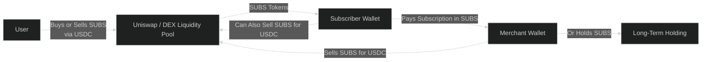
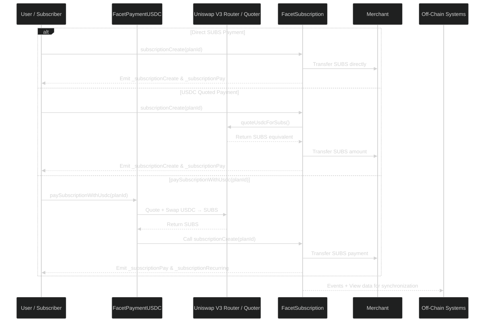

# Token Integration — SUBS Token

The **SUBS Token** is the native ERC-20 token of the Subscrypts ecosystem. It serves as the settlement medium for all on-chain transactions and subscription payments while maintaining interoperability with stablecoins such as **USDC**. The SUBS token ensures that economic activity across the platform remains transparent, decentralized, and utility-driven.

This section explains how the SUBS token integrates into the contract suite, powers subscription settlements, and interacts with decentralized exchanges (DEXs) for liquidity and quoting.

---

## Overview and Purpose

The SUBS token underpins the Subscrypts economy by providing:

- **Settlement utility** — used for payments between subscribers and merchants.
- **Economic alignment** — ensuring value accrues within the ecosystem rather than to intermediaries.
- **Liquidity pairing** — integrated with USDC to enable price stability and fair quoting.

Unlike speculative tokens, SUBS functions as a **utility and settlement asset**, directly linked to the platform’s operational logic.

---

## Token Standard and Implementation

SUBS conforms to the **ERC-20 Upgradeable** standard, extending OpenZeppelin’s `ERC20Upgradeable` contract for compatibility with the UUPS proxy architecture.

Key properties:

- **Name:** Subscrypts Token
- **Symbol:** SUBS
- **Decimals:** 18
- **Type:** ERC-20 upgradeable
- **Deployed Network:** Arbitrum One

It inherits all standard ERC-20 methods (`transfer`, `approve`, `allowance`) while supporting internal hooks for payment processing within `FacetSubscription` `FacetPaymentUSDC`.

---

## Token Economics and Utility Cycle

The **SUBS Token** powers a self-sustaining and transparent economic cycle within the Subscrypts ecosystem. It is not a speculative-only asset but a **utility token** with continuous real-world demand and supply generated by subscription activity.

### The Economic Flow

1. **Subscribers** acquire SUBS (often converting from USDC) to pay for their subscriptions.
2. **Merchants** receive SUBS as payment for their services or products.
3. **Merchants** can either:

   * Convert SUBS back to **USDC or other stable assets** to cover operational costs.
   * **Hold SUBS** to benefit from long-term platform growth and future ecosystem incentives.
4. Over time, as adoption increases, this recurring demand for SUBS (through user payments) and periodic selling (by merchants) establishes a healthy token velocity.

The result is an **organic value cycle** driven by usage, not speculation. Token demand grows naturally as more subscriptions are created and renewed, while liquidity ensures stability for real-world settlements.

### Future Incentives and Utility Expansion

While the current token model focuses on **settlement and liquidity**, future iterations may include:

* **Staking incentives** for merchants or long-term holders.
* **Reduced commission fees** or added perks for merchants holding a specific minimum balance of SUBS.
* **Discounted network fees** for recurring subscribers maintaining a wallet balance above a threshold.

These mechanisms aim to reward participants who actively contribute to the ecosystem’s stability and growth.

### Visualized Token Economy



This cyclical model keeps the Subscrypts economy dynamic and utility-driven — every token movement represents real economic activity, making SUBS both functional and sustainable.

---

## Token Flow in Subscription Settlement

The **SUBS token** is the universal settlement currency within the Subscrypts ecosystem. Regardless of whether a plan is defined in SUBS or USDC, **all payments ultimately settle in SUBS**, ensuring predictable merchant revenue and unified accounting.

### How Settlement Works

1. **Direct SUBS Payment** — When the subscriber calls `subscriptionCreate(planId)` for a SUBS-based plan, payment is performed directly in SUBS with no conversion.
2. **USDC Quoted Payment** — For USDC-based plans, if the subscriber calls `subscriptionCreate(planId)`, the contract retrieves a **real-time quote** from Uniswap to determine the SUBS equivalent and deducts that amount directly from the subscriber’s SUBS balance.
3. **USDC-to-SUBS Conversion** — When using `paySubscriptionWithUsdc(planId)`, the **FacetPaymentUSDC** contract performs an **on-chain swap** from USDC → SUBS using the Uniswap Router, then calls `subscriptionCreate()` internally to complete payment and activate or renew the subscription.
4. **Settlement** — Once the SUBS payment is finalized, funds are transferred directly to the merchant’s wallet. No custodial wallet or intermediary holds user funds.
5. **Event Emission** — Events like `_subscriptionPay`, `_subscriptionCreate`, and `_subscriptionRecurring` are emitted, enabling off-chain synchronization across the **[Subscrypts dApp](https://app.subscrypts.com)**, the **[Discord Bot](https://discord.onsubscrypts.com)**, and third-party integrations.

### Visualized Flow



This unified settlement logic ensures **atomic conversions**, **non-custodial transfers**, and **on-chain auditability**, regardless of the subscriber’s chosen payment currency.

---

## Token Liquidity and Uniswap Integration

To enable reliable conversions, SUBS maintains liquidity through a **SUBS/USDC pool** on **Uniswap V3**. The protocol interacts with three core Uniswap components:

- **Router:** Executes swaps between USDC and SUBS.
- **Quoter:** Retrieves price data for quoting during plan creation and payment estimation.
- **Position Manager:** Allows liquidity providers (LPs) to manage custom tick ranges and positions.

The `FacetSubscription` and `FacetPaymentUSDC` contracts integrates with these components to perform on-chain quoting and settlement using verified pool addresses.

---

## Conversion Functions and Logic

The **Subscrypts Smart Contract Suite** uses specialized conversion and pricing logic to ensure consistent and fair SUBS settlement across both USDC and SUBS-based plans.

Conversion and quoting are handled through two key modules:

* **FacetPaymentUSDC** — Responsible for quoting and performing real-time swaps using Uniswap.
* **FacetSubscription** — Handles subscription settlement logic using the median on-chain price for consistency and predictable merchant revenue.

| Function                                  | Module                | Description                                                                                                                                                                                            |
| ----------------------------------------- | --------------------- | ------------------------------------------------------------------------------------------------------------------------------------------------------------------------------------------------------ |
| `quoteUsdcForSubs(uint256 amountUsdc)`    | **FacetPaymentUSDC**  | Retrieves a live quote from **Uniswap’s Quoter**, returning the expected SUBS output for a given USDC input. This value reflects real market swap rates including fees, slippage, and liquidity depth. |
| `paySubscriptionWithUsdc(uint256 planId)` | **FacetPaymentUSDC**  | Executes an on-chain **USDC → SUBS** swap at the quoted price via Uniswap, then calls `subscriptionCreate()` in **FacetSubscription** to complete the transaction in a single atomic operation.        |
| `convertOtherCurrencyToToken()`           | **FacetSubscription** | Performs internal conversion calculations for supported tokens based on the **mid-range Uniswap pool price**—a balanced rate used for consistent settlement and accounting.                            |
| `convertTokenToOtherCurrency()`           | **FacetSubscription** | Performs internal conversion calculations for supported tokens based on the **mid-range Uniswap pool price**—a balanced rate used for consistent settlement and accounting.                            |

**Quoting Logic:**

* The **FacetPaymentUSDC** module uses **Uniswap’s Quoter** for direct price discovery and conversion execution. The resulting price includes all DEX-related variables such as liquidity, swap fees, and price impact.
* The **FacetSubscription** module, on the other hand, uses **mid-range pool pricing** for settlements that do not involve active swaps. This ensures consistent pricing for recurring renewals and minimizes volatility effects.

By combining both quoting and mid-range settlement logic, Subscrypts ensures that users always pay a fair, verifiable rate, while merchants receive predictable and transparent payouts.

---

## Compliance and Regulatory Alignment

The SUBS token is explicitly defined as a **utility token** under the [MiCAR](https://subscrypts.com/whitepaper) framework. It does not represent a financial instrument or security.

Compliance features include:

- On-chain sanctions and freeze logic integrated into the payment flow.
- Transparent event logging for all transfers and conversions.
- Optional KYC/KYB alignment for merchants in regulated jurisdictions.

These mechanisms ensure lawful operation while maintaining user privacy and decentralization.

---

## Example Integration (Developers)

Developers can integrate the **SUBS** ERC-20 token into their dApps, bots, or backend services using any Web3 library. Below is a ready-to-use example with **ethers.js**.

```js
import { ethers } from "ethers";
import subsTokenAbi from "./abi/subsTokenAbiV1.json";

// 1. Set up provider and signer
const rpcUrl = "https://your-arbitrum-rpc-url";
const provider = new ethers.JsonRpcProvider(rpcUrl);

const subsTokenAddress = "0xYourSubsTokenAddress"; // SUBS ERC-20 contract
const privateKey = "0xYourPrivateKey"; // load from env/secret manager in real apps
const signer = new ethers.Wallet(privateKey, provider);

// 2. Initialize the SUBS token contract
const subsToken = new ethers.Contract(subsTokenAddress, subsTokenAbi, signer);

async function main() {
  const walletAddress = await signer.getAddress();

  // Example 1: Check SUBS balance
  const balance = await subsToken.balanceOf(walletAddress);
  console.log(`Your SUBS balance: ${ethers.formatUnits(balance, 18)} SUBS`);

  // Example 2: Approve Subscrypts payment contract to spend SUBS
  const paymentContractAddress = "0xYourSubscryptsProxyOrPaymentAddress";
  const amountToApprove = ethers.parseUnits("50", 18); // approve 50 SUBS

  const approveTx = await subsToken.approve(paymentContractAddress, amountToApprove);
  const approveReceipt = await approveTx.wait();
  console.log("Approval transaction hash:", approveReceipt.hash);

  // Example 3: Send SUBS tokens to another wallet
  const recipientAddress = "0xRecipientWalletAddress";
  const amountToSend = ethers.parseUnits("5", 18); // send 5 SUBS

  const transferTx = await subsToken.transfer(recipientAddress, amountToSend);
  const transferReceipt = await transferTx.wait();
  console.log("Transfer transaction hash:", transferReceipt.hash);
}

main().catch(console.error);
```

---

## Summary

The **SUBS Token** acts as the financial backbone of the Subscrypts ecosystem. Through its seamless integration with USDC quoting, Uniswap liquidity, and modular upgradeability, SUBS enables decentralized, transparent, and compliant payment processing at scale.
