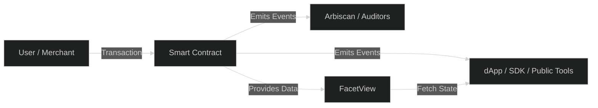
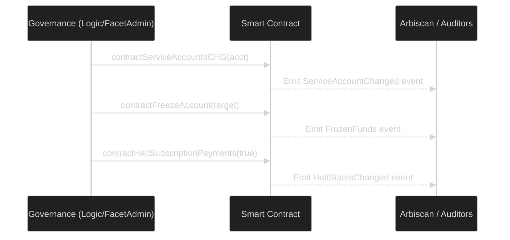

# Compliance & Transparency

The **Subscrypts Smart Contract Suite** is designed to be *compliant by architecture*. Every operation — from payment execution to merchant onboarding — is recorded on-chain and can be independently verified. This transparency allows the platform to meet emerging regulatory requirements, such as the **Markets in Crypto-Assets Regulation ([MiCAR](https://subscrypts.com/whitepaper))**, while maintaining full decentralization and privacy preservation.

Compliance is not an external process in Subscrypts — it is embedded directly into the protocol’s design. The system enforces clear rules of engagement, supports lawful operations, and provides audit-ready data for regulators and ecosystem participants.

---

## MiCAR Alignment — Regulatory Foundation

The **Markets in Crypto-Assets Regulation ([MiCAR](https://subscrypts.com/whitepaper))** introduces a unified framework for digital asset regulation within the European Union. Subscrypts was architected with MiCAR compliance in mind, ensuring that its utility token (SUBS) and platform functions operate within this legal scope.

Key principles derived from MiCAR that Subscrypts adheres to:

- **Transparency:** All financial and operational data relevant to the protocol is publicly accessible on-chain.
- **Traceability:** Each subscription, payment, and upgrade action emits an event that can be reconstructed for audit trails.
- **Consumer Protection:** Built-in freeze and halt mechanisms prevent fraudulent or unauthorized activity.
- **Utility Token Classification:** SUBS is strictly a *utility token* used for settlement and protocol operations — it does not grant financial rights or represent a security.

Unlike many blockchain systems where compliance is retrofitted later, Subscrypts integrates regulatory readiness at the core of its smart contracts.

---

## On-Chain Transparency Architecture

Transparency is achieved through **event-driven accountability** — every action taken on the Subscrypts network leaves a verifiable trace that cannot be modified or deleted.

### Transparency Components
| Mechanism | Description |
| ---------- | ----------- |
| **Event Logs** | Immutable records for all transactions, upgrades, and compliance actions. |
| **View Functions** | Public read-only access to system states via the `FacetView` contract. |
| **Public ABI Access** | The complete contract ABI is published for third-party analysis and SDK development. |

This structure ensures that regulators, merchants, and developers can all access the same truth — verifiable blockchain data.

---

## Built-In Compliance Mechanisms

The Subscrypts protocol embeds compliance functions that support both operational integrity and legal conformance.

### Key Features

1. **Sanction and Freeze Controls:**
   Functions like `contractFreezeAccount()` and `subCheckSanctions()` enforce restrictions on wallets flagged by compliance modules.
   Merchants and subscribers under sanctions cannot execute financial operations.
2. **Halt States:**
   Governance can temporarily pause sensitive activities (plan creation, payments, conversions) using `contractHalt*()` methods.
   Each halt is logged via the `HaltStatesChanged` event.
3. **Transparent Governance Actions:**
   All administrative operations (facet registration, upgrades, sanctions) emit traceable on-chain events.
   Governance actions cannot occur silently or off-chain.
4. **Versioning and Change History:**
   Each deployed or upgraded contract emits an `Upgraded` event, enabling public version tracking.

Together, these mechanisms make Subscrypts one of the few blockchain protocols with **native compliance enforcement** and verifiable governance accountability.

---

## Privacy and Data Minimization

Subscrypts adheres to privacy-by-design principles consistent with GDPR and [MiCAR](https://subscrypts.com/whitepaper) data handling requirements. Unlike traditional SaaS systems, Subscrypts does not collect or store personal information. All interactions occur between wallet addresses and smart contracts.

**Core Privacy Guarantees:**

* No user identification or PII is required for subscription creation.
* Wallet-based identity eliminates centralized databases.
* Optional metadata fields allow merchants to store pseudonymous references only when necessary.
* Off-chain components (such as the [dApp](https://app.subscrypts.com) or [Discord Bot](https://discord.onsubscrypts.com)) handle account linking voluntarily and transparently.

This ensures privacy preservation while maintaining the auditability required by financial and regulatory frameworks.

---

## Governance Transparency and Auditability

Governance transparency ensures stakeholders can follow every system modification and policy enforcement event. All actions are on-chain and accompanied by public event logs.

**Audit Trail Components:**

* `Upgraded(address newImplementation)` — shows deployment of a new contract logic version.
* `FacetSelectorUpdated(bytes4 selector, address facet)` — displays updated function mappings.
* `ContractSanctionsChanged(address newRegistry)` — tracks updates to compliance registries.
* `FrozenFunds(address target, bool frozen)` — identifies wallet restrictions.

Auditors can reconstruct a full operational timeline by indexing these events e.g.:

Every action leaves a forensic trail that can be independently verified by any observer.

---

## Compliance as a Continuous Process

Compliance in Subscrypts is **not static** — it evolves alongside regulations and user expectations. The modular UUPS architecture allows new compliance modules or policies to be deployed as independent facets without affecting core operations.

For example:

* Future sanctions APIs can be linked via `ContractSanctionsChanged()`.
* Regional compliance layers can be added as extensions for jurisdictional requirements.
* Independent oversight entities can subscribe to governance events to perform live compliance monitoring.

This flexibility ensures that the platform can adapt to global regulatory frameworks while maintaining decentralization and transparency.

---

## Summary

The **Compliance & Transparency** framework within Subscrypts is not an afterthought—it is foundational. By combining verifiable on-chain governance, [MiCAR](https://subscrypts.com/whitepaper) alignment, built-in sanction controls, and privacy-by-design, Subscrypts delivers a **trustworthy Web3 infrastructure** that satisfies both decentralization principles and regulatory rigor.

For merchants, it means operating within a legally resilient environment.
For developers, it means transparent, auditable logic.
For investors, it demonstrates that blockchain innovation and compliance can coexist harmoniously.
