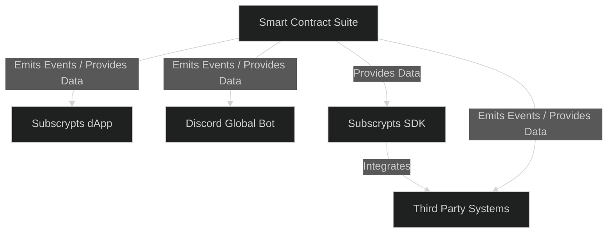
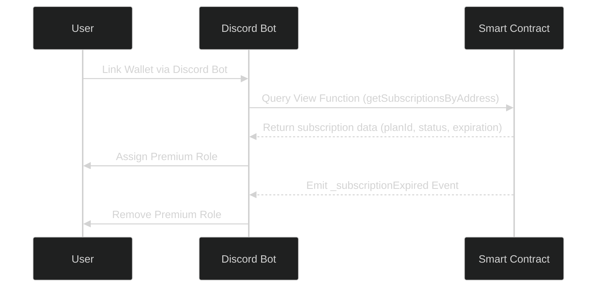

# Connection to Other Components

The **Subscrypts Smart Contract Suite** operates as the foundation layer of the entire Subscrypts ecosystem. While it defines the logic, payment routing, and governance on-chain, its true strength emerges through integration with other components — the **[Subscrypts dApp](https://app.subscrypts.com)**, **[Discord Global Bot](https://discord.onsubscrypts.com)**, and **third-party integrations**. Together, they form a seamless bridge between decentralized infrastructure and user-facing applications.

This section provides an in-depth view of how each layer interacts, how data flows between them, and how developers and merchants can extend or customize integrations.

---

## Architectural Overview — Layered Integration

The Subscrypts ecosystem is structured in three layers:

| Layer | Component | Purpose |
| ------ | ---------- | -------- |
| **Core Layer** | Smart Contract Suite | Handles all subscription logic, payments, compliance, and events on-chain. |
| **Application Layer** | [Subscrypts dApp](https://app.subscrypts.com) and [Discord Global Bot](https://discord.onsubscrypts.com) | Provides user-facing interfaces for merchants and subscribers. |
| **Integration Layer** | SDKs, APIs, Analytics Tools and third-party integrations | Enables external systems to query, analyze, and extend the ecosystem. |

These layers communicate through event-driven synchronization and on-chain data queries rather than centralized APIs.



The design ensures every connected system reads from the same verifiable data source — the blockchain.

---

## Integration with the Subscrypts dApp

The **[Subscrypts dApp](https://app.subscrypts.com)** functions as the primary user interface for merchants and subscribers. It connects directly to the smart contracts using the published ABI and Web3 providers, making all actions transparent and non-custodial.

### Key Interactions

* **For Merchants:**
  Create and manage subscription plans (`planCreate`, `planUpdate`).
  View active subscribers and revenue analytics through contract queries.
* **For Subscribers:**

  * Browse plans and initiate subscriptions via `subscriptionCreate()`.
  * Trigger renewals or cancellations on-chain.
  * Monitor payment history using event listeners or view functions.

The dApp is designed for responsiveness and decentralization — all data displayed originates from **on-chain queries** or **emitted events**. No external database controls or stores user data.

---

## Integration with the Discord Global Bot

The **[Discord Global Bot](https://discord.onsubscrypts.com)** extends Subscrypts functionality into community environments. It automates access management for tokenized memberships and subscriptions.

### Functionality Overview

* Connects a user’s Discord ID to their Ethereum wallet via the Discord Bot.
* Retrieves and monitors smart contract **view functions** or **events** such as `_subscriptionCreate`, `_subscriptionPay`, and `_subscriptionExpired`.
* Dynamically assigns or revokes Discord roles based on active subscriptions (e.g., **Premium Lite**, **Premium Ultra**).



This integration demonstrates how on-chain data and events can both be leveraged to maintain real-time synchronization between blockchain state and Discord user access, combining **event-driven automation** with **on-demand data retrieval** through view functions.

---

## SDKs and Developer Integrations

The **Subscrypts SDK** is currently in the **development roadmap** and will be introduced in a future release. Its design goal is to simplify complex Web3 interactions into clean, intuitive methods for developers building dApps, dashboards, or merchant tools within the Subscrypts ecosystem.

### Planned SDK Features *(subject to change)*

* Pre-configured ABI access and verified contract addresses.
* Real-time event streaming through WebSocket or RPC.
* Data caching, pagination, and historical analytics helpers.
* TypeScript support for improved developer experience and enterprise integrations.

Example (conceptual usage):

```js
import { SubscryptsSDK } from 'subscrypts-sdk';
const sdk = new SubscryptsSDK({ network: 'arbitrum', provider });

const plans = await sdk.getPlans();
await sdk.subscribe(planId, userAddress);
```

While the SDK is **not yet available**, it represents a major step toward enabling seamless integrations with the Subscrypts Smart Contract Suite. Once released, it will ensure developers can interact securely and efficiently without manually managing ABI logic or low-level network connections.

---

## Off-Chain Ecosystem Extensions

Beyond the official components, Subscrypts enables third-party integrations that extend its reach into payment, analytics, and identity layers:

* **Merchant Dashboards:** Aggregating subscription and revenue data via event queries.
* **Analytics Platforms:** Tracking retention, churn, and performance across merchants.
* **Compliance Tools:** Integrating sanction or KYC monitoring through external APIs linked to governance events.
* **CRM Systems:** Linking on-chain subscriptions to customer profiles using wallet metadata.

By publishing open ABIs and versioned APIs, Subscrypts ensures compatibility with existing enterprise tools.

---

## Data and Event Synchronization Model

Synchronization between the blockchain and off-chain systems is achieved through a combination of **event streams** and **view function queries**. While events provide real-time updates when state changes occur, view functions allow systems to retrieve the most recent on-chain data directly, ensuring accuracy even if an event was missed.

| Data Source                                                   | Consumed By                                                                                                         | Purpose                                                                           |
| ------------------------------------------------------------- | ------------------------------------------------------------------------------------------------------------------- | --------------------------------------------------------------------------------- |
| `_planCreate` (event)                                         | [Subscrypts dApp](https://app.subscrypts.com), Analytics                                                            | Display new merchant plans in real time.                                          |
| `_subscriptionPay` (event)                                    | [Discord Bot](https://discord.onsubscrypts.com), Merchant Dashboards                                                | Update membership and revenue metrics.                                            |
| `Upgraded` (event)                                            | Auditors, SDK                                                                                                       | Track version and upgrade history.                                                |
| `HaltStatesChanged` (event)                                   | Admin Panels                                                                                                        | Reflect halted operations or restrictions.                                        |
| `getPlans()` / `getSubscriptionsByAddress()` (view functions) | [Subscrypts dApp](https://app.subscrypts.com), [Discord Bot](https://discord.onsubscrypts.com), Third-Party Systems | Retrieve current plan and subscription state for synchronization or verification. |

This dual approach ensures integrations remain both **real-time** and **resilient**, combining event-driven responsiveness with the reliability of direct on-chain data retrieval.

---

## Ecosystem Interoperability

Subscrypts is designed to remain **chain-agnostic** and **interoperable**. Future extensions could enable:

* **Cross-chain communication** for subscription recognition across rollups.
* **Unified SDK interfaces** that abstract network differences.
* **Integration with identity providers** for secure wallet mapping.
* **Bridged liquidity modules** supporting SUBS conversions on multiple chains.

This ensures merchants and developers can operate in a multi-chain future without refactoring core integrations.

---

## Developer and Merchant Collaboration

The **Subscrypts ecosystem** is designed to foster open collaboration between developers, merchants, and integrators. By leveraging its **public ABI**, **upcoming SDK**, and **event + view function architecture**, both technical and non-technical participants can build on top of Subscrypts to expand its functionality and reach.

### Merchant Use Cases

* **Custom storefronts** with direct smart contract calls for decentralized commerce.
* **Token-gated websites and content** using Subscrypts verification logic for access control.
* **Automated billing and invoicing systems** integrated with CRM or ERP software.
* **Loyalty and rewards systems** powered by SUBS token interactions.
* **Subscription gifting or referral programs** implemented via `subscriptionGift()` and event listeners.

### Developer Use Cases

* **Analytics and performance dashboards** visualizing subscription trends and revenue flows.
* **Discord or Telegram integrations** for real-time role or access management.
* **Third-party payment gateways** that bridge traditional finance with blockchain-based subscriptions.
* **Cross-platform plugins or APIs** for WordPress, Shopify, or SaaS platforms.
* **Monitoring and compliance tools** that track contract activity for reporting or auditing.

By encouraging this cross-collaboration, Subscrypts evolves beyond a protocol — it becomes a **Web3 commerce infrastructure**, enabling the next generation of decentralized business models.

---

## Summary

The **Subscrypts ecosystem** operates as a cohesive and extensible framework connecting smart contracts, user-facing applications, and third-party integrations. It combines **event-driven automation** with **on-demand data access**, ensuring that every system within the ecosystem can stay synchronized and responsive to on-chain state changes.

* **For developers**, Subscrypts offers structured APIs, view functions, and (future) SDK support to simplify integrations and expand functionality.
* **For merchants**, it provides automation, transparency, and secure subscription management without intermediaries.
* **For subscribers**, it enables frictionless blockchain-based payments and service access through intuitive interfaces.
* **For auditors and partners**, it ensures verifiable traceability through public events, immutable data, and compliant system design.

Together, these components form a dynamic ecosystem that bridges on-chain logic with off-chain usability — delivering a decentralized yet practical foundation for the Web3 subscription economy.
