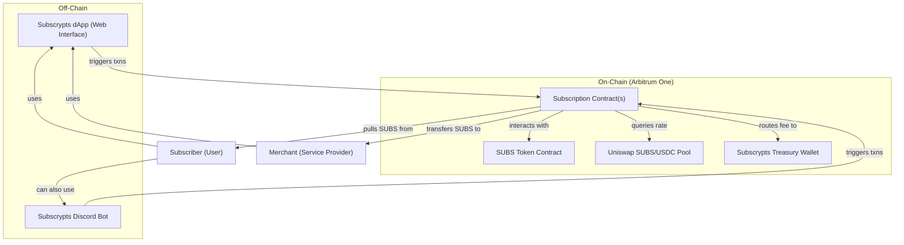

# Architecture

[Subscrypts](https://subscrypts.com)’ architecture combines on-chain smart contracts with off-chain components to deliver a seamless subscription service.

## Blockchain Layer (Arbitrum One)

At the core of [Subscrypts](https://subscrypts.com) is a set of smart contracts deployed on **Arbitrum One** (an Ethereum Layer-2 chain). Arbitrum provides high throughput and low transaction fees while inheriting the security of Ethereum, which is crucial for handling potentially frequent microtransactions. The choice of Arbitrum means users pay only minimal gas fees for subscription transactions, making the system efficient for small, recurring payments.

### Key Smart Contracts

**Subscription Smart Contracts** – These handle the logic of subscriptions: storing subscription terms, scheduling payments, and executing transfers of SUBS tokens from subscribers to merchants according to the set intervals. Each time a payment is due, the contract triggers a transfer (using the subscriber’s prior approval) of the required SUBS amount. The contract also enforces rules like the 1% platform fee and can be configured (by the project’s administrators) to adjust parameters if needed (for example, changing the fee rate for all or specific subscriptions).

**SUBS Token Contract** – An ERC-20 token contract (standard Ethereum token) governing the [Subscrypts](https://subscrypts.com) utility token. It defines the total supply of SUBS and enables transfers between users. Notably, the token contract includes admin-controlled functions for supply adjustment (minting or burning tokens) and for pausing or upgrading the contract. These functions are protected by a multi-signature governance wallet – i.e., no single person can arbitrarily mint new tokens or alter the contract. Any such change would require multiple trusted signatories and would be transparently announced to the community in advance. In practice, the initial token supply is set high at **120 billion SUBS**, and there are no current plans to use the mint/burn capabilities except possibly in extraordinary situations.

**Price Oracle/DEX Integration** – To support fiat-denominated pricing, the subscription contract interacts with on-chain price sources (specifically a SUBS/USDC decentralized exchange pair, such as on Uniswap). This allows the contract to fetch the current exchange rate between SUBS and a stablecoin (USDC) during each payment cycle. By doing so, it can calculate how many SUBS are needed to equal a merchant’s fiat-priced subscription (e.g., €10) at that moment. This integration is on-chain and trustless; it uses live market data from Arbitrum’s DEX liquidity pool, eliminating reliance on off-chain price feeds.

*For more technical details on these on-chain components, refer to the [Subscrypts Smart Contract Suite](../smart-contract/01-introduction.md) documentation.*

---

## Off-Chain Components

On top of the blockchain layer, [Subscrypts](https://subscrypts.com) provides user-facing applications that make it easy to interact with the smart contracts.

**[Subscrypts dApp](https://app.subscrypts.com) (Web Application)** – A user-friendly web interface where merchants can create and manage their subscription plans, and subscribers can browse services, subscribe, and manage their subscriptions. The dApp abstracts the blockchain interactions: users connect their crypto wallet (e.g., via MetaMask) to the website, and the dApp triggers the necessary on-chain transactions (such as approving the subscription contract or initiating a cancellation) on their behalf. This means users don’t have to manually call smart contracts; the interface handles it once they confirm actions in their wallet.

**[Subscrypts Discord Bot](https://discord.onsubscrypts.com)** – For community-driven platforms and power users, [Subscrypts](https://subscrypts.com) offers a Discord bot integration. This bot allows users to receive notifications and even execute simple commands related to their subscriptions from within Discord (assuming they’ve linked their wallets). For example, a user could get an alert in a Discord server when their subscription payment succeeds or if their balance is low. The bot interacts with the same smart contracts behind the scenes, providing an alternative way to interface with [Subscrypts](https://subscrypts.com) outside of the web app. It’s especially handy for creators who run Discord communities – they can potentially let users subscribe or check subscription status via chat commands.

*Both the web app and [Discord Bot](https://discord.onsubscrypts.com) ultimately perform operations on the Arbitrum blockchain; they do not hold funds themselves. They are convenience layers on top of the decentralized infrastructure.*

---

## Architecture Diagram

---

## Security and Governance

In this architecture, security and trust minimization are paramount. All critical operations (like moving funds or changing settings) are executed by smart contracts on Arbitrum, which means they are transparent and governed by code. [Subscrypts](https://subscrypts.com)’ team uses a multi-signature wallet to control administrative functions on these contracts, adding a layer of security – no single admin can unilaterally make changes. Furthermore, because the system is on a public blockchain, it benefits from Ethereum’s security model and community scrutiny.

Users can inspect or audit the smart contract code (and independent security audits are being planned) to verify how funds are handled. Overall, the architecture ensures that users interact with a decentralized backend (they are essentially transacting with the smart contracts directly, whether through the [Subscrypts dApp](https://app.subscrypts.com) or [Discord Bot](https://discord.onsubscrypts.com)), preserving the principles of transparency and user control.
