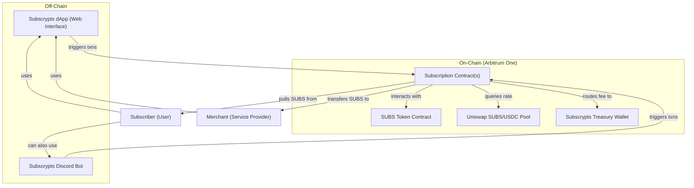

# Architecture

[Subscrypts](https://subscrypts.com)’ architecture combines on-chain smart contracts with off-chain components to deliver a seamless subscription service.

## Blockchain Layer (Arbitrum One)

At the core of [Subscrypts](https://subscrypts.com) is a set of smart contracts deployed on **Arbitrum One** (an Ethereum Layer-2 chain). Arbitrum provides high throughput and low transaction fees while inheriting the security of Ethereum, which is crucial for handling potentially frequent microtransactions. The choice of Arbitrum means users pay only minimal gas fees for subscription transactions, making the system efficient for small, recurring payments.

### Key Smart Contracts

**Subscription Smart Contracts** – These handle the logic of subscriptions: storing subscription terms, scheduling payments, and executing transfers of SUBS tokens from subscribers to merchants according to the set intervals. Each time a payment is due, the contract triggers a transfer (using the subscriber’s prior approval) of the required SUBS amount. The contract also enforces rules like the 1% platform fee and can be configured (by the project’s administrators) to adjust parameters if needed (for example, changing the fee rate for all or specific subscriptions).

**SUBS Token Contract** – An ERC-20 token contract (standard Ethereum token) governing the [Subscrypts](https://subscrypts.com) utility token. It defines the total supply of SUBS and enables transfers between users.

The token contract includes admin-controlled functions for supply adjustment (minting or burning tokens), as well as pausing or upgrading the contract. These functions are protected by a multi-signature governance wallet, meaning no single party can unilaterally alter token behavior. Any supply-related change would require explicit multi-signature approval, on-chain governance actions, and advance disclosure to the community.

In practice, the total SUBS supply is **fixed at 120 million tokens**, all minted at the Token Generation Event (TGE). There are **no plans to use mint or burn capabilities** outside of exceptional governance-approved circumstances, making the effective supply cap fixed for the foreseeable future.

**Price Oracle / DEX Integration** – To support fiat-denominated pricing, the subscription contracts interact with on-chain price sources (specifically a SUBS/USDC decentralized exchange pair on Uniswap). This allows the system to determine how many SUBS are required to match a fiat-denominated subscription price (e.g., $10) at the time of payment. The integration is fully on-chain and trustless, relying on real-time liquidity pool data without off-chain price feeds.

*For more technical details on these on-chain components, refer to the [Subscrypts Smart Contract Suite](../smart-contract/01-introduction.md) documentation.*

---

## Off-Chain Components

On top of the blockchain layer, [Subscrypts](https://subscrypts.com) provides user-facing applications that simplify interaction with the smart contracts.

**[Subscrypts dApp](https://app.subscrypts.com)** – A web-based interface allowing merchants to create and manage subscription plans and subscribers to manage their subscriptions. The dApp abstracts blockchain complexity by handling contract interactions after users confirm actions in their wallet.

**[Subscrypts Discord Bot](https://discord.onsubscrypts.com)** – A community-focused integration that allows subscription status checks, notifications, and role-based access control within Discord servers. The bot interacts with the same on-chain contracts and does not custody funds.

*Both the dApp and Discord Bot act as convenience layers only; all value transfer and enforcement occur on-chain.*

---

## Architecture Diagram

---

## Security and Governance

All critical operations within the Subscrypts architecture are executed by smart contracts on Arbitrum, ensuring transparency and deterministic behavior. Administrative actions are controlled via a multi-signature wallet, preventing unilateral changes and enforcing collective governance.

Because the system operates on a public blockchain, transactions and contract behavior are independently verifiable. Users interact directly with decentralized infrastructure through the [Subscrypts dApp](https://app.subscrypts.com) or [Discord Bot](https://discord.onsubscrypts.com), preserving user custody, transparency, and trust minimization.
