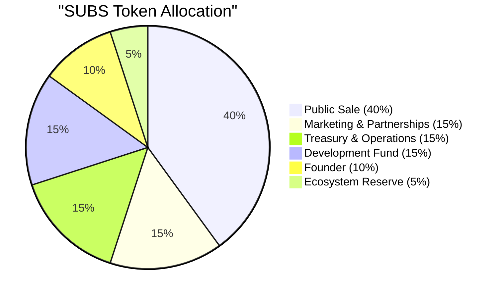

# Tokenomics

## SUBS Token Supply

The total supply of SUBS is **120 billion tokens**, all of which were created at the **Token Generation Event (TGE)** when the [Subscrypts](https://subscrypts.com) platform launched. This is the initial and maximum supply unless changed by a future governance decision – the token’s smart contract does include the capability to mint additional tokens or burn tokens, but any such change would require robust multi-signature approval and regulatory disclosure, and none is planned at launch. In effect, 120 billion is the cap for the foreseeable future.

---

## Distribution & Vesting

These 120 billion SUBS are allocated to various stakeholders and purposes to support the project’s development and community. The allocation was designed with long-term incentives in mind, using lock-up periods and vesting schedules to prevent immediate concentration of tokens in the market.

### Token Allocation

### Allocation Breakdown

**Public Sale (IDO): 40% – 48.0 billion SUBS**
This portion is offered to the public through the initial DEX offering (IDO) on Uniswap. 10% of the total supply (12 billion) is unlocked immediately at TGE to provide initial liquidity and float in the market. The remaining 30% (36 billion) is released gradually via a 12-month linear vesting schedule (~3 billion SUBS per month). This structure prevents sudden oversupply and supports an orderly token market.

**Founder: 10% – 12.0 billion SUBS**
Only 2.5% of total supply (3 billion) is immediately available at TGE; the remaining 7.5% (9 billion) is locked and vests linearly over 36 months. This long-term schedule aligns the founder’s incentives with the platform’s ongoing success.

**Marketing & Partnerships: 15% – 18.0 billion SUBS**
Reserved for marketing initiatives, user growth, and strategic partnerships. Tokens are locked for 12 months, then vest linearly over 24 months. This ensures tokens are used gradually for growth activities.

**Treasury & Operations: 15% – 18.0 billion SUBS**
Reserved for operational funding (infrastructure, salaries, legal, etc.). Locked for 12 months and vests over the next 12 months (released during year two).

**Development Fund: 15% – 18.0 billion SUBS**
Allocated for technical development, audits, and future feature expansion. Locked for 12 months and vests linearly over 24 months, ensuring sustained development funding.

**Ecosystem Reserve: 5% – 6.0 billion SUBS**
A reserve for future ecosystem initiatives or liquidity support. Locked for 12 months, then vests over 24 months.

### Circulating Supply Overview

While all 120 billion SUBS are created at launch, only about **12.5% (15 billion)** are liquid at TGE – composed of ~10% from the public sale and 2.5% founder allocation. The rest is released gradually based on the vesting schedules.

Even within the first year, no more than **51 billion SUBS (42.5%)** will enter circulation, ensuring long-term stability and preventing market flooding. The remaining **57.5%** will only become available after their respective lock-up and vesting periods over the next two to three years. This structure promotes sustainable growth and aligns with fair market and regulatory best practices.

---

## Token Utility

SUBS is a **utility token** serving as the medium of exchange for subscriptions on the [Subscrypts](https://subscrypts.com) platform. Holding SUBS enables users to pay for services and allows merchants to receive payments. Beyond this, SUBS has no inherent voting rights, dividends, or ownership stake in [Subscrypts](https://subscrypts.com).

The value of SUBS is therefore tied directly to **platform usage and demand** for subscriptions. Future utility expansions (e.g., loyalty rewards or community governance) may be considered, but would be implemented only with transparency and potential [whitepaper](https://subscrypts.com/whitepaper) updates to ensure compliance.

---

## Use of Proceeds

Funds raised during the SUBS token sale (via USDC, ETH, or other crypto-assets) go directly to the **[Subscrypts](https://subscrypts.com) treasury**, secured via a multi-signature wallet. These funds are allocated solely to support:

* Platform development and audits
* Marketing and strategic partnerships
* Infrastructure and operational costs
* Legal and compliance activities
* Team compensation

No portion of these funds is distributed as personal profit or dividends to founders or insiders. This aligns with [Subscrypts](https://subscrypts.com)’ principle that the token sale exists to bootstrap development and ensure long-term value for the ecosystem, not to enrich early stakeholders.
