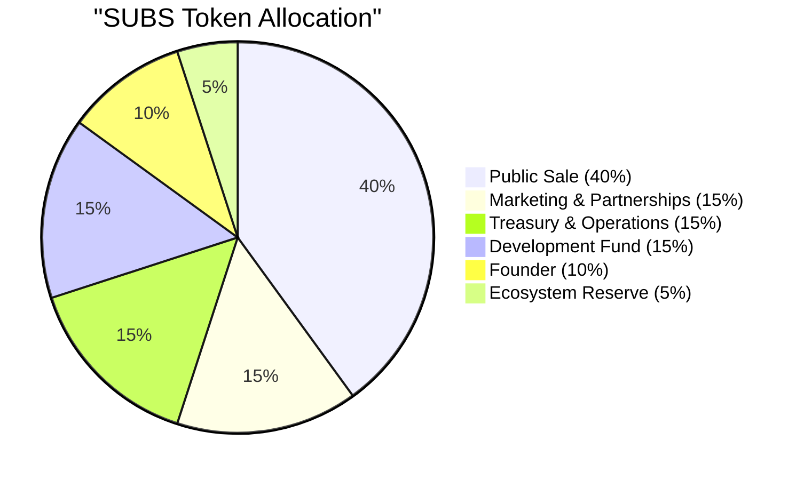

# Tokenomics

## SUBS Token Supply

The total supply of SUBS is **120 million tokens**, all of which were created at the **Token Generation Event (TGE)** when the [Subscrypts](https://subscrypts.com) platform launched. This is the initial and maximum supply unless changed by a future governance decision.

While the token’s smart contract includes the technical capability to mint or burn tokens, any such change would require robust multi-signature approval, on-chain governance actions, and regulatory disclosure. No supply changes are planned at launch. For practical and economic purposes, **120 million SUBS represents the fixed supply cap**.

---

## Distribution & Vesting

The 120 million SUBS supply is allocated across multiple stakeholder groups and ecosystem purposes. The distribution model is designed to align long-term incentives, prevent early concentration of tokens, and ensure sustainable ecosystem growth through clearly defined lock-up and vesting schedules.

### Token Allocation

### Allocation Breakdown

**Public Sale (IDO): 40% – 48.0 million SUBS**
This allocation is offered to the public through the initial DEX offering (IDO) on Uniswap.

* **10% of total supply (12.0 million SUBS)** is unlocked at TGE to provide initial liquidity and circulating supply.
* The remaining **30% (36.0 million SUBS)** vests linearly over **12 months**, releasing approximately **3.0 million SUBS per month**.

This structure ensures early market liquidity while preventing sudden oversupply.

---

**Founder: 10% – 12.0 million SUBS**
Founder allocation is structured to strongly align long-term incentives with the success of the protocol.

* **2.5% of total supply (3.0 million SUBS)** is unlocked at TGE.
* The remaining **7.5% (9.0 million SUBS)** is locked and vests linearly over **36 months**.

---

**Marketing & Partnerships: 15% – 18.0 million SUBS**
Allocated for user acquisition, ecosystem growth, and strategic partnerships.

* Locked for **12 months**
* Vests linearly over the following **24 months**

This ensures marketing tokens are deployed gradually and strategically.

---

**Treasury & Operations: 15% – 18.0 million SUBS**
Reserved for operational expenses including infrastructure, legal, compliance, and ongoing platform maintenance.

* Locked for **12 months**
* Vests over the subsequent **12 months**

---

**Development Fund: 15% – 18.0 million SUBS**
Dedicated to protocol development, audits, tooling, and long-term feature expansion.

* Locked for **12 months**
* Vests linearly over **24 months**

This allocation ensures sustained funding for technical evolution without short-term pressure.

---

**Ecosystem Reserve: 5% – 6.0 million SUBS**
A strategic reserve for future ecosystem initiatives, liquidity support, or unforeseen requirements.

* Locked for **12 months**
* Vests over **24 months**

---

### Circulating Supply Overview

Although all **120 million SUBS** are minted at TGE, only approximately **12.5% (15.0 million SUBS)** enter circulation at launch. This consists of:

* **10.0% (12.0 million SUBS)** from the public sale
* **2.5% (3.0 million SUBS)** from the founder allocation

Within the first year, no more than **42.5% (51.0 million SUBS)** will be in circulation. The remaining **57.5%** is released gradually over multi-year vesting schedules.

This controlled emission model is designed to support long-term price stability, ecosystem growth, and responsible market dynamics.

---

## Token Utility

SUBS is a **utility token** that functions as the settlement and access token for subscription services on the [Subscrypts](https://subscrypts.com) platform.

* Subscribers use SUBS to pay for recurring services.
* Merchants receive subscription revenue in SUBS.
* Platform fees are collected in SUBS.

SUBS does **not** represent equity, ownership rights, dividends, or governance voting power. Its value is derived exclusively from **platform usage and demand** for decentralized subscription services.

Future utility extensions (such as loyalty mechanisms or ecosystem incentives) may be introduced only with full transparency and, where applicable, updates to the [whitepaper](https://subscrypts.com/whitepaper).

---

## Use of Proceeds

Funds raised during the SUBS token sale (via USDC, ETH, or other crypto-assets) are transferred directly to the **[Subscrypts](https://subscrypts.com) treasury**, which is secured by a multi-signature wallet.

Treasury funds are used exclusively for:

* Platform development and security audits
* Marketing and strategic partnerships
* Infrastructure and operational costs
* Legal, regulatory, and compliance activities
* Team compensation related to platform delivery

No portion of sale proceeds is distributed as dividends or personal profit to founders or insiders. The token sale exists solely to fund platform development and long-term ecosystem sustainability.
