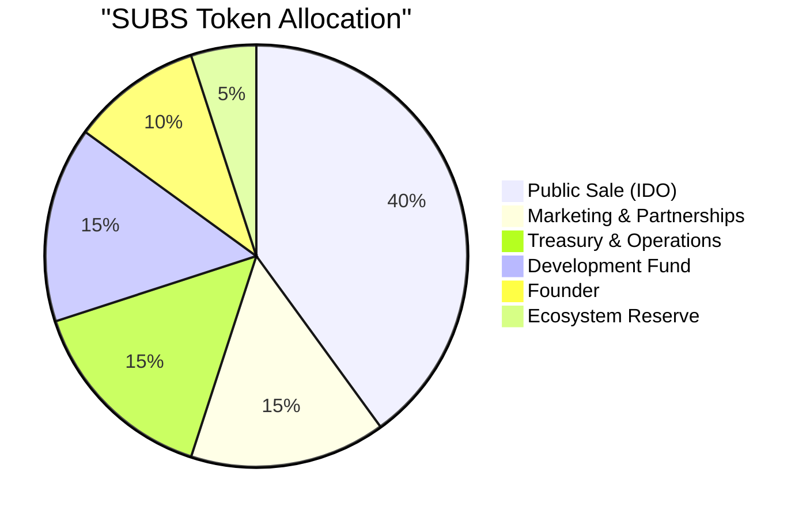

# Public Sale (IDO)

The public sale of SUBS — [Subscrypts](https://subscrypts.com)' native utility token — takes place as a **decentralized Initial DEX Offering (IDO)**. This section answers key questions about when it happens, how tokens are released, how it affects circulation, and how proceeds are used.

## What is the IDO?

The IDO (Initial DEX Offering) is the mechanism for launching and distributing SUBS tokens to the public. Rather than conducting a private raise or centralized launch, [Subscrypts](https://subscrypts.com) issues SUBS tokens **directly to the community via a decentralized exchange (Uniswap)**.

This ensures:

* Open access: no whitelist, no KYC barrier.
* Transparent pricing: determined by liquidity pool mechanics.
* Fair distribution: reduces early concentration.

---

## When does the IDO happen?

The IDO takes place at the **Token Generation Event (TGE)** — the official launch moment when SUBS tokens become live on-chain.

* **Network:** Arbitrum One (Ethereum Layer-2)
* **Launch Venue:** Uniswap V3
* **Token Pair:** SUBS / USDC
* **TGE Date:** Q4 2025 (exact date announced via official channels)

---

## How many tokens are allocated to the IDO?

Out of the fixed **120 billion SUBS total supply**, the **Public Sale allocation is 40%**:

This means **48 billion SUBS** are reserved for public distribution:

* **12 billion SUBS (10% of total supply)** are unlocked and circulating at launch (TGE).
* **36 billion SUBS** are locked and released linearly over the next **12 months**.

---

## How many tokens are in circulation at launch?

At the moment of the IDO:

| Category              | Amount (SUBS) | Circulating? |
| --------------------- | ------------- | ------------ |
| IDO Unlock            | 12 billion    | ✅ Yes        |
| Founder               | 3 billion     | ✅ Yes (2.5%) |
| All other allocations | 0             | ❌ Locked     |

➡️ **Total Circulating Supply at TGE:** **15 billion SUBS** (12.5% of total supply)

---

## What’s the release schedule after launch?

The remaining **36 billion SUBS** from the IDO allocation are released **monthly over 12 months**. Visualized below:

Each month increases circulating supply by **3 billion SUBS**, culminating in 48 billion SUBS available after 12 months.

---

## What’s the total in circulation after 1 year?

| Source                 | Circulating After 1 Year | Notes                               |
| ---------------------- | ------------------------ | ----------------------------------- |
| Public Sale (40%)      | 48 billion SUBS          | Fully released                      |
| Founder (2.5% + ~2.5%) | ~6 billion SUBS          | 3B at launch + ~3B vesting progress |
| Others (0%)            | 0 SUBS                   | Still locked (begin unlocking Y2)   |

➡️ **Total After Year 1:** ~**54 billion SUBS** (45% of supply)

---

## Why does Subscrypts use a public IDO?

The goal is to distribute SUBS tokens **as widely and fairly as possible**, especially among:

* Merchants and developers building on the platform
* Subscribers and users engaging with SUBS
* Long-term ecosystem participants

Compared to private sales or early investor rounds, an IDO:

* Prevents supply hoarding by a few insiders
* Makes pricing transparent and market-driven
* Encourages early liquidity and token utility

---

## What’s the impact on price and liquidity?

Price is determined by:

* Initial liquidity pool setup (SUBS:USDC ratio)
* Real-time market demand on Uniswap
* Circulating supply growth (linear vesting)

While some token emissions increase supply monthly, the wide distribution is designed to support:

* Broad user ownership
* Steady onboarding of new demand
* Minimized sell-pressure from concentrated holders

---

## What happens with the IDO proceeds?

All assets received from IDO token purchases (USDC, ETH, etc.):

* Flow into the [Subscrypts](https://subscrypts.com) **treasury wallet**
* Are used to fund **platform development, security, infrastructure, and ecosystem growth**

No proceeds are taken as profit by founders. The treasury is strictly used to:

* Pay for audits and development
* Maintain infrastructure
* Support grants and strategic partnerships

> The treasury wallet is publicly viewable on-chain.

---

## Summary

| Item                        | Value                       |
| --------------------------- | --------------------------- |
| IDO Allocation              | 48 billion SUBS (40%)       |
| Circulating at Launch (TGE) | 15 billion SUBS (12.5%)     |
| Monthly Unlock (IDO)        | 3 billion SUBS per month    |
| Circulating After Year 1    | ~54 billion SUBS (45%)      |
| Launch Venue                | Uniswap V3 (Arbitrum One)   |
| IDO Funds Usage             | Treasury → Ops, Dev, Growth |

The IDO model ensures a **fair, transparent, and scalable** launch, designed to avoid centralization and promote long-term health of the [Subscrypts](https://subscrypts.com) ecosystem.
