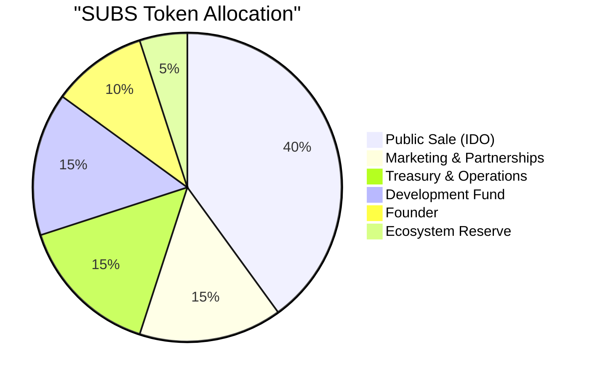
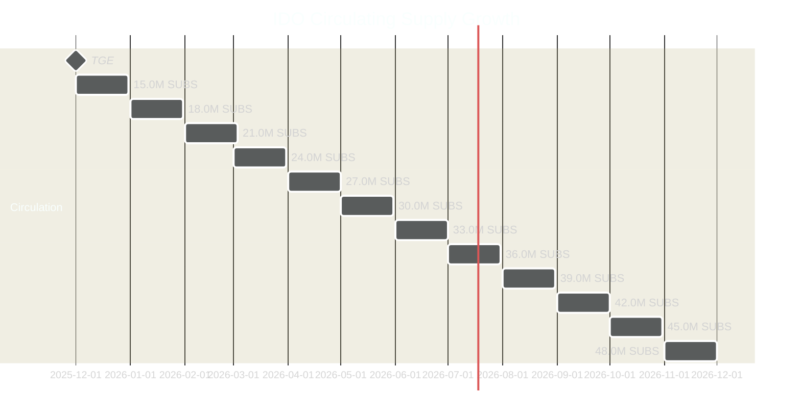

# Public Sale (IDO)

The public sale of SUBS — [Subscrypts](https://subscrypts.com)' native utility token — takes place as a **decentralized Initial DEX Offering (IDO)**. This section explains when the IDO occurs, how tokens are released, how circulating supply evolves, and how proceeds are used.

## What is the IDO?

The IDO (Initial DEX Offering) is the mechanism through which SUBS is distributed to the public. Instead of a private or centralized sale, [Subscrypts](https://subscrypts.com) launches SUBS **directly on a decentralized exchange (Uniswap)**.

This approach ensures:

* **Open access** — no whitelist or private allocation
* **Transparent pricing** — determined by market liquidity
* **Fair distribution** — reduced early concentration of supply

---

## When does the IDO happen?

The IDO takes place at the **Token Generation Event (TGE)** — the moment SUBS becomes live and tradable on-chain.

* **Network:** Arbitrum One (Ethereum Layer-2)
* **Launch Venue:** Uniswap V3
* **Token Pair:** SUBS / USDC
* **TGE Date:** Q4 2025 (exact date announced via official channels)

---

## How many tokens are allocated to the IDO?

Out of the fixed **120 million SUBS total supply**, the **Public Sale allocation is 40%**:

This corresponds to **48.0 million SUBS** reserved for public distribution:

* **12.0 million SUBS (10% of total supply)** are unlocked and circulating at TGE
* **36.0 million SUBS** are locked and released linearly over **12 months**

---

## How many tokens are in circulation at launch?

At the moment of the IDO (TGE):

| Category              | Amount (SUBS) | Circulating? |
| --------------------- | ------------- | ------------ |
| IDO Unlock            | 12.0 million  | ✅ Yes        |
| Founder               | 3.0 million   | ✅ Yes (2.5%) |
| All other allocations | 0             | ❌ Locked     |

➡️ **Total Circulating Supply at TGE:** **15.0 million SUBS** (**12.5%** of total supply)

---

## What’s the release schedule after launch?

The remaining **36.0 million SUBS** from the IDO allocation are released **linearly over 12 months**, increasing circulating supply by **3.0 million SUBS per month**.

After 12 months, the full **48.0 million SUBS** allocated to the public sale is in circulation.

---

## What’s the total in circulation after 1 year?

| Source            | Circulating After 1 Year | Notes                                  |
| ----------------- | ------------------------ | -------------------------------------- |
| Public Sale (40%) | 48.0 million SUBS        | Fully released                         |
| Founder (vesting) | ~6.0 million SUBS        | 3.0M at TGE + ~3.0M vested             |
| Other allocations | 0 SUBS                   | Still locked (unlocking starts Year 2) |

➡️ **Total After Year 1:** ~**54.0 million SUBS** (~**45%** of total supply)

---

## Why does Subscrypts use a public IDO?

The objective is to distribute SUBS **as widely and transparently as possible**, particularly among:

* Merchants building subscription services
* Developers integrating the protocol
* Users actively participating in the ecosystem

Compared to private rounds, an IDO:

* Limits insider dominance
* Creates market-driven price discovery
* Encourages early liquidity and real usage

---

## What’s the impact on price and liquidity?

The market price of SUBS is determined by:

* Initial liquidity pool configuration (SUBS / USDC)
* Ongoing supply emission via linear vesting
* Real user demand for subscriptions

While circulating supply increases monthly, the gradual release is designed to:

* Reduce abrupt sell pressure
* Support sustainable liquidity growth
* Align token availability with ecosystem adoption

---

## What happens with the IDO proceeds?

All assets received from IDO participation (USDC, ETH, or other crypto-assets):

* Are transferred directly to the **[Subscrypts](https://subscrypts.com) treasury**
* Are secured by a multi-signature wallet
* Are used exclusively for platform-related expenses

Treasury funds support:

* Development and security audits
* Infrastructure and operational costs
* Ecosystem growth and partnerships

> The treasury wallet is publicly verifiable on-chain.

---

## Summary

| Item                        | Value                       |
| --------------------------- | --------------------------- |
| IDO Allocation              | 48.0 million SUBS (40%)     |
| Circulating at Launch (TGE) | 15.0 million SUBS (12.5%)   |
| Monthly Unlock (IDO)        | 3.0 million SUBS per month  |
| Circulating After Year 1    | ~54.0 million SUBS (~45%)   |
| Launch Venue                | Uniswap V3 (Arbitrum One)   |
| IDO Funds Usage             | Treasury → Ops, Dev, Growth |

The public IDO ensures a **fair, transparent, and decentralized** launch of SUBS, aligned with long-term ecosystem sustainability.
