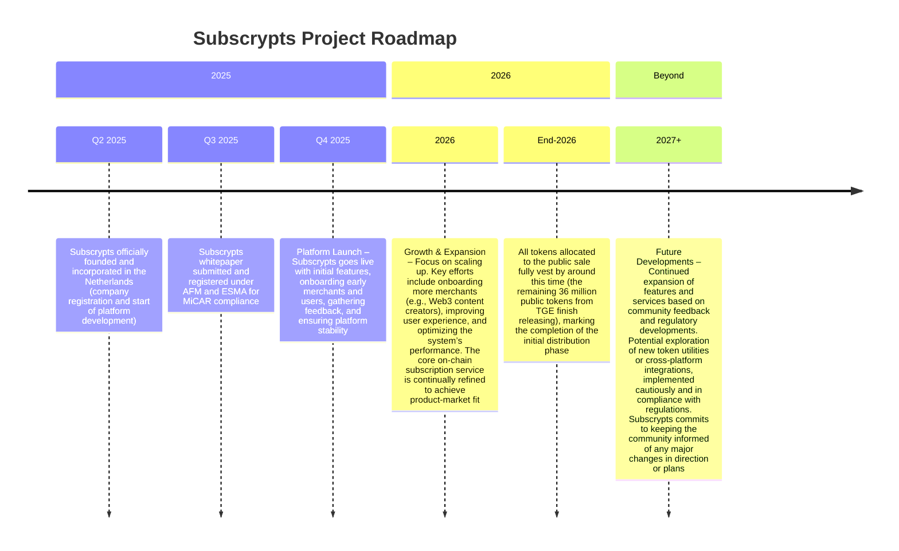

# Roadmap

Below is a high-level overview of [Subscrypts](https://subscrypts.com)’ project roadmap, highlighting past milestones, regulatory achievements, and upcoming development phases.

---

## Planned Technical Enhancements

The following upgrades are part of the near-term roadmap designed to expand both functionality and performance, while introducing more flexible payment options and enterprise-oriented features.

### Volume Subscriptions & Licensing

[Subscrypts](https://subscrypts.com) will explore volume-based subscriptions, allowing merchants to manage multiple users under a single on-chain subscription:

* A business can subscribe once with a company wallet (e.g., 30 seats).
* The contract deducts 30× the subscription amount from that single subscription for each billing period.
* Merchants may define volume pricing tiers (e.g., discounts for 10, 30, 100 seats).

This model supports B2B licensing, team subscriptions, and organizational access management while keeping all logic and settlement on-chain.

### Flexible Renewal & USDC Fallback Payments

To improve reliability of renewals, [Subscrypts](https://subscrypts.com) will explore a USDC fallback mechanism:

* If a subscriber does not have enough SUBS for an automatic renewal, the renewal can optionally be paid using their USDC balance.
* The contract would perform an on-chain USDC → SUBS conversion and complete the renewal in a single flow.

This preserves non-custodial settlement while reducing failed renewals due to temporary SUBS balance shortages.

### Staking & Incentive Programs

Future iterations may introduce staking services and token-based incentives, for example:

* Tiered staking levels that grant subscription discounts or reduced protocol commissions.
* Merchant benefits (e.g., lower network fees) when holding or staking a minimum amount of SUBS.
* Subscriber loyalty tiers based on staked or held balances.

These mechanisms are intended to reward long-term participants and encourage deeper alignment with the [Subscrypts](https://subscrypts.com) ecosystem.

### Account Abstraction

[Subscrypts](https://subscrypts.com) will explore integrating **ERC-4337 (Account Abstraction)** and related patterns to reduce friction:

* Allowing users to interact with contracts without needing ETH for gas, with blockchain fees potentially paid in SUBS or USDC.
* Merchant-side batching for multiple subscription attributes, renewals, and settlements in a single sponsored transaction.

For more information on planned smart contract upgrade patterns and modularity improvements, see the [Smart Contract Future Development](../smart-contract/16-future-development.md) page.

---

## Long-Term Vision — Decentralized Ecosystem Growth

Beyond incremental updates, [Subscrypts](https://subscrypts.com) envisions an open Web3 subscription economy — where decentralized payments, analytics, and governance converge under a unified standard.

### Ecosystem Expansion

* **Merchant Staking Pools** — staking SUBS tokens to enhance visibility and trust.
* **Cross-Protocol Collaboration** — interoperability with DeFi platforms for yield-backed subscriptions.

### Transparent Compliance Evolution

Compliance modules will continue to adapt to global standards:

* Automatic sanctions registry synchronization.
* Per-jurisdiction compliance extensions (EU, US, APAC modules).
* Smart audit hooks for regulators and third-party verifiers.

### Enterprise & SaaS Integrations

* Integration with ERP systems via [Subscrypts](https://subscrypts.com) APIs.
* Support for Web2-to-Web3 hybrid environments.
* APIs for merchant invoicing, tax reporting, and accounting.

These initiatives are structured to ensure scalability across both Web3-native and traditional enterprise ecosystems.

---

## Compliance-First Development

All enhancements described above — including volume licensing, USDC fallback renewals, staking tiers, and account abstraction — are currently conceptual. Before any feature is released, it will undergo:

* Technical feasibility analysis.
* Security review and testing.
* MiCAR / AML-aligned compliance assessment.

These planned upgrades aim to make [Subscrypts](https://subscrypts.com) more user-friendly, enterprise-ready, and scalable, while preserving its core principles of decentralization, transparency, and regulatory alignment.
